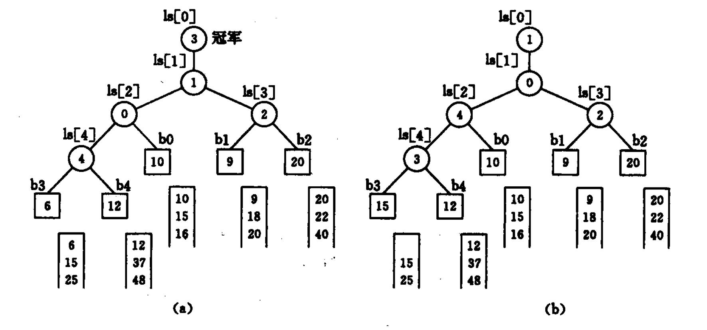
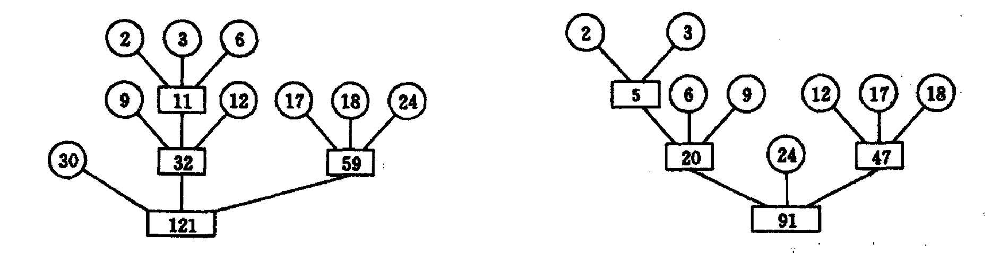

# 外部排序

## 外存信息的存取

+ **磁带信息的存取**：
  + 在**磁带**上**读写一块信息**所需的**时间**由2部分组成：$$T_{I / O} = t_a + n \cdot t_w$$其中：
    + $t_a$为**延迟时间**：**读 / 写头到达传输信息所在物理块起始位置**所需时间
    + $t_w$为**传输一个字符**的时间
  + 可见磁带这类**顺序存取设备**在**检索和修改信息**上**很不方便**
    + 因此，顺序存取设备主要用于处理**变化少**、**只进行顺序存取**的大量数据
+ **磁盘信息的存取**：
  + 在**磁盘**上**读写一块信息**所需的**时间**由3部分组成：$$T_{I / O} = t_{\text{seek}} + t_{\text{la}} + n \cdot t_{wm}$$其中：
    + $t_{\text{seek}}$为**寻查时间**（seek time）：**读 / 写头定位**所需时间
    + $t_{\text{la}}$为**等待时间**（latency time）：**等待信息块的初始位置旋转到读写头下**的时间
    + $t_{wm}$为**传输时间**
  + 在磁盘上存放信息时应将**相关的信息**放在**同一柱面**或**邻近柱面**上，以求在读 / 写信息时尽量**减少磁头来回移动的次数**，以避免不必要的寻查时间

## 外部排序的方法

+ 外部排序基本上由两个相对独立的阶段组成：
  1. 按**可用内存大小**，将**外存**上**含$n$个记录的文件**分成**若干长度为$l$** 的子**文件**或**段**（segment），依次**读入内存**并利用有效的**内部排序方法**对它们进行**排序**，并将排序后得到的**有序子文件重新写入外存**
     + 通常称这些有序子文件为**归并段**或**顺串**（run）
  2. 对这些归并段进行**逐趟归并**，使**归并段（有序的子文件）逐渐由小至大**，直至**得到整个有序文件**为止
     + 本章主要讨论第二阶段即归并的过程
+ 在外部排序中实现两两归并时，不仅要**调用merge过程**，而且要**进行外存的读 / 写**，这是由于我们**不可能将两个有序段及归并结果段同时存放在内存**中的缘故
  + 假设对于$10000$个记录，首先通过$10$次内部排序得到$10$个初始归并段，每一段包含$1000$个记录；接下来进行归并时，由于$2^3 < 10 \leqslant 2^4$故需要$4$次归并，如果每个物理块可以容纳$200$个记录，则每一趟归并需进行$50$次“读”和$50$次“写”，$4$趟归并加上内部排序时所需进行的读 / 写使得在外排中总共需进行$500$次的读 / 写
+ 一般情况下，$$\begin{aligned}\text{外部排序所需总的时间} =& \text{内部排序（产生初始归并段）所需的时间} \\ +& \text{外存信息读写的时间} \\ +& \text{内部归并所需的时间} \end{aligned}$$其中：
  + **内部排序（产生初始归并段）**所需的时间：$m \times t_{IS}$
    + $m$为**归并段数量**
    + $t_{IS}$为**得到一个初始归并段并进行内部排序**所需**时间的均值**
  + **外存信息读写**的时间：$d \times t_{IO}$
    + $d$为**总的读 / 写次数**
    + $t_{IO}$为**进行一次外存读 / 写**所需**时间的均值**
  + **内部归并**所需的时间：$s \times ut_{mg}$
    + $s$为**归并的趟数**
      + 如果**对$m$个初始归并段**进行 **$k$-路平衡归并**，则归并趟数$s = \lfloor \log_k m \rfloor$
    + $ut_{mg}$为**对$u$个记录进行内部归并**所需时间

## 多路平衡归并的实现

+ **增加平衡归并的路数$k$** 可以减少**归并的趟数$s$** ，从而减少外存读 / 写的次数，但是，从下面的讨论中又可发现，单纯增加$k$将导致**增加内部归并的时间$ut_{mg}$**
  + 对**2-路归并**，令 **$u$个记录**分布在 **$2$个归并段**上，按merge过程进行归并：
    + **每得到归并后的一个记录**，仅需**一次比较**即可
    + 得到**含$u$个记录的归并段**需**进行$u - 1$次比较**
  + 再看 **$k$-路归并**，令 **$u$个记录**分布在 **$k$个归并段**上
    + **归并后的第一个记录**应是 **$k$个归并段中关键字最小的记录**，即应从每个归并段的第一个记录的相互比较中选出最小者，这需要**进行$k - 1$次比较**
    + 同理，**每得到归并后的有序段中的一个记录**，都要**进行$k - 1$次比较**
    + 显然，为得到**含$u$个记录的归并段**需**进行$(u - 1)(k - 1)$次比较**
  + 对于$k$-路归并，如果有$n$个记录、$m$个初始归并段，则总的比较次数为$$\left\lfloor \frac{\log_2 m}{\log_2 k}\right\rfloor(k - 1)(n - 1)t_{mg}$$注意到此处$\frac{k - 1}{\log_2 k}$随$k$增长而增长，为了让**总的比较次数**（以及与之正相关的**内部归并时间**）**与$k$无关**，需要使用 **“败者树”**（Tree of Loser）
    + **“败者树”**：在**双亲结点**中**记下**刚进行完的这场比赛中的**败者**，而让**胜者**去**参加更高一层的比赛**
      + 下图所示为一棵实现**5-路归并**的败者树$\text{ls}[0， \cdots， 4]$：
        
        + **方形结点**表示**叶子结点**（也可看成是外结点），分别为5个归并段中**当前参加归并选择**的记录的关键字
        + **圆形结点**记录败者的**下标**（例如，b3和b4的比较中b4更大（失败），因此在b3和b4的双亲结点中记录4）
        + 败者树中**根结点ls[1]** 的**双亲结点ls[0]** 为 **“冠军”**

## 置换-选择排序

+ **归并的趟数**不仅**和$k$成反比**，也**和归并段数量成$m = \left\lceil \frac{n}{l} \right\rceil$正比**，其中$n$为**外部文件中的记录数**，$l$为**初始归并段中的记录数**
  + 因此，**减少$m$** 是**减少归并的趟数$s$** 的另一条途径
+ **置换-选择排序**（Replacement-Selection Sorting）是在树形选择排序的基础上得来的，它的特点是：在整个排序（得到所有初始归并段）的过程中，**选择最小**（或**最大**）**关键字**和**输入、输出**是**交叉或平行进行**的
  + 假设**初始待排文件**为**输入文件FI**，**初始归并段文件**为**输出文件FO**，**内存工作区**为**WA**，FO和WA的**初始状态为空**，并设**内存工作区WA**的容量**可容纳$w$个记录**，则置换-选择排序的**操作过程**为：
    1. 从**FI输入$w$个记录**到**工作区WA**
    2. 从**WA内**选出**其中关键字取最小值的记录**，记为**MINIMAX记录**
       + 此处使用**败者树**实现
    3. 将**MINIMAX记录输出到FO中**去
    4. 若**FI不空**，则**从FI输入下一个记录到WA中**
    5. 从**WA内所有关键字比MINIMAX记录的关键字大的记录**中选出**最小关键字记录**，作为**新的MINIMAX记录**
    6. **重复步骤3至步骤5**，直至**在WA中选不出新的MINIMAX记录为止**
       + 由此得到**一个初始归并段**，**输出一个归并段的结束标志到FO中**去
    7. **重复步骤2至步骤6**，**直至WA为空**
       + 由此得到**全部初始归并段**
  + 例子：设待排文FI = {17, 21, 05, 44, 10, 12, 56, 32, 29}，WA容量为$3$​，则排序过程如下表所示：

    |               输出文件FO |    工作区WA    | 输入文件FI                         |
    | -----------------------: | :------------: | ---------------------------------- |
    |                          |                | 17, 21, 05, 44, 10, 12, 56, 32, 29 |
    |                          | 17, 21, **05** | 44, 10, 12, 56, 32, 29             |
    |                       05 | **17**, 21, 44 | 12, 56, 32, 29                     |
    |                   05, 17 | 10, **21**, 44 | 12, 56, 32, 29                     |
    |               05, 17, 21 | 10, 12, **44** | 56, 32, 29                         |
    |           05, 17, 21, 44 | 10, 12, **56** | 32, 29                             |
    |       05, 17, 21, 44, 56 |   10, 12, 32   | 29                                 |
    | 05, 17, 21, 44, 56, 结束 | **10**, 12, 32 | 29                                 |
    |                       10 | 29, **12**, 32 |                                    |
    |                   10, 12 |   **29**, 32   |                                    |
    |               10, 12, 29 |     **32**     |                                    |
    |           10, 12, 29, 32 |                |                                    |
    |     10, 12, 29, 32, 结束 |                |                                    |

  + 假设**工作区容量**为$w$​，则置换-选择所得**初始归并段长度**的**期望值**便为$2w$
  + 若不计输入、输出的时间，则对 **$n$个记录的文件**而言，生成**所有初始归并段**所需**时间**为$O(n \log w)$

## 最佳归并树

+ 若对**长度不等**的 **$m$个初始归并段**，构造一棵**赫夫曼树**作为**归并树**，便可使在进行外部归并时所需**对外存进行的读 / 写次数**达**最少**
  + 若对 **$k$-路归并**，初始归并段**不足以构成一颗严格$k$叉树**，则需要添加长度为$0$的 **“虚段”**
    + **补充数量**：$$\begin{cases} 0 & (m - 1) \text{ MOD } (k - 1) = 0 \\ k - (m - 1) \text{ MOD } (k - 1) - 1 & (m - 1) \text{ MOD } (k - 1) \neq 0 \end{cases}$$
    + 例如下图中，左侧并非一个严格$3$叉树（**存在两条路径深度差距大于等于$2$**），而**补上$3 - (8 - 1) \text{ MOD } (3 - 1) - 1 = 1$个“虚段”** 后得到的归并树读 / 写次数真正达到最少
      
