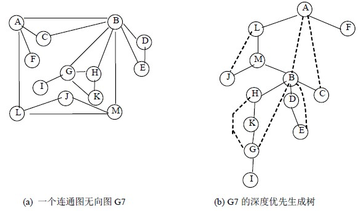

# 图

## 图的定义和术语

+ **图**（Graph）$G$由两个集合$V$和$E$组成，记为$G = (V, E)$，其中$V$是**顶点**的有穷非空集合，$E$是$V$中**顶点偶对**的有穷集合，这些**顶点偶对**称为**边**
  + $V(G)$和$E(G)$通常分别表示图$G$的顶点集合和边集合， **$E(G)$可以为空集**；**若$E(G)$为空**，则**图$G$只有顶点而没有边**
  + 若边集$E(G)$为**有向边**的集合，则称该图为**有向图**
    + 在有向图中，顶点对$\langle x, y \rangle$是**有序**的，它称为从顶点r到顶点y的一条**有向边**；因此，$\langle x, y \rangle$与$\langle y, x \rangle$是不同的两条边
      + 顶点对用一对**尖括号**括起来，$x$是有向边的**始点**，$y$是有向边的**终点**；$\langle x, y \rangle$也称作一条**弧**，则$x$为**弧尾**，$y$为**弧头**
  + 若边集$E(G)$为**无向边**的集合，则称该图为**无向图**
    + 在无向图中，顶点对$(x, y)$是**无序**的，它称为与顶点$x$和顶点$y$相关联的一条边；这条边没有特定的方向，$(x, y)$与$(y, x)$是同一条边
      + 为了有别于有向图，无向图的顶点对用一对**圆括号**括起来
+ 基本术语：
  + **子图**：假设有两个图$G = (V, E)$和$G' = (V', E')$，如果$V' \subseteq V$且$E' \subseteq E$，则称$G'$为$G$的子图
  + **无向完全图**和**有向完全图**：
    + 对于**无向图**，若**具有$n(n - 1) / 2$条边**，则称为**无向完全图**
    + 对于**有向图**，若**具有$n(n - 1)$条弧**，则称为**有向完全图**
  + **稀疏图**和**稠密图**：有**很少条边或弧**（如$e < n \log_2 n$）的图称为**稀疏图**，**反之**称为**稠密图**
  + **权**和**网**：
    + 在实际应用中，**每条边可以标上具有某种含义的数值**，该**数值**称为该边上的**权**；这些权可以表示**从一个顶点到另一个顶点**的**距离**或**耗费**
    + 这种**带权的图**通常称为**网**
  + **邻接点**：对于**无向图$G$** ，如果**图的边$(v, v')\in E$** ，则称**顶点$v$和$v'$互为邻接点**，即 **$v$和$v'$相邻接**
    + 边$(v, v')$依附于顶点$v$和$v'$,或者说边$(v, v')$与顶点$v$和$v'$相关联
  + **度**、**入度**和**出度**：
    + 顶点$v$的**度**是指**和$v$相关联**的**边的数目**，记为$TD(v)$
    + 对于**有向图**，顶点$v$的度分为**入度**和**出度**
      + **入度**是**以顶点$v$为头**的**弧的数目**，记为$ID(v)$
      + **出度**是**以顶点$v$为尾**的**弧的数目**，记为$OD(v)$
      + **顶点$v$的度**为$TD(v) = ID(v) + OD(v)$
    + 一般地，如果顶点$v$的度记为$TD(v)$，那么**一个有$n$个顶点、$e$条边的图，满足如下关系**：$$e = \frac{1}{2}\sum_{i = 1}^n TD(v_i)$$
  + **路径**和**路径长度**：
    + 在**无向图$G$** 中，从顶点$v$到顶点$v'$的**路径**是一个**顶点序列$(v = v_{i, 0}, v_{i, 1}, \cdots, v_{i, n})$** ，**其中$(v_{i, j - 1}, v_{i, j}) \in E, i \leqslant j \leqslant m$**
    + 在**有向图$G$** 中，**路径**也是**有向**的，顶点序列应**满足$\langle v_{i, j - 1}, v_{i ,j} \rangle \in E$**
    + **路径长度**是一条路径上**经过的边或弧的数目**
  + **回路**或**环**：**第一个顶点和最后一个顶点相同**的**路径**称为回路或环
  + **简单路径**、**简单回路**或**简单环**：
    + **序列中顶点不重复出现**的**路径**称为**简单路径**
    + **除了第一个顶点和最后一个顶点之外，其余顶点不重复出现**的**回路**，称为**简单回路**或**简单环**
  + **连通**、**连通图**和**连通分量**：
    + 在**无向图$G$** 中，如果**从顶点$v$到顶点$v'$有路径**，则称$v$和$v'$是**连通**的
    + 如果**对于图中任意两个顶点$v_i, v_j \in V$，$v_i$和$v_j$都是连通的**，则称$G$是**连通图**
    + **连通分量**指的是**无向图**中的**极大连通子图**
  + **强连通图**和**强连通分量**：
    + 在**有向图$G$** 中，如果**对于每一对$v_i, v_j \in E, v_i \neq v_j$，从$v_i$到$v_j$和从$v_j$到$v_i$都存在路径**，则称$G$是**强连通图**
    + **有向图**中的**极大强连通子图**称作有向图的**强连通分量**
  + 连通图的**生成树**：一个**极小连通子图，它含有图中全部顶点，但只有足以构成一棵树的$n - 1$条边**，这样的连通子图称为**连通图的生成树**
    + **如果在一棵生成树上添加一条边，必定构成一个环**，因为这条边使得它依附的那两个顶点之间有了第二条路径
    + 一棵**有$n$个顶点的生成树有且仅有$n - 1$条边**
      + 如果**一个图有$n$个顶点和小于$n - 1$条边**，则是**非连通图**
      + 如果**一个图有$n$个顶点和多于$n - 1$条边**，则**一定有环**
      + 但是，有$n$个顶点和$n - 1$条边的图**不一定是生成树**（例如图内某个点不存在任何边连接，从而剩余点之间存在环）
  + **有向树**和**生成森林**：
    + **有一个顶点的入度为$0$，其余顶点的入度均为$1$** 的**有向图**称为**有向树**
    + 一个**有向图**的**生成森林**是由**若干棵有向树组成**，**含有图中全部顶点**，但**只有足以构成若干棵不相交的有向树的弧**
+ 图的**抽象数据类型定义**：

  ```C
  ADT Graph{
    数据对象：v是具有相同特性的数据元素的集合，称为顶点集
    数据关系：R = {VR}
             VR = {<v, w> | v, w ∈ V且P(v, w)，其中<v, w>表示从v到w的弧，谓词P(v, w)定义了弧<v, w>的意义或信息}
    基本操作：
      CreateGraph(&G, V, VR)
        初始条件：V是图的顶点集，VR是图中弧的集合
        操作结果：按V和VR的定义构造图G
      DestroyGraph(&G)
        初始条件：图G存在
        操作结果：销毁图G
      LocateVex(G, u)
        初始条件：图G存在，u和G中顶点有相同特征
        操作结果：若G中存在顶点u，则返回该顶点在图中的位置;否则返回其他信息
      GetVex(G, v)
        初始条件：图c存在，v是G中某个顶点
        操作结果：返回v的值
      PutVex(&G, v, value)
        初始条件：图G存在，v是G中某个顶点
        操作结果：对v赋值value
      FirstAdjVex(G, v)
        初始条件：图G存在，v是G中某个顶点
        操作结果：返回v的第一个邻接顶点；若v在G中没有邻接顶点，则返回“空”
      NextAdjVex(G, v, w)
        初始条件：图G存在，v是G中某个顶点，w是v的邻接顶点
        操作结果：返回v的（相对于w的）下一个邻接顶点；若w是v的最后一个邻接点，则返回“空”
      InsertVex(&G, v)
        初始条件：图G存在,v和图中顶点有相同特征
        操作结果：在图∈中增添新顶点v
      DeleteVex(&G, v)
        初始条件：图G存在，v是G中某个顶点
      国聆麻时同社个
        操作结果：删除G中顶点v及其相关的弧
      InsertArc(&G, v, w)
        初始条件：图G存在，v和w是G中两个顶点
        操作结果：在G中增添弧<v, w>，若G是无向图，则还增添对称弧<w, v>
      DeleteArc(&G, v, w)
        初始条件：图G存在,v和w是G中两个顶点
        操作结果：在G中删除弧<v, w>，若G是无向图，则还删除对称弧<w, v>
      DFSTraverse(G)
        初始条件：图G存在
        操作结果：对图进行深度优先遍历，在遍历过程中对每个顶点访问一次  
      BFSTraverse(G)
        初始条件：图G存在
        操作结果：对图进行广度优先遍历，在遍历过程中对每个顶点访问一次
  }ADT Graph
  ```
  

## 图的存储结构

### 数组表示法（邻接矩阵）

+ **邻接矩阵**（Adjacency Matrix）是**表示顶点之间相邻关系**的**矩阵**
  + 设$G(V, E)$是具有$n$个顶点的图，则$G$的邻接矩阵是具有如下性质的$n$阶方阵：$$A[i][j] = \begin{cases} 1 & \langle v_i, v_j \rangle \in E \text{ 或 } (v_i, v_j) \in E \\ 0 & \text{反之}\end{cases}$$
  + 若$G(V, E)$是一个**网**，则$G$的邻接矩阵可定义为：$$A[i][j] = \begin{cases} w_{i, j} & \langle v_i, v_j \rangle \in E \text{ 或 } (v_i, v_j) \in E \\ 0 & \text{反之}\end{cases}$$
  + 用邻接矩阵表示法表示图，除了一个用于**存储邻接矩阵**的**二维数组**外，还需要用一个**一维数组**来**存储顶点信息**
+ 采用**邻接矩阵**表示法创建**无向网**的算法：
  1. 输入总顶点数和总边数
  2. 依次输入点的信息存入顶点表中
  3. 初始化邻接矩阵，使每个**权值初始化**为**极大值**
  4. 构造邻接矩阵：依次输入每条边依附的顶点和其权值，确定两个顶点在图中的位置之后，使**相应边**赋予相应的**权值**，同时使其**对称边**赋予相同的**权值**
     + 该算法的时间复杂度是$O(n^2)$
     + 若要建立**无向图**，只需对上述算法做两处小的改动：
       + 初始化邻接矩阵时，将**边的权值均初始化为0**
       + 构造邻接矩阵时，将**权值w改为常量值1**即可
     + 类似地，将该算法**稍做修改**即可建立一个**有向网**或**有向图**
+ **优缺点**：
  + **优点**：
    + 便于判断**两个顶点之间是否有边**，即根据A[i][j] = 0或1来判断
    + 便于**计算各个顶点的度**：
      + 对于**无向图**，**邻接矩阵第i行元素之和**就是**顶点i的度**
      + 对于**有向图**，**第i行元素之和**就是**顶点i的出度**，**第i列元素之和**就是**顶点i的入度**
  + **缺点**：
    + 不便于**增加和删除顶点**
    + 不便于**统计边的数目**，需要**扫描邻接矩阵所有元素才能统计完毕**，时间复杂度为$O(n^2)$
    + **空间复杂度高**：对于一个具有$n$个顶点$e$条边的图$G$
      + 如果是**有向图**，$n$个顶点需要$n^2$个单元存储边
      + 如果是**无向图**，因其邻接矩阵是**对称**的，所以对规模较大的邻接矩阵可以采用**压缩存储**的方法，仅存储**下三角**（或**上三角**）的元素，这样需要$n(n - 1)/2$个单元即可
      + 但无论以何种方式存储，邻接矩阵表示法的**空间复杂度**均为$O(n)$，这对于稀疏图而言尤其浪费空间

### 邻接表

+ **邻接表**（Adjacency List）是图的一种**链式存储结构**
  + 在邻接表中，对图中**每个顶点$v_i$** ，**建立一个单链表**，把**与$v_i$相邻接的顶点**放在这个链表中
  + 邻接表中每个**单链表的第一个结点**存放**有关顶点的信息**，把这一结点看成链表的**表头**，**其余结点**存放有关**边的信息**，这样邻接表便由两部分组成：**表头结点表**和**边表**
    + **表头结点表**：由所有**表头结点**以**顺序结构**的形式存储，以便可以随机访问任一顶点的边链表
      + 表头结点包括**数据域**（data）和**链域**（firstarc）两部分：
        + **数据域**用于存储**顶点$v_i$的名称或其他有关信息**
        + **链域**用于指向**链表中第一个结点**（即**与顶点$v_i$邻接**的**第一个邻接点**）
    + **边表**：由**表示图中顶点间关系**的$2n$个边链表组成
      + 边链表中边结点包括**邻接点域**（adjvex）、**数据域**（info）和**链域**（nextarc）三部分：
        + **邻接点域**指示与**顶点$v_i$邻接的点**在图中的位置
        + **数据域**存储**和边相关的信息**，如**权值**等
        + **链域**指示**与顶点$v_i$邻接**的**下一条边的结点**
+ 采用**邻接表**表示法创建**无向图**的算法：
  1. 输入总顶点数和总边数
  2. 依次输入点的信息存入顶点表中，使每个**表头结点**的**指针域初始化**为**NULL**
  3. 创建邻接表：依次输入每条边依附的两个顶点，**确定**这两个顶点的**序号$i$和$j$** 之后，将**此边结点**分别插入$v_i$和$v_j$对应的两个**边链表**的**头部**
     + 该算法的**时间复杂度**是$O(n+e)$
     + 建立**有向图**的**邻接表**与此类似，只是更加简单，每读入一个顶点对序$\langle i, j \rangle$，仅需生成一个**邻接点序号为$j$的边表结点**，并将其**插入到$v_i$** 的**边链表头部**即可
     + 若要创建**网**的**邻接表**，可以将**边的权值**存储在**数据域（info域）**中
+ 值得注意的是，一个图的**邻接矩阵表示**是**唯一**的，但其**邻接表表示**则**不唯一**
  + 这是因为邻接表表示中，**各边表结点的链接次序**取决于**建立邻接表的算法**，以及**边的输入次序**
+ **优缺点**：
  + **优点**：
    + 便于**增加**和**删除顶点**
    + 便于**统计边的数目**，按顶点表顺序扫描所有边表可得到边的数目，时间复杂度为$O(n + e)$
    + **空间效率高**：对于一个具有$n$个顶点$e$条边的图$G$
      + 若$G$是**无向图**，则在其**邻接表**表示中有 **$n$个顶点表结点**和 **$2e$个边表结点**
      + 若$G$是**有向图**，则在它的**邻接表**表示或**逆邻接表**表示中均有$n$个顶点表结点和$e$个边表结点
      + 因此，邻接表或逆邻接表表示的**空间复杂度**为$O(n + e)$，适合表示**稀疏图**；对于**稠密图**，考虑到**邻接表中要附加链域**，因此常采取**邻接矩阵**表示法
  + **缺点**：
    + 不便于**判断顶点之间是否有边**，要判定$v_i$和$v_j$之间是否有边，就需扫描第$i$个边表，最坏情况下要耗费$O(n)$时间
    + 不便于**计算有向图各个顶点的度**
      + 对于**无向图**，在邻接表表示中**顶点$v_i$的度**是**第$i$个边表中的结点个数**
      + 在**有向图**的**邻接表**中，**第$i$个边表上的结点个数**是**顶点$v_i$的出度**，但求 **$v_i$的入度**较困难，需**遍历各顶点的边表**
      + 若**有向图**采用**逆邻接表**表示，则与邻接表表示相反，求**顶点的入度**较**容易**，而**求顶点的出度**较**难**

### 十字链表

+ **十字链表**（Orthogonal List）是**有向图**的另一种**链式存储结构**，可以看成是将有向图的**邻接表**和**逆邻接表**进行**结合**得到的一种链表
  + 在十字链表中，对应于有向图中每一条**弧**有一个**结点**，对应于每个**顶点**也有一个**结点**
    + 在**弧结点**中有**5个域**：
      + **尾域**（tailvex）和**头域**（headvex）分别指示**弧尾**和**弧头**这两个顶点在图中的位置
      + **链域hlink**指向**弧头相同**的**下一条弧**
      + **链域tlink**指向**弧尾相同**的**下一条弧**
      + **info域**指向该**弧**的**相关信息**
    + **弧头相同的弧**在**同一链表**上，**弧尾相同的弧**也在**同一链表**上；它们的**头结点**即为**顶点节点**，由**3个域**组成：
      + **data域**存储和**顶点相关的信息**，如顶点的名称等
      + **firstin**和**firstout**为两个**链域**，分别指向**以该顶点**为**弧头**或**弧尾**的**第一个弧结点**
+ 只要输入$n$个顶点的信息和$e$条弧的信息，便可建立该有向图的十字链表；建立十字链表的**时间复杂度**和建立邻接表是相同的，均为$O(n + e)$
+ 在十字链表中既**容易找到**以 **$v_i$为尾**的**弧**，也**容易找到**以 **$v_i$为头**的**弧**，因而**容易求得**顶点的**出度**和**入度**（也可在**建立十字链表的同时求出**）

### 邻接多重表

+ **邻接多重表**（Adjacency Multilist）是**无向图**的另一种**链式存储结构**
  + 在**邻接多重表**中，
    + **每一条边**用一个结点表示，它由**6个域**组成：
      + **mark**为**标志域**，可用以标记**该条边是否被搜索过**
      + **ivex**和**jvex**为**该边依附的两个顶点**在图中的位置
      + **ilink**指向**下一条依附于顶点ivex**的**边**
      + **jlink**指向**下一条依附于顶点jvex**的**边**
      + **info**为指向和**边相关的各种信息**的**指针域**
    + **每一个顶点**也用一个结点表示，它由**2个域**组成：
      + **data域**存储和**该顶点相关的信息**
      + **firstedge域**指示**第一条依附于该顶点的边**
+ 在邻接多重表中，所有依附于同一顶点的边串联在同一链表中，由于**每条边依附于两个顶点**，则**每个边结点同时链接在两个链表**中
  + 可见，对**无向图**而言，其**邻接多重表**和**邻接表**的**差别**，仅仅在于**同一条边在邻接表中用两个结点表示**，而在**邻接多重表中只有一个结点**；因此，除了**在边结点中增加一个标志域**外，**邻接多重表**所需的**存储量**和**邻接表**是**相同**的

## 图的遍历

### 深度优先搜索

+ **深度优先搜索**（Depth First Search，DFS）的搜索过程：
  1. 从图中某个顶点$v$出发，**访问$v$**
  2. 找出**刚访问过的顶点**的**第一个未被访问的邻接点**，**访问**该顶点；**以该顶点为新顶点**，重复此步骤，直至**刚访问过的顶点没有未被访问的邻接点**为止
  3. **返回前一个访问过的且仍有未被访问的邻接点的顶点**，找出**该顶点的下一个未被访问的邻接点**，**访问**该顶点
  4. 重复步骤2和步骤3，直至图中所有顶点都被访问过，搜索结束
+ 深度优先搜索遍历**连通图**：
  1. 附设**访问标志数组**visited[n]，其初值为“false”，一旦某个顶点被访问，则其相应的分量置为“true”
  2. 从图中某个顶点$v$出发，**访问$v$，并置visited[$v$]的值为true**
  3. 依次**检查$v$的所有邻接点$w$** ，如果**visited[$w$]的值为false**，再**从$w$出发进行递归遍历**，直到图中所有顶点都被访问过
+ 对于**非连通图**，执行一次遍历过程之后，图中一定还有顶点未被访问，需要**从图中另选一个未被访问的顶点**作为**起始点**，**重复**上述深度优先搜索过程，直到图中所有顶点均被访问过为止
+ 在遍历图时，对图中**每个顶点至多调用一次DFS函数**，因为一旦某个顶点被标志成已被访问，就不再从它出发进行搜索；因此，遍历图的过程实质上是**对每个顶点查找其邻接点**的过程，其耗费的时间则取决于所采用的存储结构
  + 用**邻接矩阵**表示图时，**查找每个顶点的邻接点**的**时间复杂度**为$O(n^2)$，其中$n$为图中顶点数
  + 以**邻接表**做图的存储结构时，**查找邻接点**的**时间复杂度**为$O(e)$，其中$e$为图中边数；由此，当以邻接表做存储结构时，深度优先搜索遍历图的**时间复杂度**为$O(n + e)$

### 广度优先搜索

+ **广度优先搜索**（Breadth First Search，BFS）的搜索过程：
  1. 从图中某个顶点$v$出发，**访问$v$**
  2. 依次访问$v$的**各个未曾访问过的邻接点**
  3. 分别**从这些邻接点出发依次访问它们的邻接点**，并使 **“先被访问的顶点的邻接点”先于“后被访问的顶点的邻接点”被访问**；重复步骤3，直至图中所有已被访问的顶点的邻接点都被访问到
+ 广度优先搜索遍历**连通图**：
  1. 附设**访问标志数组**visited[n]，其初值为“false”，一旦某个顶点被访问，则其相应的分量置为“true”
  2. 从图中某个顶点$v$出发，**访问$v$，并置visited[$v$]的值为true**，然后**将$v$进队**
  3. 只要**队列不空**，则重复下述操作：
     1. **队头顶点$u$出队**
     2. 依次**检查$u$的所有邻接点$w$** ，如果**visited[$w$]的值为false**，则**访问$w$** ，并**置visited[$w$]的值为true**，然后**将$w$进队**
+ 对于**非连通图**，执行一次遍历过程之后，图中一定还有顶点未被访问，需要**从图中另选一个未被访问的顶点**作为**起始点**，**重复**上述深度优先搜索过程，直到图中所有顶点均被访问过为止
+ 在遍历图时，**每个顶点至多进一次队列**；遍历图的过程实质上是**通过边找邻接点**的过程，因此**广度优先搜索**遍历图的**时间复杂度**和**深度优先搜索**遍历**相同**
  + 即当用**邻接矩阵**存储时，时间复杂度为$O(n)$；用**邻接表**存储时，时间复杂度为$O(n + e)$
  + 两种遍历方法的不同之处仅仅在于**对顶点访问的顺序不同**

## 图的连通性问题

### 无向图的联通分量和生成树

+ 设$E(G)$为连通图$G$中所有边的集合，则从**图中任一顶点出发遍历图**时，必定将$E(G)$分成两个集合$T(G)$和$B(G)$，其中
  + $T(G)$是**遍历图过程**中**历经的边的集合**
    + **$T(G)$和图$G$中所有顶点**一起构成**连通图$G$的极小连通子图**；该子图是**连通图的一棵生成树**，称由**深度优先搜索**得到的为**深度优先生成树**，**广度优先搜索**得到的为**广度优先生成树**
    + 对于非连通图，每个连通分量中的顶点集和遍历时走过的边一起构成若干棵生成树，这些**连通分量的生成树**组成非连通图的**生成森林**
  + $B(G)$是**剩余的边的集合**

### 有向图的强联通分量

+ **深度优先搜索**是求**有向图**的**强连通分量**的一个新的有效方法
  + 如果以**十字链表**作为有向图的存储结构，则求强连通分量的步骤如下：
    1. 在有向图$G$上，从**某个顶点出发**沿以该顶点为尾的弧进行**深度优先搜索遍历**，并按其**所有邻接点的搜索都完成**（**退出DFS函数**）的**顺序**将**顶点排列起来**；需要对DFS遍历算法作如下修改：
       + 进入函数时，首先进行**计数变量count的初始化**（`count = 0;`）
       + 在**退出DFS函数之前**将**完成搜索的顶点号**记录在另一个**数组finished[vexnum]中**，即在DFS函数结束之前**加上`finished[++count] = v;`**
    2. 在有向图$G$上，从**最后完成搜索的顶点**（finished[vexnum - 1]中的顶点）出发，沿着**以该顶点为头的弧**作**逆向深度优先搜索遍历**
    3. **如果此次遍历不能访问到有向图中所有结点**，则从**余下的顶点中最后完成搜索的那个顶点**出发，继续作**深度优先搜索遍历**，依此类推，**直至有向图中所有顶点都被访问到**为止
  + **时间复杂度**：和**遍历**相同，为$O(n + e)$

### 最小生成树

+ 在一个连通网的所有生成树中，**各边的代价之和最小**的那棵**生成树**称为该连通网的**最小代价生成树**（Minimum Cost Spanning Tree），简称为**最小生成树**
+ **最小生成树性质（MST性质）**：假设$N = (V, E)$是一个连通网，$U$是顶点集$V$的一个非空子集；若$(u, v), u \in U, v \in V - U$是一条具有最小权值（代价）的边，则必存在一棵包含边$(u, v)$的最小生成树

#### 普利姆（Prim）算法

+ **求解过程**：假设$N = (V, E)$是**连通网**，$TE$是$N$上最小生成树中边的集合
  1. $U = \{u_0\} (u_0 \in V), \quad TE = \{\}$
  2. 在**所有$u \in U, v \in V - U$的边$(u, v) \in E$中找一条权值最小的边$(u_0, v_0)$并入集合$TE$** ，同时 **$v_0$并入$U$**
  3. 重复步骤2，**直到$U = V$** 为止
     + 此时$TE$必有$n - 1$条边，$T = (V, TE)$为$N$的最小生成树
     + 可以看出，普里姆算法逐步增加$U$中的顶点，可称为 **“加点法”**
+ **算法实现**：
  + 假设一个无向网$G$以邻接矩阵形式存储，从顶点$u$出发构造$G$的最小生成树$T$，要求输出$T$的各条边：
    + 为实现这个算法需**附设一个辅助数组closedge**，以记录**从$U$到$V - U$** 具有**最小权值**的边
    + 对每个顶点$v_i \in V - U$，在辅助数组中存在一个相应分量closedge[i-1]，它包括2个域：lowcost和adjvex，其中**lowcost**存储**最小边上的权值**，**adjvex**存储**最小边在$U$中的那个顶点**
    + 显然，closedge[i-1].lowcost = $\min\{\text{cost}(u, v) \mid u \in U\}$，其中$\text{cost}(u, v)$表示赋于边$(u, v)$的权
  + 算法**具体过程**：
    1. 首先将初始顶点$u$加入$U$中，对其余的每一个顶点，将**closedge[j]均初始化为到$u$的边信息**
    2. 循环$n - 1$次，做如下处理：
       1. **从各组边closedge中选出最小边closedge[k]，输出此边**
       2. **将k加入$U$中**
       3. 更新**剩余的每组最小边信息closedge[j]** ：
          1. 对于$V - U$中的边，**新增加一条从k到j的边**
          2. 如果**新边的权值比closed.ge[j].lowcost小**，则**将closedge[j].lowcost更新为新边的权值**

#### 克鲁斯卡尔（Kruskal）算法

+ **求解过程**：假设$N = (V, E)$是**连通网**，$TE$是$N$上最小生成树中边的集合
  1. 初始状态为只有$n$个顶点而无边的非连通图$T = (V, \{\})$，图中每个顶点自成一个连通分量
  2. 在$E$中选择**权值最小**的边，若**该边依附的顶点落在$T$中不同的连通分量**上（即**不形成回路**），则**将此边加入到$T$中**，否则舍去此边而选择下一条权值最小的边
  3. 重复步骤2，**直至$T$中所有顶点都在同一连通分量**上为止
     + 可以看出，克鲁斯卡尔算法逐步增加生成树的边，可称为 **“加边法”**
+ **算法实现**：
  + 克鲁斯卡尔算法需要以下**辅助数据结构**：
    + **结构体数组Edge**：存储**边的信息**，包括边的**两个顶点信息**和**权值**
  
      ```C
      struct {
      	VerTextType Head;  // 边的始点
      	VerTextType Head;  // 边的始点
      	ArcType lowcost;   // 边上的权值
      }Edge[arcnum];
      ```
  
    + **Vexset[i]** ：标识**各个顶点所属的联通分量**
  
      ```C
      int Vexset[MVNum];
      ```
  
      + 对每个顶点$v_i \in V$，在辅助数组中存在一个相应元素Vexset[i]表示该顶点所在的联通分量；**初始时Vexset[i] = i**，表示**各顶点自成一个联通分量**
  + 算法**具体过程**：
    1. 将**数组Edge**中的元素**按权值从小到大排序**
    2. 依次查看数组Edge中的边，循环执行以下操作：
       1. **依次从排好序的数组Edge中选出一条边$(v_1, v_2)$**
       2. 在Vexset中分别查找$v_1$和$v_2$所在的连通分量$vs_1$和$vs_2$，进行判断：
          + 如果 **$vs_1$和$vs_2$不等**，表明所选的两个顶点**分属不同的连通分量**，**输出此边**，并**合并$vs_1$和$vs_2$两个连通分量**
          + 如果 **$vs_1$和$vs_2$相等**，表明所选的两个顶点**属于同一个连通分量**，舍去此边而**选择下一条权值最小的边**

### 关节点和重连通分量

+ **关节点**（articulation point）：假如在**删去顶点$v$和与$v$相关联的各边**之后，将**图的一个连通分量分割成两个或两个以上的连通分量**，则称顶点$v$为该图的一个**关节点**
+ **重连通图**（biconnected graph）：一个**没有关节点的图**称
  + 在重连通图上，**任意一对顶点**之间**至少存在两条路径**
+ **连通度**：若在连通图上**至少删去$k$个顶点**才能**破坏图的连通性**，则称此图的**连通度为$k$**
+ 根据**深度优先生成树**可以**判定关节点**：
  + 若**生成树的根**有**两棵或两棵以上的子树**，则此结点必为**关节点**
    + 在图中，不存在联结不同子树中顶点的边；故删去根结点，生成树便变成生成森林
  + 若生成树中的某个**非叶子顶点$v$** ，其**某棵子树的根**和**子树中的其他结点**均**没有指向$v$的祖先的回边**（**不在生成树上的边**），则 **$v$为关节点**
+ **Tarjan算法**：对图$G = (V, E)$重新定义遍历时的访问函数$\text{visited}$，其中$\text{visited}[v]$为**深度优先搜索遍历连通图时访问顶点$v$的次序号**，并引入函数$\text{low}(v)$满足$$\text{low}[v] = \min\left\{ \text{visited}[v], \text{low}[w], \text{visited}[k] \right\}$$其中：
  + $w$是**顶点$v$** 在**深度优先生成树**上的**任一孩子结点**，满足$(v, w) \in E$
  + $k$是**顶点$v$** 在**深度优先生成树**上由**回边**（**不在生成树上的边**）联结的**任一祖先结点**，满足$(v, k) \in E$
    + 因此，$\text{low}[v]$即记录**结点$u$** 或**结点$u$的子树**通过**非父子边**能**追溯**到的**最早的祖先节点**（即**DFS次序号最小**）
  + 算法实施时：
    + 可作初始化`count = 1;`，然后令`visited[v] = ++count;`
    + 如果对于某个顶点$v$，**存在孩子结点$w$且$\text{low}[w] \geqslant \text{visited}[v]$** ，则**该顶点$v$必为关节点**；原因在于，上式表示 **$w$及其子孙均无指向$v$祖先的回边**
    + 在深度优先遍历时，应当**先遍历，再比较$\text{low}[v]$** ；注意对于**叶子结点**（即没有孩子结点），$\text{low}[v] = \min\left\{ \text{visited}[v], \text{visited}[k] \right\}$
  + 例子：对于如下的图
    
    有其$\text{visited}$（按先左后右顺序）和$\text{low}$​值分别为
  
    |  结点   |  A   |  B   |  C   |  D   |  E   |  F   |  G   |  H   |  I   |  J   |  K   |  L   |  M   |
    | :-----: | :--: | :--: | :--: | :--: | :--: | :--: | :--: | :--: | :--: | :--: | :--: | :--: | :--: |
    | visited |  1   |  5   |  12  |  10  |  11  |  13  |  8   |  6   |  9   |  4   |  7   |  2   |  3   |
    |   low   |  1   |  1   |  1   |  5   |  5   |  1   |  5   |  5   |  8   |  2   |  5   |  1   |  1   |
  
    + 其中，以下结点经过检查为关节点：
      + A结点的`visited[A] = 1`，A的孩子结点`low[L] = 1`、`low[F] = 1`，有`low[L] ≥ visited[A]`、`low[F] ≥ visited[A]`
      + B结点的`visited[B] = 5`，B的孩子结点`low[H] = 5`、`low[D] = 5`、`low[C] = 1`，有`low[H] ≥ visited[B]`、`low[D] ≥ visited[N]`
      + G结点的`visited[G] = 8`，G的孩子结点`low[I] = 8`，有`low[I] ≥ visited[G]`
  + 代码表示：
  
    ```C
    void DFSArticul(ALGraph G, int v0) {
      // 从第v0个顶点出发深度优先遍历图G，查找并输出关节点
      visited[v0] = min = ++count;  // v0是第count个访问的结点
      for(p = G.vertices[v0].firstarc; p; p = p->nextarc) {
        // 检查v0的每一个邻接顶点
        w = p->adjvex;  // w为v0的邻接顶点
        if(visited[w] == 0) {  // w未访问，是v0的孩子
          DFSArticul(G, w);  // 返回前需要求得low[w]
          if(low[w] < min)  // 取min = min{visited[v0], low[w]}
            min = low[w];
          if(low[w] >= visited[v0])  // 检查是否为关节点
            printf(v0, G.vertices[v0].data);
        } else if(visited[w] < min)  // w已访问，是v0的祖先；取min = min{min, visited[w]} = min{visited[v0], low[w], visited[w]}
          min = visited[w];
      }
      low[v0] = min;  // 将当前的low[v0]设为min
    }
    ```

  + **时间复杂度**：与**遍历**相同，为$O(n + e)$

## 有向无环图及其应用

+ **有向无环图**（Directed Acycline Graph），简称**DAG图**：指**无环的有向图**

### 拓扑排序

+ **顶点表示活动的网**（Activity On Vertex Network），简称**AOV-网**：用**顶点**表示**活动**，用**弧**表示**活动间的优先关系**的**有向图**
  + 在网中，若**从顶点$v_i$到顶点$v_j$** 有一条**有向路径**，则$v_i$是$v_j$的**前驱**；$v_j$是$v_j$的**后继**；若$\langle v_i, v_j \rangle$是网中一条**弧**，则$v_i$是$v_j$的**直接前驱**，$v_j$是$v_i$的**直接后继**
+ **拓扑排序**：将AOV-网中所有顶点排成一个**线性序列**，该序列满足：若在AOV-网中**由顶点$v_i$到顶点$v_j$有一条路径**，则在该线性序列中的**顶点$v_i$必定在顶点$v_j$之前**
+ **求解过程**：
  1. 在有向图中选一个**无前驱的顶点**且**输出它**
  2. 从图中**删除该顶点**和**所有以它为尾的弧**
  3. **重复步骤1和步骤2**，直至**不存在无前驱的顶点**
  4. 若此时**输出的顶点数小于有向图中的顶点数**，则说明**有向图中存在环**；**否**则**输出的顶点序列**即为一个**拓扑序列**
+ **算法实现**：
  + 拓扑排序算法需要以下**辅助数据结构**：
    + **一维数组indegree[i]** ：存放**各顶点入度**，**没有前驱的顶点**就是**入度为零**的顶点
      + **删除顶点及以它为尾的弧**的操作，可不必真正对图的存储结构进行改变，可用**弧头顶点的入度减$1$** 的办法来实现
    + **栈S**：暂存所有**入度为零的顶点**，这样可以**避免重复扫描数组indegree检测入度为$0$的顶点**，提高算法的效率
    + **一维数组topo[i]** ：记录**拓扑序列的顶点序号**
  + 算法**具体过程**：
    1. 求出**各顶点的入度**并**存入数组indegree[i]**中，并将**入度为$0$的顶点入栈**
    2. **只要栈不空**，则重复以下操作：
       1. 将**栈顶顶点$v_i$出栈**并**保存在拓扑序列数组topo**中
       2. 对**顶点$v_i$的每个邻接点$v_k$的入度减$1$** ，如果 **$v_k$的入度变为$0$** ，则**将$v_k$入栈**
    3. 如果**输出顶点个数少于AOV-网的顶点个数**，则**网中存在有向环**，无法进行拓扑排序，**否**则**拓扑排序成功**
+ 对有$n$个顶点和$e$条边的有向图而言：
  + **求各顶点入度**的**时间复杂度**为$O(e)$
  + **建立零入度顶点栈**的**时间复杂度**为$O(n)$
  + 在拓扑排序过程中，**若有向图无环，则每个顶点进一次栈，出一次栈，入度减$1$的操作**在循环中总共执行$e$次
  + 因此，总的**时间复杂度**为$O(n + e)$

### 关键路径

+ **边表示活动的网**（Activity On Edge Network），简称**AOE-网**：用**弧**表示**活动**，用**顶点**表示**事件**，**弧上的权值**表示**活动持续的时间**的**有向图**
+ 对于一个描述工程活动的AOE-网，在正常的情况（无环）下：
  + 网中**只有一个入度为零**的**点**，称作**源点**，也**只有一个出度为零**的**点**，称作**汇点**
  + 一条**路径各弧上的权值之和**称为该路径的**带权路径长度**（后面简称**路径长度**）
  + 要估算整项工程完成的最短时间，就是要找一条**从源点到汇点的、带权路径长度最长的路径**，称为**关键路径**（Critical Path）
  + **关键路径上的活动**叫做**关键活动**，这些活动是影响工程进度的关键，它们的提前或拖延将使整个工程提前或拖延
+ 关键路径的**描述量**：
  + **事件$v_i$** 的**最早发生时间$ve(i)$**
    + 进入事件$v_i$的每一活动都结束，$v_i$才可发生，所以 **$ve(i)$是从源点到$v_i$** 的**最长路径长度**
    + **求$ve(i)$的值**，可以根据拓扑顺序**从源点开始向汇点递推**；通常将工程的开始顶点事件$v_0$的最早发生时间定义为$0$，即$$\begin{cases} ve(0) = 0 \\ ve(i) = \max\{ve(k) + w_{k ,i}\} & \langle v_k, v_i \rangle \in T, 1 \leqslant i \leqslant n - 1 \end{cases}$$其中：
      + $T$是**所有以$v_i$为头的弧**的**集合**
      + $w_{k, i}$是**弧$\langle v_k, v_i \rangle$的权值**，即对应**活动$\langle v_k, v_i \rangle$的持续时间**
  + **事件$v_i$** 的**最迟发生时间$vl(i)$**
    + **$v_i$的最迟发生时间不得迟于其后继事件$v_k$的最迟发生时间减去$\langle v_i, v_k \rangle$的持续时间**，所以 **$vl(i)$是从$v_i$到汇点** 的**最长路径长度**
    + **求$vl(i)$的值**，可以在**求解出$ve(i)$后**，根据拓扑顺序**从汇点开始向源点递推**$$\begin{cases} vl(n - 1) = ve(n - 1) \\ vl(i) = \min\{vl(k) - w_{k ,i}\} & \langle v_i, v_k \rangle \in S, 0 \leqslant i \leqslant n - 2 \end{cases}$$其中：
      + $S$是**所有以$v_i$为尾的弧**的**集合**
      + $w_{i, k}$是**弧$\langle v_i, v_k \rangle$的权值**，即对应**活动$\langle v_i, v_k \rangle$的持续时间**
  + **活动$a_i = \langle v_j, v_k \rangle$** 的**最早发生时间$e(i)$**
    + **只有事件$v_i$发生了，活动$a_i$才能开始**；所以，**活动$a_i$的最早开始时间**实际上**等于事件$v_i$的最早发生时间$ve(j)$** ，即$$e(i) = ve(j)$$
  + **活动$a_i = \langle v_j, v_k \rangle$** 的**最晚发生时间$l(i)$**
    + **活动$a_i$的开始时间**需保证**不延误$v_k$的最迟发生时间**；所以，**活动$a_i$的最晚开始时间**实际上**等于事件$v_k$的最迟发生时间$vl(j)$减去活动$a_i$的持续时间$w_{j, k}$** ，即$$l(i) = vl(k) - w_{j, k}$$
+ **关键活动**与**非关键活动**：
  + 对于**关键活动**，$e(i) = l(i)$
  + 对于**非关键活动**，$l(i) - e(i)$的值是**该工程的期限余量**，在此范围内的适度延误不会影响整个工程的工期
+ 关键路径的**求解过程**：
  1. 对图中顶点进行**拓扑排序**，在**排序过程**中按**拓扑序列**求出**每个事件的最早发生时间$ve(i)$**
  2. 按**逆拓扑序列**求出**每个事件的最迟发生时间$vl(i)$**
  3. 求出每个活动$a_i$的**最早开始时间$e(i)$**
  4. 求出每个活动$a_i$的**最晚开始时间$l(i)$**
  5. **找出$e(i) = l(i)$的活动$a_i$** ，即为**关键活动**；由**关键活动形成的由源点到汇点的每一条路径**就是**关键路径**
     + 关键路径有**可能不止一条**
+ 关键路径的**算法实现**：
  + 关键路径的**辅助数据结构**：
    + **一维数组ve[i]** ：事件$v_i$的**最早发生时间**
    + **一维数组vl[i]** ：事件$v_i$的**最迟发生时间**
    + **一维数组topo[i]** ：记录**拓扑序列的顶点序号**
  + 算法**具体过程**：
    1. 调用**拓扑排序算法**，使**拓扑序列保存在topo中**
    2. 将每个事件的**最早发生时间ve[i]初始化为0**（即`ve[i] = 0;`）
    3. **根据topo中的值**，按**从前向后的拓扑次序**，依次求**每个事件的最早发生时间**：
       + 循环执行以下操作：
         1. 取得**拓扑序列中的顶点序号k**（即`k = topo[i];`）
         2. 用**指针p**依次**指向k的每个邻接顶点**，取得**每个邻接顶点的序号j = p->adjvex**，依次**更新顶点j**的**最早发生时间ve[i]** ：`if(ve[j] < ve[k] + p->weight) ve[j] = ve[k] + p->weight;`
    4. 将每个事件的**最迟发生时间vl[i]**初始化为**汇点的最早发生时间**（即`vl[i] = ve[n-1];`）
    5. **根据topo中的值**，按**从后向前的逆拓扑次序**，依次求**每个事件的最迟发生时间**：
       + 循环$n$次，执行以下操作：
         1. 取得**拓扑序列中的顶点序号k**（即`k = topo[i];`）
         2. 用**指针p**依次**指向k的每个邻接顶点**，取得**每个邻接顶点的序号j = p->adjvex**，依次**根据k的邻接点**，更新**k的最迟发生时间vl[k]** ：`if(vl[k] > vl[j] - p->weight) vl[k] = vl[j] - p->weight;`
    6. **判断某一活动**是否为**关键活动**：
       + 循环$n$次，执行以下操作：
         + 对于**每个顶点i**，用**指针p**依次**指向i的每个邻接顶点**，取得**每个邻接顶点的序号j = p->adjvex**，分别计算**活动$\langle v_i, v_j \rangle$** 的**最早**和**最迟**开始时间e和l：`e = ve[i]; l = vl[j] - p->weight;`
           + 如果**e和l相等**，则活动$\langle v_i, v_j \rangle$为**关键活动**，**输出弧$\langle v_i, v_j \rangle$**
+ 求每个事件的最早和最迟发生时间，以及活动的最早和最迟开始时间时，都要对**所有顶点**及**每个顶点边表中所有的边结点**进行检查；由此，求关键路径算法的**时间复杂度**为$O(n + e)$


## 最短路径

### 从某个源点到其余各顶点的最短路径

+ **迪杰斯特拉（Dijkstra）算法**的**求解过程**：
  + 对于网$N=(V,E)$，将$N$中的顶点分成两组：
    + 第一组$S$：**已求出的最短路径的终点集合**（初始时只包含源点$v_0$）
    + 第二组$V - S$：**尚未求出的最短路径的顶点集合**（初始时为$V - \{v_0\}$）
  + 算法将按**各顶点与$v_0$间最短路径长度递增的次序**，逐个**将集合$V - S$中的顶点加人到集合$S$中**去；在这个过程中，总**保持**从$V_0$到**集合$S$中各顶点的路径长度**始终**不大于**到**集合$V - S$中各顶点的路径长度**
+ **算法实现**：
  + 迪杰斯特拉算法的**辅助数据结构**：
    + **一维数组S[i]** ：记录从源点$v_0$到终点$v_i$**是否已被确定最短路径长度**，true表示确定，false表示尚未确定
    + **一维数组Path[]** ：记录从源点$v_0$到终点$v_i$的**当前最短路径上$v_i$的直接前驱顶点序号**
      + 其**初值**为：如果从$v_0$到$v_i$**有弧**，则**Path[i]为$v_0$** ；**否**则**为-1**
    + **一维数组D[]** ：记录从源点$v_0$到终点$v_i$的**当前最短路径长度**
      + 其**初值**为：如果从$v_0$到$v_i$**有弧**，则D[]为**弧上的权值**；**否**则**为$\infty$**
  + 算法**具体过程**：
    1. 初始化：
       1. 将**源点$v_0$加到$S$中**， 即S[$v_0$] = true
       2. **将$v_0$到各个终点的最短路径长度**初始化为**权值**，即D[i] = G.arcs[$v_0$][$v_i$]，其中$v_i \in V - S$
       3. 如果 **$v_0$和顶点$v_i$之间有弧**，则将 **$v_i$的前驱置为$v_0$** ，即Path[i] = $v_0$，**否则Path[i] = -1**
    2. 循环$n - 1$次，执行以下操作：
       1. 选择**下一条最短路径的终点$v_k$，使得**$$\text{D}[k] = \min\{\text{D}[i] \mid v_i \in V - S\}$$
       2. 将 **$v_k$加到$S$中**，即S[$v_k$] = true
       3. 根据条件**更新从$v_0$出发到集合$V - S$上任一顶点的最短路径的长度**：
          + 若**条件$\text{D}[k] + G.\text{arcs}[k][i] < \text{D}[i]$成立**，则
            + **更新$D[i] = D[k] + G.\text{arcs}[k][i]$**
            + **更改$v_i$的前驱为$v_k$**
            + **Path[i] = k**
+ 求解最短路径的主循环共进行$n - 1$次，每次执行的时间是$O(n)$，所以算法的**时间复杂度**是$O(n^2)$
  + 如果用**带权的邻接表**作为有向图的存储结构，则虽然**修改D的时间可以减少**，但由于**在D向量中选择最小分量的时间不变**，所以**时间复杂度**仍为$O(n^2)$
  + 人们可能**只希望找到从源点到某一个特定终点的最短路径**，但是，这个问题和求源点到其他所有顶点的最短路径一样复杂，也需要利用迪杰斯特拉算法来解决，其**时间复杂度**仍为$O(n^2)$

### 每一对顶点之间的最短路径

+ 可以分别以图中的每个顶点为源点，共**调用$n$次迪杰斯特拉算法**，**时间复杂度**为$O(n^3)$
+ 也可以使用**弗洛伊德（Floyd）算法**，其**求解过程**为：
  + 将**每一对$v_i$到$v_j$** 的最短路径长度初始化为$G.\text{arcs}[i][j]$（不存在边即为$\infty$），然后进行$n$次比较和更新：
    1. 在 **$v_i$和$v_j$间加入顶点$v_0$** ：
       + **比较$(v_i, v_j)$和$(v_i, v_0, v_j)$的路径长度**，取其中较短者作为 **$v_i$到$v_j$的中间顶点序号不大于$0$的最短路径**
    2. 在 **$v_i$和$v_j$间加入顶点$v_1$** ，得到$(v_i, \cdots, v_1)$和$(v_1, \cdots, v_j)$：其中$(v_i, \cdots, v_1)$是$v_i$到$v_1$的、**中间顶点的序号不大于$0$的最短路径**，$(v_1, \cdots, v_j)$是$v_1$到$v_i$的、**中间顶点的序号不大于$0$的最短路径**，这两条路径已在上一步中求出
       + **比较$(v_i, \cdots, v_1, \cdots, v_j)$** 与**上一步求出的、从$v_i$到$v_j$的、中间顶点序号不大于$0$的最短路径**，取其中**较短者**作为 **$v_i$到$v_j$的中间顶点序号不大于$1$** 的**最短路径**
    3. 依次类推，在 **$v_i$和$v_j$间加入顶点$v_k$** ，得到$(v_i, \cdots, v_k)$和$(v_k, \cdots, v_j)$：分别为从$v_i$到$v_k$和从$v_k$到$v_j$的**中间顶点的序号不大于$k - 1$的最短路径**
       + **将$(v_i, \cdots, v_k, \cdots, v_j)$** 和**已经得到的、从$v_i$到$v_j$的、中间顶点序号不大于$k - 1$的最短路径**相**比较**，其**长度较短者**便是**从$v_i$到$v_j$的、中间顶点的序号不大于$k$** 的**最短路径**
  + **经过$n$次比较**后，最后求得的**必是从$v_i$到$v_j$的最短路径**；按此方法，可以同时求得各对顶点间的最短路径
+ **算法实现**：
  + 弗洛伊德算法的**辅助数据结构**：
    + **二维数组Path[i][j]**（为$n \times n$的方阵）：最短路径上**顶点$v_j$的前一顶点的序号**
    + **二维数组D[i][j]**（为$n \times n$的方阵）：记录**顶点$v_i$和$v_j$之间的最短路径长度**
  + 在求解过程的$n + 1$步（初始化 + $n$个循环）里，**Path[i][j]和D[i][j]会不断变化**，对应一个长度为$n + 1$的**方阵组序列**：$$(\text{Path}^{(-1)}, D^{(-1)}), (\text{Path}^{(0)}, D^{(0)}), \cdots, (\text{Path}^{(k)}, D^{(k)}), \cdots, (\text{Path}^{(n - 1)}, D^{(n - 1)})$$其中$$\begin{cases} D^{(-1)}[i][j] = G.\text{arcs}[i][j] \\ D^{(k)}[i][j] = \min\{ D^{(k - 1)}[i][j], D^{(k - 1)}[i][k] + D^{(k - 1)}[k][j] \} & 0 \leqslant k \leqslant n - 1 \end{cases}$$
    + $D^{(k)}[i][j]$是**从$v_i$到$v_j$的、中间顶点序号不大于$k$的最短路径长度**
    + $D^{(n - 1)}[i][j]$是**从$v_i$到$v_j$的最短路径长度**
    + 每一次**更新从$v_i$到$v_j$的最短路径**时，**Path[i][j]**和**D[i][j]都要相应地更新**！
  + 求解最短路径完成后，找出从$v_i$到$v_j$的具体最短路径：
    + 找Path[i][j]的取值；若其取值为k<sub>1</sub>，则再找Path[i][k<sub>1</sub>]的取值；若其取值为k<sub>2</sub>，则再找Path[i][k<sub>2</sub>]的取值……重复直到k~m+1~ == i为止，则最短路径为$\langle v_i, v_{k_m} \rangle, \langle v_{k_m}, v_{k_{m - 1}}\rangle, \cdots, \langle v_{k_2}, v_{k_1}\rangle, \langle v_{k_1}, v_j \rangle$
