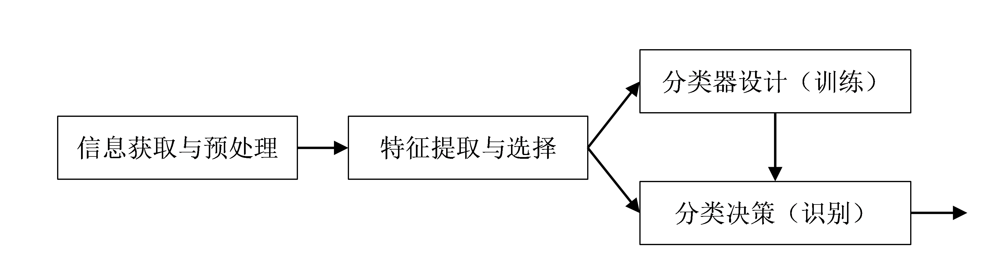
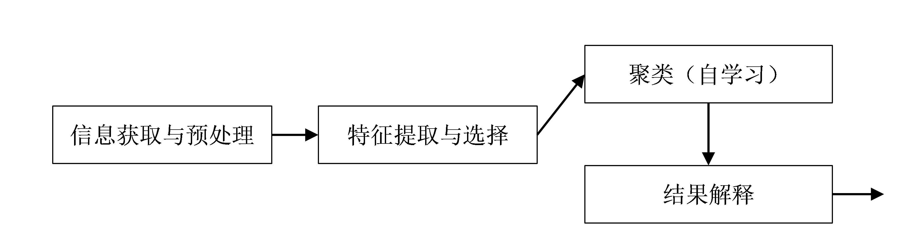

# 概论

## 监督模式识别与非监督模式识别
**监督模式识别：** 存在类别已知的训练样本。
**非监督模式识别：** 不知道要划分为什么类别， 也不存在类别已知的样本。也被称作**聚类**。

## 模式识别系统的典型构成
+ 有已知样本的情况：监督模式识别

    一般步骤：
        1. 分析问题
        2. 原始特征获取
        3. 特征提取与选择
        4. 分类器设计
        5. 分类决策
+ 无已知样本的情况：非监督模式识别

    一般步骤：
        1. 分析问题
        2. 原始特征获取
        3. 特征提取与选择
        4. 聚类分析
        5. 结果解释

