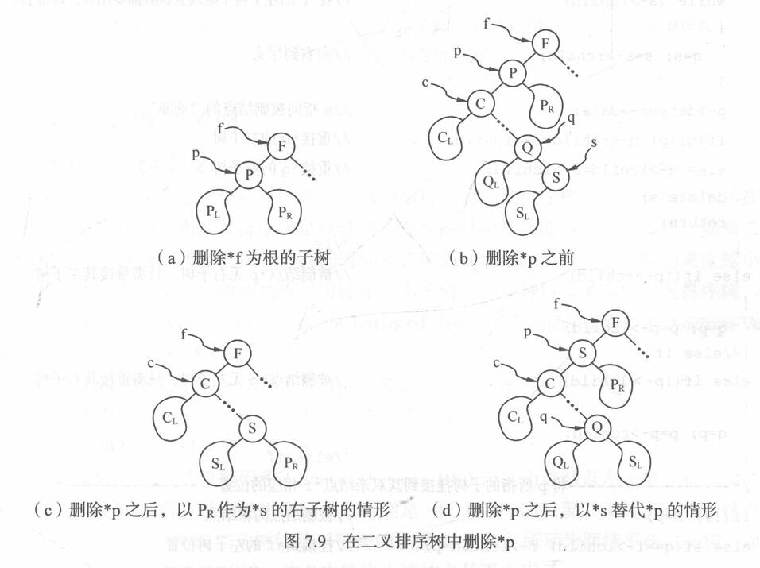
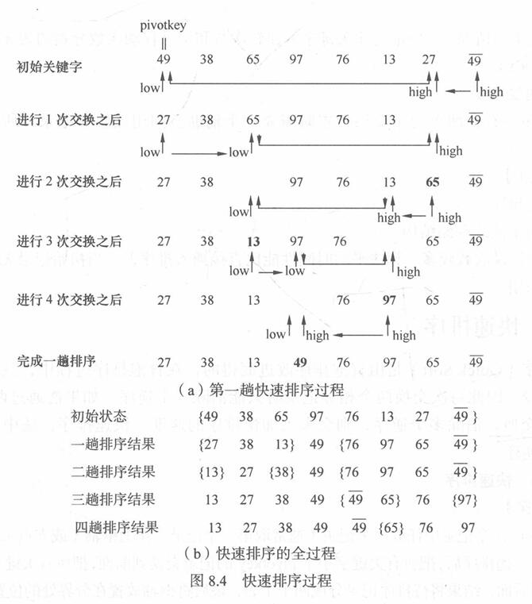
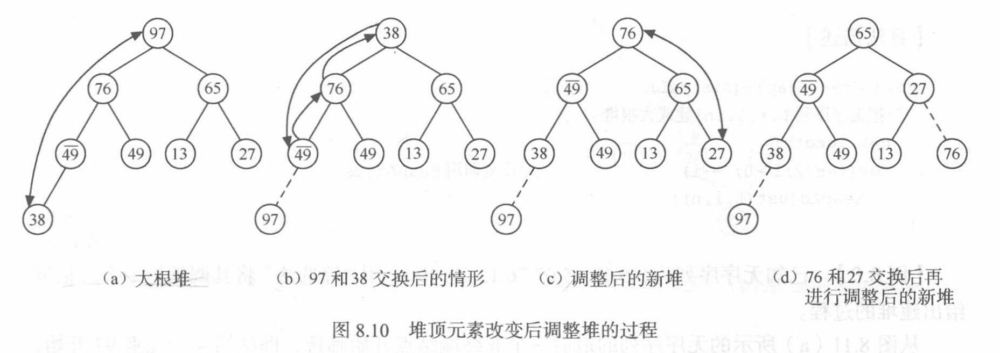
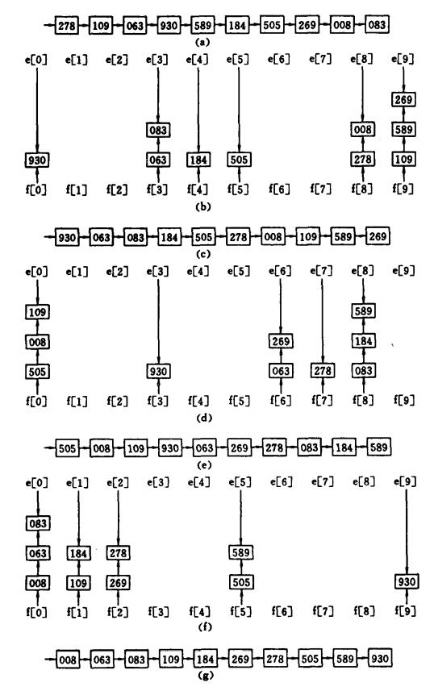

# 内部排序

## 概述

+ **排序**（Sorting）：按关键字的非递减或非递增顺序对一组记录重新进行排列的操作
  + 确切描述如下：
    + 假设含$n$个记录的序列为$\{R_1, R_2, \cdots, R_n\}$，其相应的关键字序列为
      ${K_1, K_2, \cdots, K_n}$；需确定$1, 2, \cdots, n$的一种排列$p_1, p_2, \cdots，p_n$，使其**相应的关键字**满足**非递减（或非递增）关系$K_{p_1} \leqslant K_{p_2} \leqslant \cdots \leqslant K_{p_n}$** ，即使得记录的序列成为一个按关键字有序的序列$\{R_{p_1}, R_{p_2}, \cdots, R_{p_n}\}$
+ 排序的**稳定性**：
  + 假设$K_i = K_j (1 \leqslant i \leqslant n, 1 \leqslant j \leqslant n, i \neq j)$，且在**排序前的序列**中 **$R_i$领先于$R_j$** （即$i < j$）
    + 若在**排序后的序列**中 **$R_i$仍领先于$R_j$** ，则称所用的排序方法是**稳定**的
    + 反之，若**可能**使**排序后的序列**中 **$R_j$领先于$R_i$** ，则称所用的排序方法是**不稳定**的
  + 排序算法的**稳定性**是针对**所有记录**而言的；也就是说，在所有的待排序记录中，**只要有一组关键字的实例不满足稳定性要求**，则**该排序方法**就是**不稳定**的
  + 虽然稳定的排序方法和不稳定的排序方法排序结果不同，但不能说不稳定的排序方法就不好，各有各的适用场合
+ **内部排序**：**待排序记录**全部**存放在计算机内存**中进行排序的过程
  + 根据**逐步扩大记录有序序列长度**的**原则**不同，可以将内部排序分为以下几类：
    + **插入**类：将**无序子序列**中的一个或几个**记录“插入”到有序序列**中，从而增加记录的有序子序列的长度
      + 主要包括**直接插入排序**、**折半插入排序**和**希尔排序**
    + **交换**类：通过 **“交换”无序序列中的记录**从而得到其中**关键字最小或最大的记录**，并将它**加入到有序子序列**中，以此方法增加记录的有序子序列的长度
      + 主要包括**冒泡排序**和**快速排序**
    + **选择**类：从记录的**无序子序列**中 **“选择”关键字最小或最大的记录**，并将它**加入到有序子序列**中，以此方法增加记录的有序子序列的长度
      + 主要包括**简单选择排序**、**树形选择排序**和**堆排序**
    + **归并**类：通过**“归并”两个或两个以上的记录有序子序列**，逐步增加记录有序序列的长度
      + **2-路归并排序**是最为常见的归并排序方法
    + **分配**类：是唯一一类不需要进行关键字之间比较的排序方法，排序时主要利用**分配**和**收集**两种基本操作来完成
      + **基数排序**是主要的分配类排序方法。
+ **外部排序**：**待排序记录**的数量很大，以致内存一次不能容纳全部记录，在**排序过程**中尚需**对外存进行访问**的排序过程
+ **待排序记录**的**存储方式**：
  + **顺序表**：记录之间的次序关系由其存储位置决定，实现排序**需要移动记录**
  + **链表**：记录之间的次序关系由指针指示，实现排序**不需要移动记录**，仅需**修改指针**即可
    + 这种排序方式称为**链表排序**
  + **待排序记录**本身**存储在一组地址连续的存储单元**内，同时**另设一个指示各个记录存储位置的地址向量**，在排序过程中不移动记录本身，而**移动地址向量中这些记录的“地址”**，在排序结束之后再**按照地址向量中的值调整记录的存储位置**
    + 这种排序方式称为**地址排序**
  + 在本章的讨论中，除**基数排序**外，**待排序记录**均按**顺序表**存储，且为了讨论方便，设记录的关键字均为整数
+ 排序算法效率的**评价指标**：
  + **执行时间**：
    + 对于排序操作，**时间**主要消耗在**关键字之间的比较**和**记录的移动**上（这里，只考虑以顺序表方式存储待排序记录），排序算法的**时间复杂度**由**这两个指标决定**
      + 因此可以认为，高效的排序算法的比较次数和移动次数都应该尽可能的少
  + **辅助空间**：
    + **空间复杂度**由排序算法所需的**辅助空间**决定；辅助空间是除了存放待排序记录占用的空间之外，执行算法所需要的其他存储空间
      + **理想的空间复杂度**为$O(1)$，即算法执行期间所需要的辅助空间与待排序的数据量无关

## 插入排序

### 直接插入排序

+ **算法步骤**：
  1. 设待排序的记录存放在数组$r[1 \cdots n]$中，$r[1]$是一个有序序列
  2. 循环$n - 1$次：
     1. 使用 **“顺序查找法”**，查找$r[i] (i = 2, \cdots, n)$在**已排好序的序列$r[1, \cdots, i - 1]$中**的**插入位置**
     2. **将$r[i]$插入表长为$i - 1$的有序序列$r[1, \cdots, i - 1]$**
     3. **直到将$r[n]$插入表长为$n - 1$的有序序列$r[1, \cdots, n - 1]$** ，最后得到一个表长为$n$的有序序列
+ **时间复杂度**：最坏情况关键字比较次数$KCN \approx \frac{n^2}{2}$，记录移动次数$RMN \approx \frac{n^2}{2}$，故**时间复杂度**为$O(n^2)$
+ **空间复杂度**：只需要一个记录的辅助空间$r[0]$，故**空间复杂度**为$O(1)$
+ **特点**：
  + **稳定**排序
  + 算法简便，且容易实现
  + **也适用**于**链式存储结构**，只是**在单链表上无需移动记录**，只需**修改相应的指针**
  + 更适合于**初始记录基本有序（正序）**的情况，当初始记录无序，$n$较大时，此算法时间复杂度较高，不宜采用

### 折半插入排序

+ **算法步骤**：
  1. 设待排序的记录存放在数组$r[1 \cdots n]$中，$r[1]$是一个有序序列
  2. 循环$n - 1$次：
     1. 使用 **“折半查找法”**，查找$r[i] (i = 2, \cdots, n)$在**已排好序的序列$r[1, \cdots, i - 1]$中**的**插入位置**
     2. **将$r[i]$插入表长为$i - 1$的有序序列$r[1, \cdots, i - 1]$**
     3. **直到将$r[n]$插入表长为$n - 1$的有序序列$r[1, \cdots, n - 1]$** ，最后得到一个表长为$n$的有序序列
+ **时间复杂度**：关键字比较次数$KCN \approx \lfloor \log_2 i \rfloor + 1$，记录移动次数（最坏）为$RMN \approx \frac{n^2}{2}$，故**时间复杂度**为$O(n^2)$
+ **空间复杂度**：只需要一个记录的辅助空间$r[0]$，故**空间复杂度**为$O(1)$
+ **特点**：
  + **稳定**排序
  + **只适用**于**顺序存储结构**（需要能够实现折半查找）
  + 更适合于**初始记录无序，$n$较大时**的情况

### 希尔排序

+ **算法步骤**：
  1. 第一趟取增量$d_1 (d_1 < n)$把全部记录分成$d_1$个组，所有间隔为$d_1$的记录分在同一组，在各个组中进行直接插入排序
  2. 第二趟取增量$d_2 (d_2 < d_1)$，重复上述的分组和排序
  3. 依次类推，直到所取的增量$d_t = 1 ( d_t < d_{t - 1} < \cdots < d_2 < d_1)$，所有记录在同一组中进行直接插入排序为止
     
+ **时间复杂度**：当增量大于$1$时，关键字较小的记录就不是一步一步地挪动，而是跳跃式地移动，从而使得在进行最后一趟增量为$1$的插入排序中，序列已基本有序，只要做记录的少量比较和移动即可完成排序，因此希尔排序的**时间复杂度**较**直接插入排序**更**低**
  + 有人指出，当增量序列为$dt[k] = 2^{t - k + 1} - 1$时，希尔排序的时间复杂度为$O(n^{\frac{3}{2}})$，其中$t$为排序趟数，$1 \leqslant k \leqslant t \leqslant \lfloor \log_2 (n + 1) \rfloor$
  + 还有人在大量的实验基础上推出：当$n$在某个特定范围内，希尔排序所需的比较和移动次数约为$n^{1.3}$，当$n \to \infty$时，可减少到$n(\log_2 n)^2$
+ **空间复杂度**：从空间来看，希尔排序和前面两种排序方法一样，也只需要一个辅助空间$r[0]$，**空间复杂度**为$O(1)$
+ **特点**：
  + **稳定**排序
  + **适用**于**链式存储结构**
  + **移动记录次数较多**，**算法平均时间性能**比**直接插入排序差**；当**初始记录无序**， **$n$较大**时，此算法**不宜采用**

## 交换排序

### 冒泡排序

+ **算法步骤**：
  1. 设待排序的记录存放在数组$r[1, \cdots, n]$中：
     1. 首先将**第一个记录的关键字**和**第二个记录的关键字**进行比较，若为**逆序**（即$L.r[1].key > L.r[2].key$），则**交换两个记录**
     2. 然后比较**第二个记录**和**第三个记录**的**关键字**
     3. 依次类推，直至**第$n - 1$个记录和第$n$个记录的关键字进行过比较**为止
        + 上述过程称作**第一趟起泡排序**，其结果使得**关键字最大的记录**被安置到**最后一个记录的位置上**
  2. 然后进行**第二趟起泡排序**，对**前$n - 1$个记录进行同样操作**
     + 其结果是使**关键字次大的记录**被安置到**第$n - 1$个记录的位置上**
  3. 重复上述比较和交换过程，**第$i$趟**是**从$L.r[1]$到$L.r[n - i + 1]$** ；依次**比较相邻两个记录的关键字**，并在 **“逆序” **时**交换相邻记录**
     + 其结果是**这$n - i + 1$个记录中关键字最大的记录**被交换到**第$n - i + 1$的位置上**
  4. 直到在**某一趟排序过程**中**没有进行过交换记录的操作**，说明序列已全部达到排序要求，则**完成排序**
+ **时间复杂度**：最坏情况关键字比较次数$KCN \approx \frac{n^2}{2}$，记录移动次数$RMN \approx \frac{3n^2}{2}$，故**时间复杂度**为$O(n^2)$
+ **空间复杂度**：只需要一个记录的辅助空间$r[0]$，故**空间复杂度**为$O(1)$
+ **特点**：
  + **稳定**排序
  + **适用**于**链式存储结构**
  + **移动记录次数较多**，**算法平均时间性能**比**直接插入排序差**；当**初始记录无序**， **$n$较大**时，此算法**不宜采用**

### 快速排序

+ **算法步骤**：
  1. 在待排序的$n$个记录中**任取一个记录**（通常取**第一个记录**）作为**枢轴**（或支点），设其**关键字**为**pivotkey**
  2. 经过一趟排序后，把所有**关键字小于pivotkey的记录**交换到**前面**，把所有**关键字大于pivotkey的记录**交换到**后面**，结果将**待排序记录分成两个子表**，最后将**枢轴放置在分界处的位置**
     + 每趟排序的具体过程：
       1. 选择待排序表中的**第一个记录**作为**枢轴**，将枢轴记录暂存在$r[0]$的位置上；附设两个指针**low**和**high**，初始时分别指向**表的下界**和**上界**（第一趟时，`low = 1; high = L.length;`）
       2. 从表的**最右侧位置依次向左搜索**，找到**第一个关键字小于枢轴关键字pivotkey的记录**，将其**移到low处**；具体操作是：
          + 当**low < high**时，若**high所指记录**的**关键字大于等于pivotkey**，则**向左移动指针high**（执行操作`--high;`）
          + 否则将**high所指记录**移到**low所指记录**
       3. 然后再从表的**最左侧位置依次向右搜索**，找到**第一个关键字大于pivotkey的记录**和枢轴记录交换；具体操作是：
          + 当**low < high**时，若**low所指记录**的**关键字小于等于pivotkey**，则**向右移动指针low**（执行操作`++low`）
          + 否则将**low所指记录**移到**high所指记录**
       4. **重复步骤2**和**步骤3**，直至**low与high相等**为止；此时**low或high的位置**即为**枢轴在此趟排序中的最终位置**，原表被分成两个子表
  3. 然后，分别**对左、右子表重复上述过程**，直至**每一子表只有一个记录**时，**排序完成**
     
+ **时间复杂度**：
  + **最好情况**为$O(n\log_2 n)$
  + **最坏情况**为$O(n^2)$
  + **平均情况**为$O(n\log_2 n)$
+ **空间复杂度**：快速排序是递归的，执行时需要有一个**栈**来存放相应的数据；**最大递归调用次数**与**递归树的深度**一致，因此
  + **最好情况**下为$O(log_2 n)$
  + **最坏情况**下为$O(n)$
+ **特点**：
  + 记录非顺次的移动导致排序方法是**不稳定**的
  + 排序过程中需要定位表的下界和上界，所以**适合**用于**顺序结构**，很难用于链式结构
  + 当 **$n$较大**时，在**平均情况**下**快速排序**是所有内部排序方法中**速度最快**的一种，所以其适合**初始记录无序**、 **$n$较大**时的情况

## 选择排序

### 简单选择排序

+ **算法步骤**：
  1. 设待排序的记录存放在数组$r[1, \cdots, n]$中
  2. 第一趟**从$r[1]$开始**，通过$n - 1$次比较，从 **$n$个记录**中选出**关键字最小**的记录，**记为$r[k]$** ，**交换$r[1]$和$r[k]$**
  3. 第二趟**从$r[2]$开始**，通过$n - 2$次比较，从 **$n - 1$个记录**中选出**关键字最小**的记录，**记为$r[k]$** ，**交换$r[2]$和$r[k]$**
  4. 依次类推，第$i$趟**从$r[i]$开始**，通过$n - i$次比较，从 **$n - i + 1$个记录**中选出**关键字最小**的记录，**记为$r[k]$** ，**交换$r[i]$和$r[k]$**
  5. 经过$n - 1$趟，排序完成
+ **时间复杂度**：关键字比较次数在任何情况下均相同，为$KCN \approx \frac{n^2}{2}$，记录移动次数（最坏）为$RMN = 3(n - 1)$，故**时间复杂度**为$O(n^2)$
+ **空间复杂度**：只需要一个交换时的记录的辅助空间，故**空间复杂度**为$O(1)$
+ **特点**：
  + **稳定**排序
    + 如果在比较最小值时使用$<$而非$<=$，则比较次数减少，但排序会变得不稳定
  + **适用**于**链式存储结构**
  + **移动记录次数较少**，当**每一记录占用的空间较多**时，此方法比直接插入排序快

### 树形选择排序

+ 又称**锦标赛排序**
+ 每次比较时，首先**对$n$个记录的关键字**进行**两两比较**，然后在**其中$\left\lceil \frac{n}{2} \right\rceil$个较小者之间**再进行**两两比较**，如此重复，直至**选出最小关键字**的记录为止
+ **时间复杂度**：在树形选择排序中，除了最小关键字之外，每选择一个次小关键字仅需进行$\lceil \log_2 n \rceil$次比较，因此，它的**时间复杂度**为$O(n \log_2 n)$

### 堆排序

+ **堆**：$n$个元素的序列$\{k_1, k_2, \cdots, k_n\}$称之为堆，当且仅当满足以下**两个条件之一**时：
  + $k_i \geqslant k_{2i}$且$k_i \geqslant k_{2i + 1}$（其中$1 \leqslant i \leqslant \left\lfloor \frac{n}{2} \right\rfloor$）
  + $k_i \leqslant k_{2i}$且$k_i \leqslant k_{2i + 1}$（其中$1 \leqslant i \leqslant \left\lfloor \frac{n}{2} \right\rfloor$）
+ **调整堆**：**筛选法**
  1. 从$r[2s]$和$r[2s + 1]$中选出**关键字较大**者，**假设$r[2s]$的关键字较大**，比较$r[s]$和$r[2s]$的关键字
     + 若$r[s].\text{key} >= r[2s].\text{key}$，说明**以$r[s]$为根的子树已经是堆**，不必做任何调整
     + 若$r[s].\text{key} < r[2s].\text{key}$，**交换$r[s]$和$r[2s]$**
       + 交换后，**以$r[2s + 1]$为根的子树**仍是**堆**，**如果以$r[2s]$为根的子树不是堆**，则**重复上述过程**，将**以$r[2s]$为根的子树调整为堆**，直至**进行到叶子结点**为止
         
+ **建初堆**：
  + 对于无序序列$r[1, \cdots, n]$，**从$i = \frac{n}{2}$开始**，反复调用**筛选法$\text{HeapAdjust}(L, i, n)$** ，依次将**以$r[i], r[i - 1], \cdots, r[1]$为根的子树**调整为**堆**
+ **算法步骤**：
  1. 按**堆的定义**将**待排序序列$r[1, \cdots, n]$调整为大根堆**（这个过程称为**建初堆**）
  2. **交换$r[1]$和$r[n]$** ，则$r[n]$为**关键字最大的记录**；将$r[1, \cdots, n]$重新调整为堆
  3. **交换$r[1]$和$r[n - 1]$** ，则$r[n - 1]$为**关键字次大的记录**
  4. **循环$n - 1$次**，直到**交换了$r[1]$和$r[2]$为止**，得到了一个非递减的有序序列$r[1, \cdots, n]$
+ **时间复杂度**：最坏情况下**时间复杂度**为$O(n \log_2 n)$，**平均性能接近最坏性能**
+ **空间复杂度**：只需要一个交换时的记录的辅助空间，故**空间复杂度**为$O(1)$
+ **特点**：
  + **不稳定**排序
  + **只适用**于**顺序存储结构**
  + 初始建堆所需的比较次数较多，因此**记录数较少**时**不宜采用**
  + 堆排序在**最坏情况**下**时间复杂度**为$O(nlog_2 n)$，相对于快速排序最坏情况下的$O(n^2)$而言是一个优点，当**记录较多**时较为**高效**

## 归并排序

+ **$\text{Merge}$归并算法**的**算法步骤**：
  1. 设两个有序表存放在同一数组中相邻的位置上：$R[\text{low}, \cdots, \text{mid}]$和$R[\text{mid} + 1, \cdots, \text{high}]$
  2. 每次分别**从两个表中取出一个记录**进行**关键字的比较**，将**较小者放入$T[\text{low}, \cdots, \text{high}]$中**
  3. **重复此过程**，直至**其中一个表为空**，最后**将另一非空表中余下的部分**直接**复制到$T$** 中
+ **2-路归并排序**的**算法步骤**：
  1. 将$R[\text{low}, \cdots, \text{high}]$中的记录归并排序后放入$T[\text{low}, \cdots, \text{high}]$中，当**序列长度等于$1$时**，**递归结束**，**否则**：
     1. 将**当前序列一分为二**，求出分裂点$\text{mid} = \left\lfloor \frac{\text{low} + \text{high}}{2} \right\rfloor$
     2. 对**子序列$R[\text{low}, \cdots, \text{mid}]$递归**，进行归并排序，结果放入$S[\text{low}, \cdots, \text{mid}]$中
     3. 对**子序列$R[\text{mid} + 1, \cdots, \text{high}]$递归**，进行归并排序，结果放入$S[\text{mid} + 1, \cdots, \text{high}]$中
     4. **调用算法$\text{Merge}$** ，将**有序的两个子序列$S[\text{low}, \cdots, \text{mid}]$和$S[\text{mid} + 1, \cdots, \text{high}]$归并**为一个**有序的序列$T[\text{low}, \cdots, \text{high}]$**
+ **时间复杂度**：$O(n \log_2 n)$
+ **空间复杂度**：用顺序表实现归并排序时，需要和待排序记录个数相等的辅助存储空间，所以**空间复杂度**为$O(n)$
+ **特点**：
  + **稳定**排序
  + **适用**于**链式存储结构**，且**不需要附加存储空间**（但递归实现时仍需要开辟相应的递归工作栈）

## 基数排序

### 多关键字的排序

+ 假设有$n$个记录的序列$\{R_1, R_2, \cdots, R_n\}$，每个记录$R_i$含有$d$个关键字$(K_i^0, K_i^1, \cdots, K_i^{d - 1})$，且对于序列中任意两个记录$R_i$和$R_j$（这里$1 \leqslant i < j \leqslant n$）都满足$(K_i^0, K_i^1, \cdots, K_i^{d - 1}) < (K_j^0, K_j^1, \cdots, K_j^{d - 1})$，则称：**序列$\{R_1, R_2, \cdots, R_n\}$对关键字$(K^0, K^1, \cdots, K^{d - 1})$有序**
  + 这里$K^0$称为**最主位关键字**，$K^{d - 1}$称为**最次位关键字**
+ 为实现多关键字排序，通常有两种方法：
  + **最高位优先**（Most Significant Digit first）法，简称**MSD法**：
    1. 对**最主位关键字$K^0$进行排序**，将**序列分成若干子序列**，**每个子序列中的记录都具有相同的$K^0$值**
    2. 分别**就每个子序列对关键字$K^1$进行排序**，按$K^1$值不同再分成若干更小的子序列
    3. **依次重复**，直至**对$K^{d - 2}$进行排序之后**，得到的每一子序列中的记录都**具有相同的关键字$(K^0, K^1, \cdots, K^{d - 2})$**
    4. 分别**就每个子序列对关键字$K^{d - 1}$进行排序**
    5. 最后**将所有子序列依次联接在一起**成为一个有序序列
  + **最低位优先**（Least Significant Digit first）法，简称**LSD法**：
    1. 从**最次位关键字$K^{d - 1}$** 开始进行排序
    2. 再对高一位的关键字$K^{d - 2}$进行排序
    3. **依次重复**，直至**对$K^0$进行排序**后便成为一个有序序列
  + 比较：
    + 若按**MSD**进行排序，必须将**序列**逐层**分割成若干子序列**，然后对各子序列分别进行排序；而按**LSD**进行排序时，**不必分成子序列**，对**每个关键字**都是**整个序列参加排序**，但对$K^i (0 \leqslant i \leqslant d - 2)$进行排序时，只能用**稳定的排序方法**
    + 按**LSD**进行排序时，在一定的条件下（即对**前一个关键字$K^i (0 \leqslant i \leqslant d - 2)$的不同值**，**后一个关键字$K^{i + 1}$** 均**取相同值**），也可以**不利用**前几节所述各种通过**关键字间的比较**来实现排序的方法，而是通过**若干次“分配”和“收集”** 来实现排序

### 链式基数排序

+ 基数排序是借助 **“分配”** 和 **“收集”** 两种操作对**单逻辑关键字**进行排序的一种内部排序方法
+ 有的逻辑关键字可以看成由若干个关键字复合而成的
  + 例如，若关键字$K$是数值，且其值都在$0 \leqslant K \leqslant 999$范围内，则可把每一个十进制数字看成一个关键字，即可认为$K$由$3$个关键字$(K^0, K^1, K^2)$组成，其中$K^0$是百位数，$K^1$是十位数，$K^2$是个位数
  + 由于如此分解而得的**每个关键字$K^j$都在相同的范围内**（对数字，$0 \leqslant K^j \leqslant 9$，对字母$'A' \leqslant K^j \leqslant 'Z'$），则按**LSD**进行排序更为方便，只要**从最低数位关键字**起，按**关键字的不同值**将**序列中记录“分配”到RADIX个队列**中后再 **“收集”之**，如此**重复$d$次**
    + 按这种方法实现排序称之为**基数排序**，其中 **“基”** 指的是**RADIX的取值范围**，在上述两种关键字的情况下，它们分别为“10”和“26”
+ 用**链式基数排序**对**三位数**进行排序：
  1. 首先以**静态链表**存储$n$个待排记录，并令**表头指针**指向**第一个记录**，
  2. **第一趟分配**：**最低数位关键字**（**个位数**）进行，**改变记录的指针值**将**链表中的记录分配至$10$个链队列**中去，**每个队列**中的**记录关键字的个位数相等**
  3. **第一趟收集**：是**改变所有非空队列的队尾记录**的**指针域**，令其**指向下一个非空队列的队头记录**，重新**将$10$个队列中的记录依次**从**队尾出队**，并**链成一个链表**
  4. **第二趟分配**，**第二趟收集**及**第三趟分配**和**第三趟收集**分别是对十位数和百位数进行的，其过程和个位数相同；至此排序完毕
     + 在下图中，用`e[i]`和`f[i]`表示第`i`个队列的头指针和尾指针
       
     + 对于$n$个记录（假设每个记录含$d$个关键字，每个关键字的取值范围为rd个值）进行**链式基数排序**的**时间复杂度**为$O(d(n + rd))$
       + **每一趟分配**的**时间复杂度**为$O(n)$
       + **每一趟收集**的**时间复杂度**为$O(rd)$，整个排序需**进行$d$趟分配和收集**
     + 所需**辅助空间**为$2rd$个队列指针
