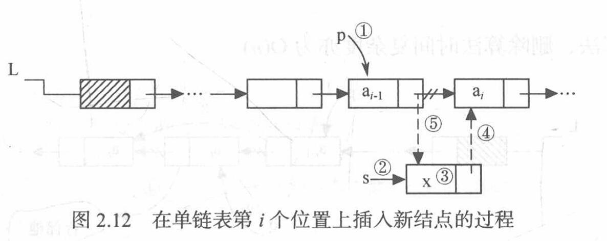
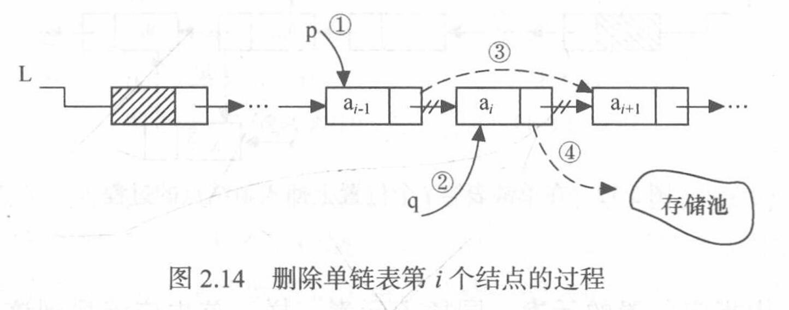
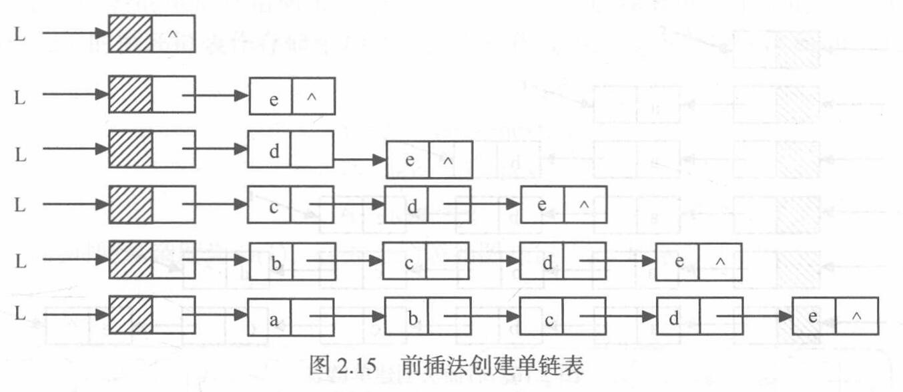
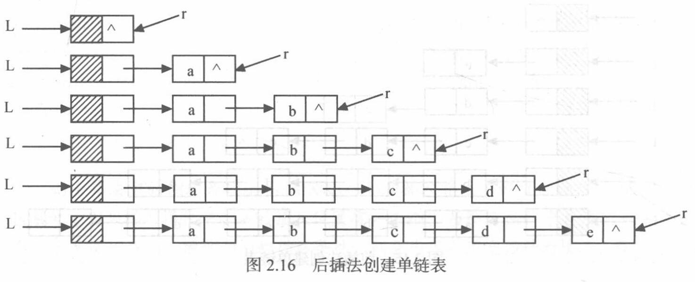
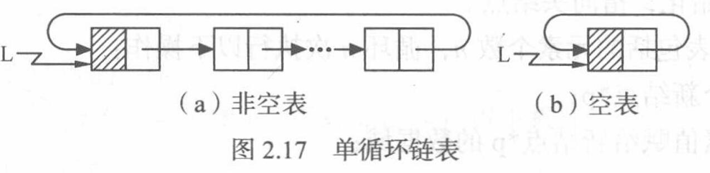
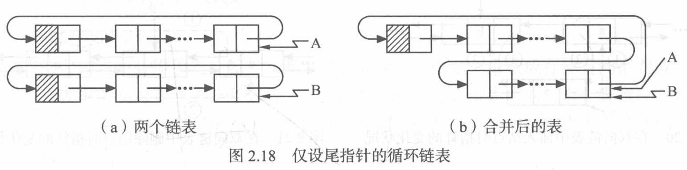

# 线性表

## 线性表的定义和特点

+ **线性表**：由$n(n\geqslant 0)$个**数据特性相同的元素**构成的**有限序列**
+ 线性表中元素的个数$n(n\geqslant 0)$定义为**线性表的长度**，$n=0$时称为**空表**
+ 对于非空的线性表或线性结构，其**特点**是：
  + 存在**唯一**的一个被称作**“第一个”**的数据元素
  + 存在**唯一**的一个被称作**“最后一个”**的数据元素
  + **除第一个之外**，结构中的每个数据元素均**只有一个前驱**
  + **除最后一个之外**，结构中的每个数据元素均**只有一个后继**

## 线性表的类型定义

+ 线性表的**抽象数据类型性定义**： 
  ```C
  ADT List{
    数据对象: D = {a(i) | a(i)∈ElemSet, i = 1,2,…,n, n≥0}
    基本操作：
      InitList(&L)
        操作结果: 构造一个空的线性表L
      DestroyList(&L)
        初始条件: 线性表已存在
        操作结果: 销毁线性表L
      clearList(&L)
        初始条件: 线性表L已存在
        操作结果: 将L重置为空表
      ListEmpty(L)
        初始条件: 线性表L已存在
        操作结果: 若L为空表，则返回true，否则返回false
      ListLength(L)
        初始条件: 线性表L已存在
        操作结果: 返回L中数据元素个数
      GetElem(L, i, &e)
        初始条件: 线性表L已存在,且1≤i≤ListLength(L)
        操作结果: 用e返回L中第i个数据元素的值
      LocateElem(L, e)
        初始条件: 线性表L已存在
        操作结果: 返回L中第1个值与e相同的元素在L中的位置；若这样的数据元素  不存在，则返  回值为0
      PriorElem(L, cur_e, &pre_e)
        初始条件: 线性表L已存在
        操作结果: 若cur_e是L的数据元素，且不是第一个，则用pre_e返回其前  驱，否则操作失  败，pre_e无定义
      NextElem(L, cur_e, &next_e)
        初始条件: 线性表L已存在
        操作结果: 若cur_e是L的数据元素，且不是最后一个，则用next_e返回其后  继，否则操作  失败，next_e无定义
      ListInsert(&L, i, e)
        初始条件: 线性表L已存在，且1≤i≤ListLength(L)+1
        操作结果: 在L中第i个位置之前插入新的数据元素e，L的长度加1
      ListDelete(&L, i)
        初始条件: 线性表L已存在且非空，且1≤i≤ListLength(L)
        操作结果: 删除L的第i个数据元素，L的长度减1
      TraverseList(L)
        初始条件: 线性表L已存在
        操作结果: 对线性表L进行遍历，在遍历过程中对L的每个结点访问一次
  }ADT List
  ```

## 线性表的顺序表示和实现

+ **线性表的顺序表示**指的是**用一组地址连续的存储单元依次存储线性表的数据元素**，这种表示也称作线性表的**顺序存储结构**或**顺序映像**
  + 通常，称这种存储结构的线性表为**顺序表**（Sequential List）
  + 其特点是，逻辑上相邻的数据元素，其物理次序也是相邻的
  + **只要确定了存储线性表的起始位置，线性表中任一数据元素都可随机存取**，所以线性表的顺序存储结构是一种**随机存取**的存储结构

### 顺序表中基本操作的实现

+ 顺序表的**初始化**：
  1. 为顺序表L动态分配一个预定义大小的数组空间，使elem指向这段空间的基地址
  2. 将表的当前长度设为0
+ 顺序表的**按序号查找（取值）**：**时间复杂度**为$O(1)$
  1. 判断指定的位置序号i值是否合理（1≤i≤L.length），若不合理，则返回ERROR
  2. 若i值合理，则将第i个数据元素L.elem[i-1]赋给参数e，通过e返回第i个数据元素的传值
+ 顺序表的**按值查找**：**时间复杂度**最好$O(1)$，最坏$O(n)$，平均$O(n)$
  1. 从第一个元素起，依次和e相比较，若找到与e相等的元素L.elem[i]，则查找成功，返回该元素的序号i+1
  2. 若查遍整个顺序表都没有找到，则查找失败，返回0
+ 顺序表的**插入**：**时间复杂度**最好$O(1)$，最坏$O(n)$，平均$O(n)$
  1. 判断插入位置i是否合法（i值的合法范围是1≤i≤n+1），若不合法则返回ERROR
  2. 判断顺序表的存储空间是否已满，若满则返回ERROR
  3. 将第n个至第i个位置的元素依次向后移动一个位置，空出第i个位置（i=n+1时无需移动）
  4. 将要插入的新元素e放入第i个位置
  5. 表长加1
+ 顺序表的**删除**：**时间复杂度**最好$O(1)$，最坏$O(n)$，平均$O(n)$
  1. 判断删除位置i是否合法（合法值为1≤i≤n），若不合法则返回ERROR
  2. 将第i+1个至第n个的元素依次向前移动一个位置（i=n时无需移动）
  3. 表长减1


## 线性表的链式表示和实现

### 单链表的定义和表示

+ 线性表链式存储结构的特点是：用一组任意的存储单元存储线性表的数据元素（这组存储单元可以是连续的，也可以是不连续的）；因此，为了表示每个数据元素a<sub>i</sub>与其直接后继数据元素a<sub>i+1</sub>之间的逻辑关系，对数据元素a<sub>i</sub>来说，除了存储其本身的信息之外，还需存储一个指示其直接后继的信息（即直接后继的存储位置）
  + 这两部分信息组成数据元素a<sub>i</sub>的存储映像，称为**结点**；结点包括两个**域**
  + 存储**数据元素信息**的域称为**数据域**
  + 存储**直接后继存储位置**的域称为**存储域**
  + 由于此链表的**每个结点中只包含一个指针域**，故又称**线性链表**或**单链表**
+ **首元结点**：链表中**存储第一个数据元素$a_1$的结点**头
+ **头结点**：在首元结点之前附设的一个结点，其**指针域指向首元结点**
  + 头结点的数据域可以不存储任何信息，也可存储与数据元素类型相同的其他附加信息；例如，当数据元素为整数型时，头结点的数据域中可存放该线性表的长度
+ **头指针**：**指向链表中第一个结点的指针**
  + 若链表设有头结点，则头指针所指结点为线性表的头结点
  + 若链表不设头结点，则头指针所指结点为该线性表的首元结点

### 单链表基本操作的实现

+ 单链表的**初始化**：
  1. 生成新结点作为头结点，用头指针L指向头结点
  2. 头结点的指针域置空
+ 单链表的**求表长**：**时间复杂度**为$O(n)$
  1. 用指针p指向首元结点，用j做计数器初值赋为1
  2. 从首元结点开始依次顺着链域next向下访问，只要指向当前结点的指针p不为空（NULL），并且没有到达序号为i的结点，则循环执行以下操作：
    1. p指向下一个结点
    2. 计数器j相应加1
  5. 退出循环时：
       + 如果指针p为空，则表长为0
       + 如果指针p不为空，则表长为计数器j的值
+ 单链表的**按序号查找（取值）**：**时间复杂度**为$O(n)$
  1. 用指针p指向首元结点，用j做计数器初值赋为1
  2. 从首元结点开始依次顺着链域next向下访问，只要指向当前结点的指针p不为空（NULL），并且没有到达序号为i的结点，则循环执行以下操作：
    1. p指向下一个结点
    2. 计数器j相应加1
  5. 退出循环时：
       + 如果指针p为空，或者计数器j大于i，说明指定的序号i值不合法（i大于表长n或i小于等于0），取值失败返回ERROR
       + 如果指针p不为空，则取值成功，此时j=i时，p所指的结点就是要找的第i个结点，用参数e保存当前结点的数据域，返回OK
+ 单链表的**按值查找**：**时间复杂度**为$O(n)$
  1. 用指针p指向首元结点
  2. 从首元结点开始依次顺着链域next向下查找，只要指向当前结点的指针p不为空，并且p所指结点的数据域不等于给定值e，则循环执行以下操作:p指向下一个结点
  3. 返回p：
       + 若查找成功，p此时即为结点的地址值
       + 若查找失败，p的值即为NULL
+ 单链表的**插入**（将值为e的新结点插入到表的第i个结点的位置上，即插入到结点 a<sub>i-1</sub>与a<sub>i</sub>之间）：**时间复杂度**为$O(n)$
  1. 查找结点a<sub>i-1</sub>并由指针p指向该结点
  2. 生成一个新结点\*s
  3. 将新结点\*s的数据域置为e
  4. 将新结点\*s的指针域指向结点a<sub>i</sub>
  5. 将结点\*p的指针域指向新结点*s
     
+ 单链表的**删除**（删除第i个结点a<sub>i</sub>）：**时间复杂度**为$O(n)$
  1. 查找结点a<sub>i-1</sub>并由指针p指向该结点
  2. 临时保存待删除结点a<sub>i</sub>的地址在q中，以备释放
  3. 将结点\*p的指针域指向a的直接后继结点
  4. 释放结点a<sub>i</sub>的空间
  
+ 单链表的**删除结点\*p**：**时间复杂度**为$O(1)$，前提是\*p不是尾结点
  1. 将指针q指向结点\*p的直接后继
  2. 将结点\*p的数据域赋值为结点\*q的数据域
  3. 将结点\*p的指针域赋值为结点\*q的直接后继的指针域
  4. 释放结点*q的空间
+ 单链表的**建立**：
  + 使用**前插法（头插法）**：**时间复杂度**为$O(n)$
  1. 创建一个只有头结点的空链表
  2. 根据待创建链表包括的元素个数n，循环n次执行以下操作：
    1. 生成一个新结点\*p
    2. 输入元素值赋给新结点\*p的数据域
    3. 将新结点\*p插入到头结点之后
      
  + 使用**后插法（尾插法）**：**时间复杂度**为$O(n)$
    1. 创建一个只有头结点的空链表
    2. 尾指针r初始化，指向头结点
    3. 根据创建链表包括的元素个数n，循环n次执行以下操作：
    4. 生成一个新结点\*p
    5. 输入元素值赋给新结点\*p的数据域
    6. 将新结点\*p插入到尾结点\*r之后
    7. 尾指针r指向新的尾结点\*p
    

### 循环链表

#### 循环单链表

+ **循环链表**（Circular Linked List）：表中**最后一个结点的指针域指向头结点**，整个链表形成一个环；由此，从表中任一结点出发均可找到表中其他结点
  
+ 循环单链表的操作和单链表基本一致，差别仅在于当**链表遍历**时，**判别当前指针p是否指向表尾结点的终止条件**不同
  + 在单链表中，判别条件为p!=NULL或p->next!=NULL
  + 在循环单链表中，判别条件为p!=L或p->next!=L
+ 在某些情况下，若**在循环链表中设立尾指针**而不设头指针，可使一些操作简化
  + 例：将两个线性表合并成一个表时，仅需将第一个表的尾指针指向第二个表的第一个结点，第二个表的尾指针指向第一个表的头结点，然后释放第二个表的头结点；整个过程只需要$O(1)$时间复杂度
  
  + 例：头指针向表尾插入元素需要$O(n)$时间复杂度（遍历整个线性表找到表尾），而尾指针向表尾和表头（表尾的后继）插入元素都只需要$O(1)$时间复杂度

#### 循环双链表

+ 在**循环双链表**中，除了基本的循环链表（表尾结点的next指针指向表头）和双链表（prior指针指向直接前驱）特征，**头结点的prior指针还要指向表尾结点**

### 双向链表

+ 在单链表中，查找直接后继结点的执行时间为$O(1)$，而查找直接前驱的执行时间为$O(n)$，解决这个问题可以使用**双向链表**
+ 在双向链表的结点中有两个指针域，**一个指向直接后继**，**另一个指向直接前驱**
+ 双向链表的操作：
  + 双向链表的**插入**：
    1. 查找结点a<sub>i</sub>并由指针p指向该结点
    2. 生成一个新结点\*s
    3. 将新结点\*s的数据域置为e
    4. 将新结点\*s的直接前驱指向结点a<sub>i-1</sub>（即p的直接前驱）
    5. 将新结点\*s的直接后继指向结点a<sub>i</sub>（即p）
    6. 将结点\*p的直接前驱指向新结点*s
    7. 将结点a<sub>i-1</sub>的直接后继指向新结点*s
  + 双向链表的**删除**：
    1. 查找结点a<sub>i</sub>并由指针p指向该结点
    2. 将结点\*p的直接前驱的直接后继指向*p的直接后继
    3. 将结点\*p的直接后继的直接前驱指向*p的直接前驱
    4. 释放结点*p的空间

### ※ 静态链表

+ **静态链表**：用数组来描述线性表的链式存储结构，结点也有数据域和指针域，但此处指针是结点在数组中的相对地址（数组下标），又称**游标**；和顺序表一样，静态链表也要预先分配一块连续的存储空间
+ 静态链表一般以next==-1作为其结束的标志

### 顺序表和链表的比较

#### 空间性能的比较

+ **存储空间的分配**：
  + **顺序表的存储空间**必须**预先分配**，元素个数扩充受一定限制，易造成存储空间浪费或空间溢出现象
  + **链表不需要为其预先分配空间**，只要内存空间允许，链表中的元素个数就没有限制
  + 基于此，当**线性表的长度变化较大，难以预估存储规模**时，宜采用**链表**作为存储结构
+ **存储密度的大小**：
  + **存储密度**：数据元素本身所占用的存储量和整个结点结构所占用的存储量之比，即$$\text{存储密度} = \frac{\text{数据元素本身占用的存储量}}{\text{结点结构占用的存储量}}$$存储密度越大，存储空间的利用率就越高
  + **顺序表**的存储密度为$1$
  + **链表**的存储密度**小于$1$**
  + **如果每个元素数据域占据的空间较小**，则**指针的结构性开销就占用了整个结点的大部分空间**，这样存储密度较小
  + 例如，若单链表的结点数据均为整数，指针所占用的空间和整型量相同，则单链表的存储密度为$0.5$；因此，如果不考虑顺序表中的空闲区，则顺序表的存储空间利用率为$100\%$，而单链表的存储空间利用率仅为$50\%$
  + 当**线性表的长度变化不大，易于事先确定其大小**时，为了节约存储空间，宜采用**顺序表**作为存储结构

#### 时间性能的比较

+ **存取元素的效率**：
  + **顺序表**是由数组实现的，它是一种**随机存取结构**，指定任意一个位置序号i，都可以**在$O(1)$时间内**直接存取该位置上的元素，即取值操作的效率高
  + **链表**是一种**顺序存取结构**，按位置访问链表中第i个元素时，只能从表头开始依次向后遍历链表，直到找到第i个位置上的元素，**时间复杂度为$O(n)$** ，即取值操作的效率低
  + 基于此，若**线性表的主要操作是和元素位置紧密相关的这类取值操作**，且**很少做插入或删除**时，宜采用顺序表作为存储结构
+ **插入和删除操作的效率**：
  + 对于**链表**，在**确定插入或删除的位置**后，插入或删除操作**无需移动数据，只需要修改指针**，**时间复杂度为$O(1)$**
  + 对于**顺序表**，进行**插入或删除**时，**平均要移动表中近一半的结点**，**时间复杂度为$O(n)$** ；尤其是当每个结点的信息量较大时，移动结点的时间开销就相当可观
  + 基于此，对于**频繁进行插入或删除操作的线性表**，宜采用**链表**作为存储结构

## 一元多项式的表示及相加

+ 一元多项式的表示使用稀疏表示法，即每一项数据包含$(p_i, e_i)$，其中$p_i$为**非零项系数**（$p_i \neq 0$），$e_i$为**指数**
+ 在顺序表的使用上，使用**链式表示**能简化合并过程（合并过程为$O(1)$时间复杂度）
+ 多项式的**创建**：
  1. 创建一个只有头结点的空链表
  2. 根据多项式的项的个数n，循环n次执行以下操作
    1. 生成一个新结点\*s
    2. 输入多项式当前项的系数和指数赋给新结点\*s的数据域
    3. 设置一前驱指针pre，用于指向待找到的第一个大于输入项指数的结点的前驱，pre初值指向头结点
    4. 指针q初始化，指向首元结点
    5. 循链向下逐个比较链表中当前结点与输入项指数，找到第一个大于输入项指数的结点\*q
    6. 将输入项结点\*s插入到结点\*q之前
+ 多项式的**相加**：
  1. 指针p1和p2初始化，分别指向Pa和Pb的首元结点
  2. p3指向和多项式的当前结点，初值为Pa的头结点
  3. 当指针p1和p2均未到达相应表尾时，则循环比较p1和p2所指结点对应的指数值（p1->expn与p2->expn），有下列3种情况：
    + 当p1->expn等于p2->expn时，则将两个结点中的系数相加，若和不为零，则修改p1所指结点的系数值，同时删除，p2所指结点，若和为零，则删除p1和p2所指结点
    + 当p1->expn小于 p2->expn时，则应摘取p1所指结点插入到“和多项式”链表中去
    + 当p1->expn大于p2->expn时，则应摘取p2所指结点插入到“和多项式”链表中去
  4. 将非空多项式的剩余段插入到p3所指结点之后
  5. 释放Pb的头结点
+ 多项式的**相乘**：转化为多个多项式的相加$$\begin{aligned}M(x) =& A(x) \times B(x) \\ =& A(x) \times (b_1x^{e_1} + b_2x^{e_2} + \cdots + b_nx^{e_n}) \\ =& \sum\limits_{i = 1}^n b_i A(x) x^{e_i} \end{aligned}$$
