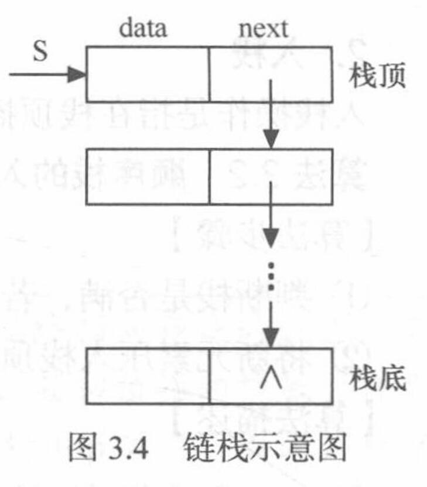
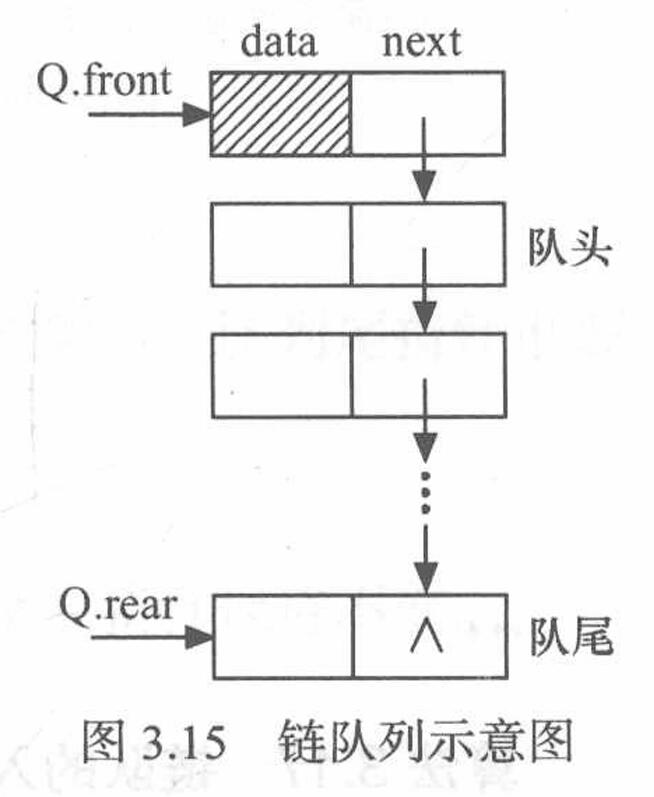

# 栈和队列

## 栈

### 抽象数据类型栈的定义

+ **栈**（stack）是**限定仅在表尾进行插人或删除操作**的**线性表**；因此，对栈来说，**表尾端**有其特殊含义，称为**栈顶**（top），相应地，**表头端**称为**栈底**（bottom）；**不含元素的空表**称为**空栈**
  + 栈又称为**后进先出**（Last In First Out，LIFO）的线性表
+ 栈的**抽象数据类型性定义**：
  ```C
  ADT Stack{
    数据对象：D = {a[i]|a[i]∈ElemSet, i=1,2,…,n, n≥0}
    数据关系：R = {<a[i-1],a[i]>|a[i-1], a[i]∈D, i=2,…,n}
        约定a[n]端为栈顶，a[1]端为栈底
    基本操作：
      Initstack(&S)
        操作结果：构造一个空栈S
      DestroyStack(&S)
        初始条件：栈S已存在
        操作结果：栈S被销毁
      clearstack(&S)
        初始条件：栈S已存在
        操作结果：将s清为空栈
      StackEmpty(S)
        初始条件：栈S已存在
        操作结果：若栈S为空栈，则返回true，否则返回false
      StackLength(S)
        初始条件：栈S已存在
        操作结果：返回s的元素个数，即栈的长度
      GetTop(S)
        初始条件：栈S已存在且非空
        操作结果：返回s的栈顶元素,不修改栈顶指针
      Push(&S, e)
        初始条件：栈S已存在
        操作结果：插人元素e为新的栈顶元素
      Pop(&S, &e)
        初始条件：栈S已存在且非空
        操作结果：删除S的栈顶元素，并用e返回其值
      stackTraverse(S)
        初始条件：栈S已存在且非空
        操作结果：从栈底到栈顶依次对s的每个数据元素进行访问
  }ADT Stack
  ```

### 栈的表示和实现

#### 顺序栈的表示和实现

+ **顺序栈**：指**利用顺序存储结构实现的栈**，即利用一组地址连续的存储单元依次存放自栈底到栈顶的数据元素，同时**附设指针top指示栈顶元素在顺序栈中的位置**
  + 通常习惯的做法是：以top=0表示空栈，鉴于C语言中数组的下标约定从0开始，则当以C语言作描述语言时，如此设定会带来很大不便，因此**另设指针 base**指示**栈底元素在顺序栈中的位置**；当**top和base的值相等**时，表示**空栈**
+ 顺序栈的定义如下：

  ```C
  #define MAXSIZE 100
  typedef struct {
    SElemType *base;
    SElemType *top;
    int stacksize;
  }SqStack;
  ```

+ 顺序栈的**初始化**：
  1. 为顺序栈动态分配一个最大容量为MAXSIZE的数组空间，使base指向这段空间的基地址，即栈底
  2. 栈顶指针top初始为base，表示栈为空
  3. stacksize置为栈的最大容量MAXSIZE
+ **入栈**：
  1. 判断栈是否满，若满则返回ERROR
  2. 将新元素压入栈顶，栈顶指针加1
+ **出栈**：
  1. 判断栈是否空，若空则返回ERROR
  2. 栈顶指针减1，栈顶元素出栈
+ **取栈顶元素**：
  1. 当栈非空时，此操作返回当前栈顶元素的值，栈顶指针保持不变

##### ※ 共享栈

+ 利用栈底位置相对不变的特性，可**让两个顺序栈共享一个一维数组空间**，将两个栈的**栈底**分别设置在**共享空间的两端**，两个**栈顶**向**共享空间的中间延伸**
  + 仅当两个栈顶指针相邻时，判断为栈满

#### 链栈的表示和实现

+ **链栈**：指采用**链式存储结构实现的栈**；通常链栈用**单链表**来表示
  
+ 链栈的定义如下：

  ```C
  typedef struct StackNode{
    ElemType data;
    struct StackNode *next;
  }StackNode, *LinkStack;
  ```

+ 链栈的**初始化**：
  1. 直接将栈顶指针置空
+ **入栈**：
  1. 为入栈元素e分配空间，用指针p指向
  2. 将新结点数据域置为e
  3. 将新结点插入栈顶
  4. 修改栈顶指针为p
+ **出栈**：
  1. 判断栈是否为空，若空则返回 ERROR
  2. 将栈顶元素赋给e
  3. 临时保存栈顶元素的空间，以备释放
  4. 修改栈顶指针，指向新的栈顶元素
  5. 释放原栈顶元素的空间
+ **取栈顶元素**：
  1. 当栈非空时，此操作返回当前栈顶元素的值，栈顶指针保持不变

### 出栈次序的数量

+ 一个栈（无穷大）有$n$个不同元素进栈，则**出栈序列的个数**为**Catalan数：$\frac{1}{n + 1}\binom{2n}{n}$**

## 栈的应用举例（略）

### 数制转换（略）
### 括号匹配的检验（略）

### 行编辑程序（略）

### 迷宫求解（略）

### 表达式求值（略）

## 栈与递归的实现

### 采用递归算法解决的问题

+ 所谓递归是指，若**在一个函数、过程或者数据结构定义的内部又直接（或间接）出现定义本身的应用**，则称它们是**递归**的，或者是**递归定义**的
  + 在以下三种情况下，常常使用递归的方法：
    + **定义**是递归的
      + 如：阶乘
    + **数据结构**是递归的
      + 如：链表
    + **问题的解法**是递归的
      + 如：Hanoi塔问题

### 递归过程与递归工作栈

+ 通常，当在一个函数的运行期间调用另一个函数时，
  + 在运行被调用函数之前，系统需先完成3件事：
    + 将所有的实参、返回地址等信息传递给被调用函数保存
    + 为被调用函数的局部变量分配存储区
    + 将控制转移到被调函数的入口
  + 而从被调用函数返回调用函数之前，系统也应完成3件工作：
    + 保存被调函数的计算结果
    + 释放被调函数的数据区
    + 依照被调函数保存的返回地址将控制转移到调用函数
  + 当**有多个函数构成嵌套调用**时，按照 **“后调用先返回”的原则**，上述函数之间的信息传递和控制转移必须通过“栈”来实现，即**系统将整个程序运行时所需的数据空间安排在一个栈中**：
    + 每当**调用一个函数**时，就**为它在栈顶分配一个存储区**
    + 每当**从一个函数退出**时，就**释放它的存储区**
    + 当前**正运行的函数的数据区必在栈顶**
+ 和每次调用相关的一个重要概念是递归函数运行的“层次”：
  + 假设调用该递归函数的主函数为第0层，则从主函数调用递归函数为进入第1层
  + 从第i层递归调用本函数为进人“下一层”，即第i+1层
  + 反之，退出第i层递归应返回至“上一层”，即第i-1层

### 递归算法的效率分析

#### 时间复杂度的分析

+ 在算法分析中，当一个算法中包含递归调用时，其时间复杂度的分析可以转化为一个**递归方程求解**
  + **迭代法**是求解递归方程的一种常用方法，其基本步骤是**迭代地展开递归方程的右端**，使之**成为一个非递归的和式**，然后通过**对和式的估计**来达到对方程左端（即方程的解）的估计
    + 例子：设阶乘递归函数$\text{Fact}(n)$的执行时间为$T(n)$，则$T(n) = \begin{cases}D &n = 0 \\ C + T(n - 1) &n \geqslant 1\end{cases}$，不断代入可得$T(n) = nC + T(0) = nC + D$，从而$T(n) = O(n)$

#### 空间复杂度的分析

+ 递归函数在执行时，系统需设立一个“递归工作栈”存储每一层递归所需的信息，此工作栈是递归函数执行的辅助空间，因此，分析递归算法的空间复杂度需要分析工作栈的大小
  + 对于递归算法，空间复杂度$$S(n)= O(f(n))$$其中，$f(n)$为 **“递归工作栈”中工作记录的个数与问题规模$n$的函数关系**；例如阶乘、Fibonacci数列、Hanoi塔问题的空间复杂度均为$O(n)$

### 利用栈将递归转换为非递归的方法

+ 通过接下来的步骤，可**将任何递归算法改写成非递归算法**，但改写后的非递归算法和原来比较起来，结构不够清晰，可读性差，有的还需要经过一系列的优化：
  + 设置一个工作栈存放递归工作记录（包括实参、返回地址及局部变量等）
  + 进入非递归调用入口（即被调用程序开始处）将调用程序传来的实在参数和返回地址入栈（递归程序不可以作为主程序，因而可认为初始是被某个调用程序调用）
  + 进入递归调用入口：当不满足递归结束条件时，逐层递归，将实参、返回地址及局部变量入栈，这一过程可用循环语句来实现——模拟递归分解的过程
  + 递归结束条件满足，将到达递归出口的给定常数作为当前的函数值
  + 返回处理：在栈不空的情况下，反复退出栈顶记录，根据记录中的返回地址进行题意规定的操作，即逐层计算当前函数值，直至栈空为止——模拟递归求值过程

## 队列

### 抽象数据类型队列的定义

+ 是一种**先进先出**（First in First Out，FIFO）的**线性表**；**队列**（queue）**只允许在表的一端进行插入，而在另—端删除元素**；在队列中，**允许插入的一端**称为**队尾**（rear），允许删除的—端则称为**队头**（front）
  + 队列又称为**后进先出**（Last In First Out，LIFO）的线性表
+ 队列的**抽象数据类型性定义**：

  ```C
  ADT Queue {
    数据对象：D = {a[i] | a[i]∈ElemSet, i=1,2,…,n, n≥0}
    数据关系：R = {<a[i-1], a[i]> | a[i-1], a[i]∈D, i=2,…,n}
        约定a[1]端为队头，a[n]端为队尾
    基本操作：
      InitQueue(&Q)
        操作结果：构造一个空队列Q
      DestroyQueue(&Q)
        初始条件：队列Q已存在
        操作结果：队列Q被销毁，不再存在
      clearQueue(&Q)
        初始条件：队列已存在
        操作结果：将Q清为空队列
      QueueEmpty(Q)
        初始条件：队列Q已存在
        操作结果：若Q为空队列，则返回true，否则返回false
      QueueLength(Q)
        初始条件：队列已存在
        操作结果：返回的元素个数，即队列的长度
      GetHead(Q)
        初始条件：Q为非空队列
        操作结果：返回Q的队头元素
      EnQueue(&Q, e)
        初始条件：队列Q已存在
        操作结果：插人元素e为Q的新的队尾元系
      DeQueue(&Q, &e)
        初始条件：o为非空队列
        操作结果：删除的队头元素，并用e返回其值
      QueueTraverse(Q)
        初始条件：已存在且非空
        操作结果：从队头到队尾，依次对Q的每个数据元素访问
  }ADT Queue
  ```

#### ※ 双端队列

+ **允许两端都可以进行插入和删除操作**的线性表；一般将**左端**称为**前端**，**右端**称为**后端**；双端队列**两端的地位**是**平等**的
  + 如果**只从一端输入 / 输出**，则该双端队列可**视为一个栈**
+ 有些时候会出现**一端输入 / 输出受限**（**只能输出 / 输入**）的双端队列，这时候需要根据题目条件进行具体判断
  + 同样地可以利用“如果**只从一端输入 / 输出**，则该双端队列可**视为一个栈**”

### 队列的表示和实现

#### 循环队列——队列的顺序表示和实现

+ 在队列的**顺序存储结构**中，除了用一组地址连续的存储单元依次存放从队列头到队列尾的元素之外，尚需**附设两个整型变量front和rear**分别指示**队列头元素**及**队列尾元素**的位置（后面分别称为**头指针**和**尾指针**）
  + 队列的顺序存储结构表示如下：

    ```C
    #define MAXQSIZE 100
    typedef struct {
      QElemType *base;
      int front;
      int stacksize;
    }SqQueue;
    ```

+ 循环队列的**初始化**：
  1. 为队列分配一个最大容量为MAXQSIZE的数组空间，base指向数组空间的首地址
  2. 头指针和尾指针置为零，表示队列为空
+ **求队列长度**：
  1. 对于非循环队列，尾指针和头指针的差值便是队列长度；而对于循环队列，差值可能为负数，所以需要将差值加上MAXQSIZE，然后与MAXQSIZE求余
     + 即：$(\text{rear} - \text{front} + \text{MAXQSIZE})\ \%\ \text{MAXQSIZE}$
+ **入队**：
  1. 判断队列是否满，若满则返回ERROR
  2. 将新元素插入队尾
  3. 队尾指针加1
+ **出队**：
  1. 判断队列是否为空，若空则返回ERROR
  2. 保存队头元素
  3. 队头指针加1
+ **取队头元素**：
  1. 当队列非空时，此操作返回当前队头元素的值，队头指针保持不变


#### 链队列——队列的链式表示和实现

+ 链队列是指采用**链式存储结构**实现的队列，通常链队用单链表来表示；一个链队列显然需要两个分别指示**队头**和**队尾**的**指针**（分别称为**头指针**和**尾指针**）才能唯一确定；为了操作方便起见，**给链队列添加一个头结点，并令头指针始终指向头结点**

  

+ 队列的链式存储结构表示如下：

  ```C
  typedef struct QNode{
    QElemType *base;
    struct QNode *next;
  }QNode, *QueuePtr;
  typedef struct{
    QueuePtr front;
    QueuePtr rear;
  }LinkQueue;
  ```

+ 链队列的**初始化**：
  1. 生成新结点作为头结点,队头和队尾指针指向此结点
  2. 头结点的指针域置空
+ **入队**：
  1. 为入队元素分配结点空间，用指针p指向
  2. 将新结点数据域置为e
  3. 将新结点插入到队尾
  4. 修改队尾指针为p
+ **出队**：
  1. 判断队列是否为空，若空则返回ERROR
  2. 临时保存队头元素的空间，以备释放
  3. 照火谙入衣部修改队头指针，指向下一个结点
  4. 判断出队元素是否为最后一个元素，若是，则将队尾指针重新赋值，指向头结点
  5. 释放原队头元素的空间
+ **取队头元素**：
  1. 当队列非空时，此操作返回当前队头元素的值，队头指针保持不变

## 离散时间模拟

+ 模拟问题：某银行有$n$个窗口对外接待客户，进入银行的客户会选择空窗口办理业务或排队人数最少的队伍尾端等待；现在计算平均客户在银行逗留的时间
+ 使用的结构：
  + 客户的事件链表（有序链表，按触发时间排序）
  + 每个窗口的客户队列（队列）
+ 事件类型及处理方法：
  + 客户到达：将本事件插入事件链表，将该客户插入当前所含元素最少的队列；如果该队列插入前为空，则同时将离开事件插入事件链表
  + 第$i$个窗口客户离开：从队列中移除该客户；如果队列不为空，将本事件插入事件链表
+ 整体算法：
  + 从第一个客户到达开始（该事件需要加入事件链表），不断删除事件链表的第一个结点并处理该事件（在此过程中新事件会不断加入），直到银行关门时间为止
