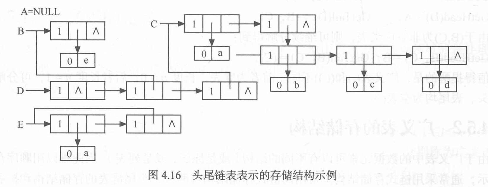
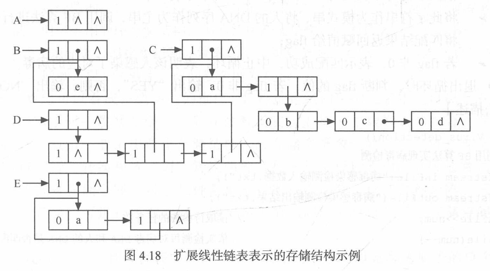

# 数组和广义表

## 数组的定义

+ **数组**是**由类型相同的数据元素构成的有序集合**，每个元素称为数组元素，每个元素受n（n ≥ 1）个线性关系的约束，每个元素在n个线性关系中的序号i<sub>1</sub>，i<sub>2</sub>，…，i<sub>n</sub>称为该元素的下标，可以通过下标访问该数据元素
+ **一维数组**可以看成是一个**线性表**，**二维数组**可以看成**数据元素是线性表**的**线性表**
+ 数组的**抽象数据类型定义**：

  ```C
  ADT Array{
    数据对象：j[i]=0,…,b[i] - 1, i=1,2,…,n
        D={a[j[1]j[2]…j[n]]|n>0称为数组的维数，b[i]是数组第i维的长度，
           j[i]是数组元素的第i维下标，a[j[1]j[2]…j[n]]∈ElemSet}
    数据关系：R={R1,R2,……，Rn}
    基本操作：
    InitArray(&A, n, boundi, …, boundn)
      操作结果：若维数n和各维长度合法，则构造相应的数组A，并返回OK
    DestroyArray(&A)
      操作结果：销毁数组A。
    Value(A, &e, indexl, …, indexn)
      初始条件：A是n维数组，e为元素变量，随后是n个下标值
      操作结果：若各下标不超界，则e赋值为所指定的A的元素值，并返回OK
    Assign(&A, e, indexl, …, indexn)
      初始条件：A是n维数组，e为元素变量，随后是n个下标值
      操作结果：若下标不超界，则将e的值赋给所指定的A的元素，并返回OK
  }ADT Array
  ```


## 数组的顺序表示和实现

+ **数组**采用**顺序存储结构**表示数组比较合适：由于**数组一般不做插人或删除操作**，也就是说，一旦建立了数组，则结构中的数据元素个数和元素之间的关系就不再发生变动
+ 由于存储单元是一维的结构，而数组可能是多维的结构，则**用一组连续存储单元存放数组的数据元素**就有**次序约定问题**
  + 在扩展 Basic、Pascal、Java和C语言中，用的都是以**行序**为**主序**的存储结构
  + 在FORTRAN语言中，用的是以列序为主序的存储结构
+ 对于数组，一旦**规定了其维数**和**各维的长度**，便**可为它分配存储空间**；反之，**只要给出一组下标**便可**求得**相应数组元素的**存储位置**

## 矩阵的压缩存储

### 特殊矩阵

#### 对称矩阵

+ 对于对称矩阵，可以**为每一对对称元分配一个存储空间**，则可**将$n^2$个元压缩存储到$\frac{n(n + 1)}{2}$个元的空间中**
  + 不失一般性，可以行序为主序存储其下三角（包括对角线）中的元
+ 假设以一维数组sa[n(n + 1)/2]作为n阶对称矩阵A的存储结构，则sa[k]和矩阵元a<sub>ij</sub>之间存在着一一对应的关系：$$k = \begin{cases} \frac{i(i - 1)}{2} + j - 1 & i \geqslant j \\ \frac{j(j - 1)}{2} + i - 1 & i < j \end{cases}$$

#### 三角矩阵

+ 此处**上三角矩阵**的**对角线下方**为**常数C（可以非0）**，下三角矩阵亦然
  + 注意**区别**数学上的对角矩阵定义！
+ 对三角矩阵进行压缩存储时，除了和对称矩阵一样，**只存储其上（下）三角中的元素**之外，**再加一个存储常数C的存储**（即sa[n(n + 1) / 2] = C）
  + 对于上三角矩阵，sa[k]和矩阵元a<sub>ij</sub>之间的对应关系为$$k = \begin{cases} \frac{(i - 1)(2n - i + 2)}{2} + (j - i) & i \geqslant j \\ \frac{n(n + 1)}{2} & i < j \end{cases}$$
  + 对于下三角矩阵，sa[k]和矩阵元a<sub>ij</sub>之间的对应关系为$$k = \begin{cases} \frac{i(i - 1)}{2} + j - 1 & i \geqslant j \\ \frac{n(n + 1)}{2} & i < j \end{cases}$$

#### 对角矩阵

+ 对角矩阵：**所有的非零元**都集中在**以主对角线为中心的带状区域**中，即除了**主对角线上**和**直接在对角线上、下方若干条对角线上**的元之外，**所有其他的元皆为零**
  + 注意**区别**数学上的对角矩阵定义！
+ 对这种矩阵，也可按某个原则（或**以行为主**，或**以对角线的顺序**）将其压缩存储到一维数组上

### 稀疏矩阵

+ 假设在$m \times n$的矩阵中，有$t$个元素不为零；令$\delta = \frac{t}{m \times n}$，称$\delta$为矩阵的**稀疏因子**；通常认为$\delta \leqslant 0.05$的矩阵为**稀疏矩阵**
+ 按照压缩存储的概念，只存储稀疏矩阵的**非零元$a_{ij}$** ，以及**其所在的行列$i, j$**
+ 如果以**顺序结构**存储：
  ```C
  #define MAXSIZE 12500
  typedef struct{
      int i, j;
      ElemType e;
  }Triple;
  typedef struct{
      Triple data[MAXSIZE + 1];  // 非零元三元组表，data[0]不使用
      int mu, nu, tu;  // 矩阵的行数、列数和非零元个数
  }TSMatrix;
  ```
  + 在此基础上，进行**矩阵转置**的算法：
    + 将矩阵$M$的**行列值**相互**交换**
    + 将**每个三元组**中的 **$i$和$j$相互交换**
    + **重排三元组之间的次序**
  + 这里，**重排三元组之间的次序**有两种方式实现：
    + 以**转置后的次序**为基准进行查找：
      1. 需要在转置前的矩阵中从**第一行起进行遍历**，找到**转置后每个行（转置前每个列）所在**的**三元组**
         ```C
         Status TransposeSMatrix(TSMatrix M, TSMatrix &T) {
             T.mu = M.nu; T.nu = M.mu; T.tu = M.tu;
             if(T.tu) {  // T（转置后的M）非空
                 q = 1;
                 for(col = 1; col <= M.nu; ++col)  // 对M的每列（转置后T的每行）
                     for(p = 1; p <= M.tu; ++p)  // 遍历M的每一个三元组
                         if(M.data[p].j == col) {  // 如果某个三元组的列为正在被寻找的col列
                   T.data[q].i = M.data[p].j;
                   T.data[q].j = M.data[p].i;  // 交换i和j
                   T.data[q].e = M.data[p].e;  // 传递数值
                   ++q;
                 }
             }
           return OK;
         }
         ```
         + **时间复杂度**：$O(\text{mu} \times \text{nu})$
           + **如果$\text{tu}$和$\text{mu} \times \text{nu}$为同数量级**，则**时间复杂度**变为$O(\text{mu} \times \text{nu}^2)$
    + 以**转置前的次序**为基准进行查找：又称为 **“快速转置”**
      1. 添加**数组num**和**cpot**，使得对于**每一列col**，有**num[col]**为**该列非零元素的个数**，**cpot[col]**为该列**第一个非零元在转置后矩阵中的位置**，从而有$$\begin{cases} \text{cpot}[1] = 1 \\ \text{cpot}[\text{col}] = \text{cpot}[\text{col} - 1] + \text{num}[\text{col} - 1] & 2 \leqslant \text{col} \leqslant M.\text{nu} \end{cases}$$
      2. 对于**原矩阵**的**每一个三元组**，可以直接**利用cpot数组**中**三元组所在列对应元素的值**快速**定位**到在**转置后矩阵中的位置**
         ```C
         Status FastTransposeSMatrix(TSMatrix M, TSMatrix &T) {
             T.mu = M.nu; T.nu = M.mu; T.tu = M.tu;
           if(T.tu) {
             for(col = 1; col <= M.nu; ++col)
               num[col] = 0;  // 初始化num
             for(t = 1; t <= M.tu; ++t)
               ++num[M.data[t].j];  // 求M中每一列含非零元个数
             cpot[1] = 1;
             for(col = 2; col <= M.nu; ++col)
               cpot[col] = cpot[col - 1] + num[col - 1];  // 计算cpot
             for(p = 1; p <= M.tu; ++p) {  // 遍历M的每一个三元组
               col = M.data[p].j;  // 取当前三元组的列作为col
               q = cpot[col];  // 取出cpot[col]的值作为q
               T.data[q].i = M.data[p].j;
               T.data[q].j = M.data[p].i;  // 交换i和j
               T.data[q].e = M.data[p].e;  // 传递数值
               ++cpot[col];  // 在完成一次三元组的处理后，cpot[col]要自增1，表示T的第col行（M的第col列）已经有了一个新的三元组，对应的序数需要增加1
             }
           }
           return OK;
         }
         ```
         + **时间复杂度**：$O(\text{mu} + \text{nu})$
           + **如果$\text{tu}$和$\text{mu} \times \text{nu}$为同数量级**，则**时间复杂度**变为$O(\text{mu} \times \text{nu})$
+ 如果以**行逻辑链接**形式存储：在**顺序结构存储**的**基础**上，固定**每行第一个非零元的位置**到**数组rpos**中

  ```C
  #define MAXSIZE 12500
    typedef struct{
      int i, j;
      ElemType e;
    }Triple;
    typedef struct{
      Triple data[MAXSIZE + 1];  // 非零元三元组表
      int rpos[MAXRC + 1];  // 各行第一个非零元的位置表
      int mu, nu, tu;  // 矩阵的行数、列数和非零元个数
    }RLSMatrix;
  ```

  + 在此基础上，进行**矩阵相乘（M × N = Q）** 的算法：
    1. 对矩阵M中的每个元素$M.\text{data}[p], p = 1, 2, \cdots, M.\text{tu}$，找到**N中所有满足条件$M.\text{data}[p].j = N.\text{data}[q].i$的元素$N.\text{data}[q]$** ，**求得$M.\text{data}[p].v \times N.\text{data}[q].v$这一乘积**
    2. 两个稀疏矩阵的乘积不一定为稀疏矩阵；同样，两个矩阵第i行和第j列分量相乘之和；因此，可以在**计算后完成判断**，再**压缩存储**到**结果矩阵Q的Q\[i\]\[j\]中去**
       + **时间复杂度**：$O\left(M.\text{mu} \times N.\text{nu} + \frac{M.\text{tu} \times N.\text{tu}}{N.\text{mu}}\right)$
         + 加号前为**累加器初始化**的时间复杂度，以及**压缩存储**的时间复杂度
         + 加号后为**求Q所有非零元**的时间复杂度
+ 如果以**十字链表**形式存储：每个非零元可用一个含5个域的结点表示，其中**i**、**j**和**e**分别表示该非零元所在的**行**、**列**和非零元的**值**，**right**链接**同一行中下一个非零元**，**down**链接**同一列中下一个非零元**

  ```C
  #define MAXSIZE 12500
    typedef struct OLNode{
      int i, j;
      ElemType e;
      OLink *rhead, *down;
    }OLNode; *OLink;
    typedef struct{
      OLink *rhead, *chead;  // 行链表rhead和列链表chead的头指针向量基址由CreateSMatrix分配
      int mu, nu, tu;  // 矩阵的行数、列数和非零元个数
    }RLSMatrix;
  ```

  + 在此基础上，进行**矩阵相加（A = A + B）** 的算法：
    1. 令**pa**和**pb**分别指向**A**和**B**的**第一行的第一个非零元素结点**，即`pa = A.rhead[1]; pb = B.rhead[1];`
    2. 在**A的行链表**上设**pre指针**，指向**pa所指结点的前驱结点**；初始值`pre = NULL;`
    3. 对A的**第j列**，设一个**指针数组hl**，其初始化为**列链表的头指针**，即`hl[j] = A.chead[j];`；对每一列都进行此初始化
    4. 对当前行（首次执行即为第一行）重复以下步骤：
       + 若`pa == NULL`或`pa->j > pb->j`（**A这一行的所有非零元素都已处理完**）：在**A**中**插入**一个**pb所指结点的复制结点**，假设**新结点地址为p**
         + A的行表中的指针需要进行如下变化：
           
           ```C
           if(pre == NULL)  // pa所指结点没有前驱
             A.rhead[p->i] = p;  // 由于p被插入到pa之前，A的行链表中，p所指向行的第一个非零元素结点为p
           else  // pa所指结点有前驱
             pre->right=p;  // pre指向的右侧下一个非零元定为p
           p->right = pa; pre = p;  // 在p的右侧重新链接上a，并让pre指向p
           ```

         + A的列链表中的指针也要做出相应改变：
           1. 从`hl[p->j]`开始找到新结点在同一列中的前驱结点
           2. 让`hl[p->j]`指向该节点
           3. 在列链表中插入新结点
              
              ```C
              if(!A.chead[p->j] || A.chead[p->j]->i > p->i) {
                // A的第p->j列为空，或A的第p->j列的行数大于p所在的行数
                // 需要插入到列链表开头
                p->down = A.chead[p->j];  // p下方指向A.chead[p->j]，即第p->j列的第一个指针（可能为空）
                A.chead[p->j] = p;  // 在列链表开头插入p
              } else {
                // 插入到hl[p->j]下方
                p->down = hl[p->j]->down;
                hl[p->j]->down = p;
              }
              hl[p->j] = p;  // hl[p->j]设为p
              ```

       + 若`pa != NULL`且`pa->j < pb->j`：令pa指向本行下一个非零元结点
         
         ```C
         pre = pa; pa = pa->right;
         ```

       + 若`pa->j == pb->j`：将B中当前结点的值加到A中当前结点上
         
         ```C
         pa->e += pb->e;
         ```

         + 完成后需要检查是否有`pa->e == 0`；如果等于0，则需要删除该结点，需要对行表和列表进行处理：
           
           ```C
           // 行处理
           if(pre == NULL)  // pre为NULL，则该结点位于行表头
             A.rhead[pa->i] = pa->right;
           else
             pre->right = pa->right;  // 让pre的右侧结点指向pa的右侧结点，pa自身也指向右侧下一个结点
           
           p = pa; pa = pa->right;  // 记录此时的p为pa
           
           // 列处理
           if(A.chead[p->j] == p)  // 该结点位于列表头
             A.chead[p->j] = hl[p->j] = p->down;
           else
             hl[p->j]->down = p->down;  // 让hl[p->j]的下侧结点指向p的下侧结点
           
           free(p);  // 释放空间
           ```

    5. 如果**当前行不是最后一行**，则令**pa**和**pb**指向**下一行的第一个非零元结点**，转**步骤2**；**否**则**结束**

## 广义表的定义

+ 广义表是线性表的推广，也称为**列表**；广义表一般记作$$LS = (a_1, a_2, \cdots, a_n)$$其中，LS是广义表$(a_1, a_2, \cdots, a_n)$的名称，$n$是其长度
+ 在**广义表**的定义中，$a_i$可以是**单个元素**，也可以是**广义表**，分别称为广义表LS的**原子**和**子表**
  + 习惯上，用**大写字母**表示广义表的**名称**，用**小写字母**表示**原子**
  + 参考Python的列表（以及将列表作为元素的列表）
+ 广义表的结论：
  + 广义表是一个多层次的结构，可以用树形象地表示
  + 广义表可为其他广义表所共享
  + 广义表可以是一个递归的表，即广义表也可以是其本身的一个子表
+ 广义表最重要的两个运算：
  + **取表头**GetHead(LS)：
    + 取出的表头为**非空广义表的第一个元素**，它可以是一个单原子，也可以是一个子表
  + **取表尾**GetTail(LS)：
    + 取出的表尾为**除去表头之外，由其余元素构成的表**；即**表尾一定是一个广义表**

## 广义表的存储结构

### 头尾链表的存储结构

+ 由于广义表中的数据元素可能为原子或广义表，由此需要两种结构的结点：
  + **表结点**，用以表示广义表
    + 一个**表结点**可由3个域组成：**标志域**、**指示表头的指针域（hp）**和**指示表尾的指针域（tp）**
  + **原子结点**，用以表示原子
    + **原子结点**只需两个域：**标志域**和**值域（atom）**
  + 可以让标志域值为1时表明结点是子表，值为0时表明结点是原子
+ 若广义表不空，则可分解成表头和表尾，因此，**一对确定的表头和表尾**可**唯一确定广义表**
+ 形式定义：

  ```C
  typedef enum {ATOM,LIST} ElemTag;  // ATOM==0：原子；LIST==1：子表
  typedef struct GLNode{
    ElemTag tag;  // 公共部分，用于区分原子结点和表结点
    union{  // 原子结点和表结点的联合部分
      AtomType atom;  // atom是原子结点的值域，AtomType由用户定义
      struct{struct GLNode*hp, *tp;}ptr;  // ptr是表结点的指针域，ptr.hp和ptr.tp分别指向表头和表尾
    };
  }*GList;  // 广义表类型
  ```

+ 特征：
  + 除**空表**的**表头指针为空**外，对**任何非空广义表**，其**表头指针**均指向一个**表结点**，且该结点中
    + **hp域**指示**广义表表头**（或为原子结点，或为表结点）
    + **tp域**指向**广义表表尾**（**除非表尾为空**，则指针为空，否则**必为表结点**）
  + 容易分清列表中**原子和子表所在层次**
  + **最高层的表结点个数**即为**广义表的长度**
    

### 扩展线性列表的存储结构

+ 在这种结构中，无论是原子结点还是表结点**均由三个域**（**标签域**，**表头指针域（hp） / 值域（atom）**，**表尾指针域（tp）**）组成
  + 对于空表，只有标签域非空
  + 对于非空表，无论该元素是广义表还是原子，都将此元素及之后的元素视为一个新的广义表，用表头指针域 / 值域指向当前元素，表尾指针域指向剩下的表尾
    

## $m$元多项式的表示

+ **任何一个$m$元多项式**，都可以按如下操作**分解**：
  1. 分解出**第一个（主）变元**，则**原多项式**是**关于该主变元的多项式**
  2. 分解出**第二个变元**，则上一个多项式中**各个系数**为**关于第二个变元的多项式**
  3. 依此类推，直到 **$m$个未知元都被选择**
     + 例：在以下式子中，变元依次选择$z$、$y$、$x$，则有$$\begin{aligned} P(x, y, z) =& x^{10}y^3z^2 + 2x^6y^3z^2 + 3x^5y^2z^2 + x^4y^4z + 6x^3y^4z + 2yz + 15 \\ =& ((x^{10} + 2x^6)y^3 + 3x^5y^2)z^2 + ((x^4 + 6x^3)y^4 + 2y)z + 15 \end{aligned}$$
+ 采用上述方式，则可以将**任何一个$m$元多项式**用**广义表表示**
  + 对于$P(x, y, z) = ((x^{10} + 2x^6)y^3 + 3x^5y^2)z^2 + ((x^4 + 6x^3)y^4 + 2y)z + 15$，其广义表形式为$$P = z((A, 2), (B, 1), (15, 0))$$
    + 其中：
      + $A = y((C, 3), (D, 2))$，这里$C = x((1, 10), (2, 6))$、$D = x((3, 5))$
      + $B = y((E, 4), (F, 1))$，这里$E = x((1, 4), (6, 3))$、$F = x((2, 0))$
  + 其形式定义如下：

    ```C
    typedef struct MPNode {
      ElemTag tag;  // 区分原子结点和表结点
      int exp;  // 指数域
      union{
        float coef;  // 系数域
        struct MPNode *hp;  // 表结点的表头指针
      };
      struct MPNode *tp;  // 相当于线性链表的next，指向下一个元素结点
    }*MPList;  // m元多项式广义表类型
    ```


## 广义表的递归算法

### 求广义表的深度

+ **广义表的深度**定义为广义表中**括弧的重数**
  + 例：**多元多项式**中**变元的个数**即为其广义表的深度
  + 广义表$LS = (\alpha_1, \alpha_2, \cdots, \alpha_n)$的深度$\text{DEPTH}(LS)$的**递归定义**为：$$\text{DEPTH}(LS) = \begin{cases} 1 & \text{LS为空表} \\ 0 & \text{LS为原子} \\ 1 + \max\limits_{1 \leqslant i \leqslant n} \{\text{DEPTH}(\alpha_i)\} & n \geqslant 1 \end{cases}$$
  + 其算法如下所示：

    ```C
    int GListDepth(GList L) {
      // 采用头尾链表存储结构，求广义表L的深度
      if(!L) return 1;  // 空表深度为1
      if(L->tag == ATOM) return 0;  // 原子深度为0
      for(max = 0, pp = L; pp; pp = pp->ptr.pp) {  // 用DFS的方式进行遍历
        ddep = GListDepth(pp->ptr.hp);  // 求以pp->ptr为头指针的子表深度
        if(dep > max) max = dep;
      }
      return max + 1;  // 非空表的深度是各元素深度的最大值 + 1
    }
    ```

### 复制广义表

+ **复制操作**的**递归定义**：
  + **基本项**：`InitGList(NEWLS){置空表}`（当广义表LS为空表时）
  + **归纳项**：`COPY(GetHead(LS)->GetHead(NEWLS)){复制表头}`、`COPY(GetTail(LS)->GetTail(NEWLS)){复制表尾}`

### 建立广义表的存储结构

+ **广义表操作**的**递归定义**有两种分析方法：
  + 将广义表分解为**表头**和**表尾**两部分
  + 将广义表看做**含有$n$个并列子表**（假设原子也视作子表）的表
+ 对于将广义表看做**含有$n$个并列子表**的形式，其**建立广义表链表存储结构**的**递归定义**如下所示：
  + **基本项**：$$\begin{cases} \text{置空原子表} & \text{S为空表串} \\ \text{建立原子节点的子表} & \text{S为单字符串} \end{cases}$$
  + **归纳项**：
    + 假设sub为**S脱去最外层括弧的子串**，**记为"s<sub>1</sub>, s<sub>2</sub>, …, s<sub>n</sub>"** ，其中s<sub>i</sub>为非空字符串
    + 对**每一个s<sub>i</sub>建立一个表结点**，并令其**hp域的指针**为由**s<sub>i</sub>建立的子表的头指针**
    + 除**最后建立的表结点**的**尾指针**为**NULL**外，其余**表结点的尾指针**均**指向在它之后建立的表结点**

