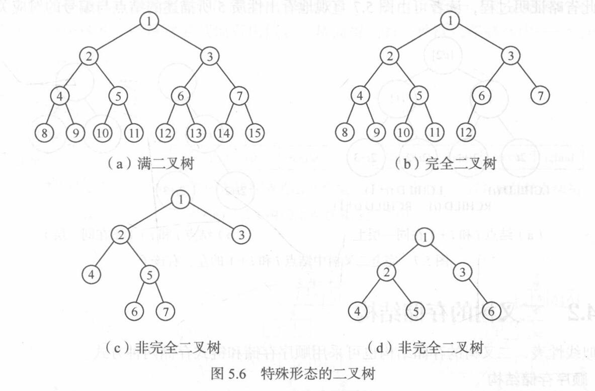

# 树和二叉树

## 树的定义和基本术语

+ **树（Tree）**是$n (n \geqslant 0)$个结点的有限集，它或为**空树**（$n = 0$），或为**非空树**，对于非空树$T$：
  + **有且仅有一个**称之为**根**的结点
  + **除根结点以外的其余结点**可分为$m (m > 0)$个**互不相交的有限集**$T_1, T_2, \cdots, T_m$，其中**每一个集合本身又是一棵树**，并且称为**根的子树**（SubTree）
+ 树的术语：
  + **结点**：树中的一个独立单元；包含**一个数据元素**及**若干指向其子树的分支**
  + **结点的度**：结点拥有的**子树数**称为结点的度
  + **树的度**：树的度是**树内各结点度的最大值**
  + **叶子**：**度为$0$的结点**称为叶子或**终端结点**
  + **非终端结点**：**度不为$0$的结点**称为非终端结点或**分支结点**；**除根结点之外**，非终端结点也称为**内部结点**
  + **双亲**和**孩子**：**结点的子树的根**称为**该结点的孩子**，相应地，**该结点**称为**孩子**的**双亲**
  + **兄弟**：**同一个双亲的孩子**之间互称兄弟
  + **祖先**：**从根到该结点所经分支上**的**所有结点**
  + **子孙**：**以某结点为根的子树**中的**任一结点**都称为该结点的子孙
  + **层次**：结点的层次从根开始定义起，**根为第一层**，**根的孩子为第二层**；树中**任一结点的层次**等于**其双亲结点的层次加$1$**
  + **堂兄弟**：**双亲在同一层的结点**互为堂兄弟
  + **树的深度**：**树中结点的最大层次**称为树的深度或高度
  + **有序树**和**无序树**：如果将**树中结点的各子树看成从左至右是有次序的**（即不能互换），则称该树为**有序树**，**否**则称为**无序树**
    + 在**有序树**中，**最左边的子树的根**称为**第一个孩子**，**最右边**的称为**最后一个孩子**
  + **森林**：是 **$m (m \geqslant 0)$棵互不相交的树的集合**；对**树中每个结点**而言，**其子树的集合即为森林**
    + 由此，也可以用**森林和树相互递归的定义**来**描述树**
+ 树的**抽象数据类型性定义**：

  ```C
  ADT Tree{
    数据对象D：D是具有相同特性的数据元素的集合
    数据关系R：
      若D为空集，则称为空树；
      若D仅含一个数据元素，则R为空集，否则R = {H}，H是如下二元关系：
        (1)在D中存在唯一的称为根的数据元素root，它在关系H下无前驱
        (2)若D - {root} ≠ ∅，则存在D - {root}的一个划分D[l],D[2],…,D[m] (m>0)，对任意j≠k (1≤j, k≤m)有D[j] ∩ D[k]=∅，且对任意的i (1≤i≤m)，唯一存在数据元素x[i] ∈ D[i]，有<root, x[i]> ∈ H
        (3)对应于D = {root}的划分，H - {<root, x[1]>,…,<root, x[m]>=有唯一的一个划分H[l],H[2],…,H[m] (m>0)，对任意j ≠ k (1≤j, k≤m)有H[j] ∩ H[k] = ∅，且对任意i (1≤i≤m)，H[i]是D[i]上的二元关系，(D[i], {H[i]})是一棵符合本定义的树，称为根root的子树
    基本操作P：
      InitTree(&T)
        操作结果：构造空树T
      DestroyTree(&T)
        初始条件：树T存在
        操作结果：销毁树T
      CreateTree(&T, definition)
        初始条件：definition给出树T的定义
        操作结果：按definition构造树T
      ClearTree(&T)
        初始条件：树T存在
        操作结果：将树T清为空树
      TreeEmpty(T)
        初始条件：树T存在
        操作结果：若T为空树，则返回true，否则false
      TreeDepth(T)
        初始条件：树T存在
        操作结果：返回T的深度
      Root(T)
        初始条件：树T存在
        操作结果：返回T的根
      Value(T, cur_e)
        初始条件：树T存在，cur_e是T中某个结点
        操作结果：返回cur_e的值
      Assign(T, cur_e, value)
        初始条件：树T存在,cur_e是T中某个结点
        操作结果：结点cur_e赋值为value
      Parent(T, cur_e)
        初始条件：树T存在，cur_e是T中某个结点
        操作结果：若cur_e是T的非根结点，则返回它的双亲，否则函数值为“空”
      Leftchild(T, cur_e)
        初始条件：树T存在，cur_e是T中某个结点
        操作结果：若cur_e是T的非叶子结点，则返回它的最左孩子，否则返回“空”
      Rightsibling(T, cur_e)
        初始条件：树T存在，cur_e是T中某个结点
        操作结果：若cur_e有右兄弟，则返回它的右兄弟，否则函数值为“空”
      Insertchild(&T, p, i, c)
        初始条件：树T存在，p指向T中某个结点，1≤i≤p所指结点的度+=1，非空树c与T不相交
        操作结果：插入c为T中p指结点的第i棵子树
      DeleteChild(&T, p, i)
        初始条件：树T存在，p指向T中某个结点，1≤i≤p指结点的度
        操作结果：删除T中p所指结点的第i棵子树
      TraverseTree (T)
        初始条件：树T存在
        操作结果：按某种次序对T的每个结点访问一次
  }ADT Tree
  ```

## 二叉树

### 二叉树的定义

+ **二叉树**（Binary Tree）是$n (n \geqslant 0)$个结点所构成的集合，它或为**空树**（$n = 0$）；或为**非空树**，对于非空树$T$：
  + **有且仅有一个**称之为**根**的结点
  + **除根结点以外的其余结点**分为**两个**互不相交的子集$T_1$和$T_2$，分别称为$T$的**左子树**和**右子树**，且$T_1$和$T_2$**本身又都是二叉树**  
+ 二叉树与树一样具有**递归**性质，**二叉树与树的区别**主要有以下两点：
  + 二叉树每个结点**至多只有两棵子树**（即二叉树中**不存在度大于$2$的结点**）
  + 二叉树的**子树有左右之分**，其**次序不能任意颠倒**  
+ 二叉树的递归定义表明二叉树或为**空**，或是**由一个根结点加上两棵分别称为左子树和右子树的、互不相交的二叉树**组成；由于这两棵子树也是二叉树，则由二叉树的定义，它们也可以是空树
  + 由此，二叉树可以有5种**基本形态**：
    + **空二叉树**
    + **仅有根结点**的二叉树
    + **右子树为空**的二叉树
    + **左子树为空**的二叉树
    + **左、右子树均非空**的二叉树  
+ 二叉树的**抽象数据类型性定义**：

  ```C
  ADT BinaryTree{
    数据对象D：D是具有相同特性的数据元素的集合
    数据关系R：
      若D = ∅，则R = ∅，称BinaryTree为空二叉树
      若D ≠ ∅，则R = {H}，H是如下二元关系：
        (1)在D中存在唯一的称为根的数据元素root，它在关系H下无前驱
        (2)若D - {root} ≠ ∅，则存在D - {root} = {D[l], D[r]}，且D[l] ∩ D[r] = ∅
        (3)若D[l] ≠ ∅，则D[l]中存在唯一的元素x[l]，<root, x[l]> ∈ H，且存在D[l]上的关系H[l] ⊂ H；若D[r] ≠ ∅，则D[r]中存在唯一的元素x[r]，<root, x[r]> ∈ H，且存在D[r]上的关系H[r] ⊂ H；H = {<root, x[l]>, <root, x[r]>, H[l], H[r]}
        (4)(D[l], {H[l]})是一棵符合本定义的二叉树，称为根的左子树；(D[r], {H[r]})是一棵符合本定义的二叉树，称为根的右子树
    基本操作P：
      InitBiTree(&T)
        操作结果：构造空二叉树T
      DestroyBiTree(&T)
        初始条件：二叉树T存在
        操作结果：销毁二叉树T
      CreateBiTree(&T, definition)
        初始条件：definition给出二叉树T的定义
        操作结果：按definition构造二叉树T
      ClearBiTree ( &T)
        初始条件：二叉树T存在
        操作结果：将二叉树T清为空树
      BiTreeEmpty(T)
        初始条件：二叉树T存在
        操作结果：若T为空二叉树，则返回true，否则false
      BiTreeDepth (T)
        初始条件：二叉树T存在
        操作结果：返回T的深度
      Root(T)
        初始条件：二叉树T存在
        操作结果：返回T的根
      Value(T, e)
        初始条件：二叉树T存在，e是T中某个结点
        操作结果：返回e的值
      Assign(T, &e, value)
        初始条件：二叉树T存在，e是T中某个结点
        操作结果：结点e赋值为value
      Parent(T, e)
        初始条件：二叉树T存在，e是T中某个结点
        操作结果：若e是T的非根结点，则返回它的双亲，否则返回“空”
      LeftChild(T, e)
        初始条件：二叉树T存在，e是T中某个结点
        操作结果：返回e的左孩子；若e无左孩子，则返回“空”
      Rightchild(T, e)
        初始条件：二叉树T存在，e是T中某个结点
        操作结果：返回e的右孩子；若e无右孩子，则返回“空”
      LeftSibling(T, e)
        初始条件：二叉树T存在，e是T中某个结点
        操作结果：返回e的左兄弟；若e是T的左孩子或无左兄弟，则返回“空”
      RightSibling(T, e)
        初始条件：二叉树T存在，e是T中某个结点
        操作结果：返回e的右兄弟；若e是T的右孩子或无右兄弟，则返回“空”
      InsertChild(&T, p, LR, c)
        初始条件：二叉树T存在，p指向T中某个结点，LR为0或1，非空二叉树c与T不相交且右子树为空
        操作结果：根据LR为0或1，插入c为T中p所指结点的左或右子树；p所指结点的原有左或右子树则成为c的右子树
      Deletechild(&T, p, LR)
        初始条件：二叉树T存在,p指向T中某个结点，LR为0或1
        操作结果：根据LR为0或1，删除T中p所指结点的左或右子树
      PreOrderTraverse(T)
        初始条件：二叉树T存在
        操作结果：先序遍历T，对每个结点访问一次
      InOrderTraverse(T)
        初始条件：二叉树T存在
        操作结果：中序遍历T，对每个结点访问一次
      PostOrderTraverse(T)
        初始条件：二叉树T存在
        操作结果：后序遍历T，对每个结点访问一次
      LevelOrderTraverse(T)
        初始条件：二叉树T存在
        操作结果：层序遍历T，对每个结点访问一次
  }ADT BinaryTree
  ```

### 二叉树的性质

+ 基本性质：
  + 在**二叉树的第$i$层**上**至多**有 **$2^{i - 1}$个结点**（$i \geqslant 1$）
  + **深度为$k$** 的二叉树**至多**有 **$2^k - 1$个结点**（$k \geqslant 1$）
  + 对任何一棵二叉树$T$，如果**其终端结点数为$n_0$** ，**度为$2$的结点数为$n_2$** ，**则$n_0 = n_2 + 1$**
+ **满二叉树**：**深度为$k$** 且**含有$2^k - 1$个结点**的二叉树
  + 特点：**每一层上的结点数**都是**最大结点数**，即每一层$i$的结点数都具有最大值$2^{i - 1}$
+ **完全二叉树**：对满二叉树的结点进行连续编号，约定**编号从根结点起，自上而下，自左至右**；如果一棵二叉树深度为$k$、有$n$个结点，则当且仅当其**每一个结点**都与**深度为$k$的满二叉树中编号从$1$至$n$的结点**一一对应时，称之为完全二叉树
  + 特点：
    + **叶子结点**只可能在**层次最大的两层**上出现
    + 对任一结点，若其**右分支下的子孙**的**最大层次**为$l$，则其**左分支下的子孙**的**最大层次**必为$l$或$l + 1$
  + 性质：
    + 具有 **$n$个结点**的**完全二叉树**的**深度**为$\lfloor \log_2 n \rfloor + 1$
    + 如果对一棵有$n$个结点的完全二叉树（其深度为$\lfloor \log_2 n \rfloor + 1$）的结点按层序编号（从第$1$层到第$\lfloor \log_2 n \rfloor + 1$层，每层从左到右），则对任一结点$i (1 \leqslant i \leqslant n)$，有
      + 如果$i = 1$，则结点$i$是二叉树的**根**，无双亲；如果$i > 1$，则**其双亲PARENT($i$)是结点$\lfloor i / 2 \rfloor$**
      + 如果$2i > n$，则结点$i$要么**无左孩子**（结点$i$为**叶子结点**），要么**左孩子LCHILD($i$)是结点$2i$**
      + 如果$2i + 1 > n$，则结点$i$要么**无右孩子**，要么**其右孩子RCHILD($i$)是结点$2i + 1$**



### 二叉树的存储结构

#### 顺序存储结构

+ 二叉树的顺序存储结构表示：
  
  ```C
  #define MAXTSIZE 100
  typedef TElemType SqBiTree[MAXTSIZE];
  SqBiTree bt;
  ```
  
+ 顺序存储结构使用一组地址连续的存储单元来存储数据元素，为了能够在存储结构中反映出结点之间的逻辑关系，必须将二叉树中的结点依照一定的规律安排在这组单元中：
  + 对于**完全二叉树**，只要**从根起按层序存储**即可，依次**自上而下**、**自左至右**存储结点元素，即将完全二叉树上编号为$i$的结点元素存储在如上定义的一维数组中下标为$i - 1$的分量中
  + 对于**一般二叉树**，则应将其**每个结点与完全二叉树上的结点相对照**，存储在一维数组的相应分量中（对于不存在的结点需要在该分量进行类似于“0”的表记）
    + 由此可见，这种**顺序存储结构仅适用于完全二叉树**；因为，在最坏的情况下，一个深度为$k$且只有$k$个结点的单支树（树中不存在度为$2$的结点）却需要长度为$2^k - 1$的一维数组，这造成了存储空间的极大浪费


#### 链式存储结构

+ 二叉树的链式存储结构表示：

  ```C
  typedef struct BiTNode{
    TElemType data;
    struct BiTNode *lchild, *rchild;
  }BiTNode, *BiTree;
  ```

+ 表示二叉树的链表中的结点至少包含3个域：**数据域**和**左、右指针域**
  + 有时，为了便于找到结点的双亲，还可在结点结构中增加一个**指向其双亲结点的指针域**
  + 利用这两种结点结构所得二叉树的存储结构分别称之为**二叉链表**和**三叉链表**
+ 链表的**头指针**指向二叉树的**根结点**
+ 容易证得，在**含有$n$个结点的二叉链表**中有 **$n + 1$个空链域**

## 遍历二叉树和线索二叉树

### 遍历二叉树

#### 遍历二叉树算法描述

+ **遍历二叉树**（traversing binary tree）：按某条搜索路径巡访树中每个结点，**使得每个结点均被访问一次，而且仅被访问一次**
  + 遍历的**实质**是对二叉树进行**线性化**的过程  
+ **先序遍历二叉树**的操作定义如下：
  + 若二叉树为空，则空操作；否则
    1. **访问根结点**
    2. **先序遍历左子树**
    3. **先序遍历右子树**  
+ **中序遍历二叉树**的操作定义如下：
  + 若二叉树为空，则空操作；否则
    1. **中序遍历左子树**
    2. **访问根结点**
    3. **中序遍历右子树**  
+ **后序遍历二叉树**的操作定义如下：
  + 若二叉树为空，则空操作；否则
    1. **后序遍历左子树**
    2. **后序遍历右子树**
    3. **访问根结点**
+ **层次遍历二叉树**：按照 **“从上到下，从左到右”** 的顺序遍历二叉树，可以使用**队列**实现
+ 表达式与先序 / 中序 / 后序遍历的关系：

  |    表达式的表示结果     | 遍历方式 |       表示名称       |
  | :---------------------: | :------: | :------------------: |
  | a + b * (c - d) - e / f | 原表达式 |                      |
  |  - + a * b - c d / e f  | 先序遍历 | 前缀表示（逆波兰式） |
  |  a + b * c - d - e / f  | 中序遍历 |       中缀表示       |
  |  a b c d - * + e f / -  | 后序遍历 | 后缀表示（逆波兰式） |

+ **中序遍历**的**递归算法**：

  ```C++
  void InOrderTraverse(BiTree T) {
    if(T) {  // 若二叉树非空
      InOrderTraverse(T->lchild);  // 中序遍历左子树
      cout << T->cout;             // 访问根结点
      InOrderTraverse(T->rchild);  // 中序遍历右子树
    }
  }
  ```

  + 递归工作栈的状态：
    1. 工作记录中包含两项，其一是递归调用的语句编号，其二是指向根结点的指针，则当栈顶记录中的指针非空时，应遍历左子树，即指向左子树根的指针进栈
    2. 若栈顶记录中的指针值为空，则应退至上一层,若是从左子树返回，则应访问当前层（即栈顶记录）中指针所指的根结点
    3. 若是从右子树返回，则表明当前层的遍历结束，应继续退栈。从另一个角度看，这意味着遍历右子树时不再需要保存当前层的根指针，直接修改栈顶记录中的指针即可

+ **中序遍历**的**非递归算法**：

  ```C++
  void InOrderTraverse(BiTree T) {
    InitStack(S); p = T;
    q = new BiTNode;
    while(p || !StackEmpty(S)) {
      if(p) {  // p非空
        Push(S, p);     // 根指针进栈
        p = p->lchild;  // 根指针进栈后，遍历左子树
      } else {  // p为空
        Pop(S, q);        // 退栈
        cout << q->data;  // 访问根结点（输出结果）
        p = q->rchild;    // 遍历右子树
      }
    }
  }
  ```

+ **时间复杂度**：不论按哪一种次序进行遍历，每个结点均被访问一次，故对含$n$个结点的二叉树，其时间复杂度均为$O(n)$
+ **空间复杂度**：助空间为遍历过程中栈的最大容量，即树的深度；最坏情况下为$n$，则空间复杂度也为$O(n)$

#### 根据遍历序列确定二叉树

+ 由二叉树的**先序序列**和**中序序列**，或由其**后序序列**和**中序序列**均能唯一地确定一棵二叉树
  + 方法（以**后序序列**BDCEAFHG和**中序序列**DECBHGFA为例）：
    1. 确定**后序序列**的**最后一个**（**先序序列**则为**第一个**）结点（G），找出该结点在中序结点中的位置
    2. **将中序序列从该结点位置分开**，则左序列（DECB）和右序列（FA）分别为其左子树和右子树
    3. 对**每一个子树**（以DECB为例），找到**所有该子树元素中在后序序列里的最后一个**（E），并**重复以上步骤**（分为左子树D和右子树CB……）
+ 注意：依靠**先序序列**和**后序序列**是**无法唯一确定**一棵二叉树的！

### 线索二叉树

#### 线索二叉树的基本概念

+ 在二叉树的基础上，**若结点有左子树**，则其**lchild域指示其左孩子**，否则**令lchild域指示其前驱**；**若结点有右子树**，则其**rchild域指示其右孩子**，否则**令rchild域指示其后继**；为了避免混淆，尚需改变结点结构，增加两个**标志域**（LTag和RTag）：

  + $\text{LTag} = \begin{cases} 0 & \text{lchild域指示结点的左孩子} \\ 1 & \text{lchild域指示结点的前驱} \end{cases}$
  + $\text{RTag} = \begin{cases} 0 & \text{rchild域指示结点的右孩子} \\ 1 & \text{rchild域指示结点的后继} \end{cases}$

+ 二叉线索类型的定义：

  ```C
  typedef struct BiThrNode{
    TElemType data;
    struct BiThrNode *lchild, *rchild;  // 左右孩子指针
    int LTag, RTag;  // 左右标志
  }BiThrNode, *BiThrTree;
  ```

+ 以这种结点结构构成的二叉链表作为二叉树的存储结构，叫做**线索链表**，其中**指向结点前驱和后继的指针**，叫做**线索**；**加上线索A的二叉树**称之为**线索二叉树**（Threaded Binary Tree）

  + **对二叉树以某种次序遍历使其变为线索二叉树**的过程叫做**线索化**

#### 构造线索二叉树

+ 为了记下遍历过程中访问结点的先后关系，附设一个**指针pre始终指向刚刚访问过的结点**，而**指针p指向当前访问的结点**，由此记录下遍历过程中访问结点的先后关系
+ 以结点p为根的子树**中序线索化**：
  1. 如果**p非空**，**左子树递归线索化**
  2. 如果**p的左孩子为空**，则给**p**加上**左线索**，将其**LTag置为1**，让**p的左孩子指针指向pre（前驱）**；否则将**p的LTag置为0**
  3. 如果**pre的右孩子为空**，则给**pre**加上**右线索**，将其**RTag置为1**，让**pre的右孩子指针指向p（后继）**；否则将**pre的RTag置为0**
  4. 将**pre指向刚访问过的结点p**，即pre = p
  5. **右子树递归线索化**

#### 遍历线索二叉树

+ 在**中序线索二叉树**中查找
  + p指针所指结点的**前驱**：
    + 若**p->LTag为1**，则**p的左链**指示其**前驱**
    + 若**p->LTag为0**，则说明**p有左子树**；结点的前驱是**中序遍历左子树时最后访问的一个结点**（**左子树中最右下的结点**）
  + p指针所指结点的**后继**：
    + 若**p->RTag为1**，则**p的右链**指示其**后继**
    + 若**p->RTag为0**，则说明**p有右子树**；根据中序遍历的规律可知，结点的后继应是**中序遍历其右子树时访问的第一个结点**（**右子树中最左下的结点**）
+ 在**先序线索二叉树**中查找
  + p指针所指结点的**前驱**：
    + 若**p->LTag为1**，则**p的左链**指示其**前驱**
    + 若**p->LTag为0**，则说明**p有左子树**；此时p的前驱有两种情况：
      + 若**\*p**是其**双亲的左孩子**，则其**前驱**为其**双亲结点**
      + **否则**应是其**双亲的左子树上先序遍历最后访问到的结点**（**双亲的左子树中最右下的结点**）
  + p指针所指结点的**后继**：
    + **若p->RTag为1**，则**p的右链**指示其**后继**
    + 若**p->RTag为0**，则说明**p有右子树**；按先序遍历的规则可知，\*p的后继必为其**左子树根（若存在）或右子树根**
+ 在**后序线索二叉树**中查找
  + p指针所指结点的**前驱**：
    + 若**p->LTag为1**，则**p的左链**指示其**前驱**
    + 若**p->LTag为0**，
      + **p->RTag为0**时，则**p的右链**指示其**前驱**
      + **p->RTag为1**时，则**p的左链**指示其**前驱**
  + p指针所指结点的**后继**：
    + 若**\*p是二叉树的根**，则其后继为**空**
    + 若**\*p是其双亲的右孩子**，则其后继为**双亲结点**
    + 若**\*p是其双亲的左孩子**，且**\*p没有右兄弟**，则其后继为**双亲结点**
    + 若**\*p是其双亲的左孩子**，且**\*p有右兄弟**，则其后继为**双亲的右子树上按后序遍历列出的第一个结点**（**双亲的右子树中最左下的结点**）
+ 由于有了结点的前驱和后继的信息，**线索二叉树的遍历**操作**无需设栈**（除了**后序遍历**），避免了频繁的进栈、出栈，因此**在时间和空间上都较遍历二叉树节省**
  + 如果**遍历某种次序的线索二叉树**，则只要**从该次序下的根结点出发**，**反复查找其在该次序下的后继**，**直到叶子结点**
  + 遍历**中序线索二叉树**：
    1. 指针p指向根结点
    2. p为非空树或遍历未结束时，循环执行以下操作：
      1. 沿左孩子向下，到达最左下结点\*p，它是中序的第-一个结点
      2. 访问\*p
      3. 沿右线索反复查找当前结点\*p的后继结点并访问后继结点，直至右线索为0或者遍历结束
      4. 转向p的右子树

## 树和森林

### 树的存储结构

+ **双亲表示法**：
  + 这种表示方法中，以**一组连续的存储单元**存储**树的结点**，每个结点除了**数据域data**外，还附设一个**parent域**用以指示其**双亲结点的位置**
    + 这种存储结构利用了**每个结点（除根以外）只有唯一的双亲**的性质
    + 在这种存储结构下，**求结点的双亲**十分方便，也很容易**求树的根**，但**求结点的孩子时需要遍历整个结构**
+ **孩子表示法**：
  + 由于树中每个结点可能有多棵子树，则可用**多重链表**，即**每个结点有多个指针域**，其中**每个指针指向一棵子树的根结点**；此时有两种结点表示法：
    + **data, child[1], child[2], ..., child[d]型**
      + 若采用此结点格式，则多重链表中的结点是**同构**的，其中**d为树的度**；
        + 由于**树中很多结点的度小于d**，所以**链表中有很多空链域**，空间较浪费
        + 不难推出，在一棵有$n$个结点度为$k$的树中必有$n(k - 1)+ 1$个空链域
    + **data, degree = d, child[1], child[2], ..., child[d]型**
      + 若采用此结点格式，则多重链表中的结点是**不同构**的，其中**d为结点的度**，**degree域**的**值同d**
        + 此时，虽能**节约存储空间**，但**操作不方便**
+ **孩子兄弟法**：
  + 又称**二叉树表示法 / 二叉链表表示法**，即以**二叉链表**做**树的存储结构**
    + 链表中结点的**两个链域**分别指向该结点的**第一个孩子结点**和**下一个兄弟结点**，分别命名为**firstchild域**和**nextsibling域**
    + 这种存储结构的优点是**它和二叉树的二叉链表表示完全一样**，便于**将一般的树结构转换为二叉树进行处理**，利用二叉树的算法来实现对树的操作；因此孩子兄弟表示法是应用较为普遍的一-种树的存储表示方法

### 森林与二叉树的转换

+ **森林转换成二叉树**
  + 如果$F = \{T_1, T_2, \cdots, T_m\}$是森林，则可按如下规则转换成一棵二叉树$B = (\text{root}, \text{LB}, \text{RB})$：
    + 若 **$F$为空**，即$m = 0$，则 **$B$为空树**
    + 若 **$F$非空**，即$m \neq 0$，则
      + $B$的**根$\text{root}$** 即为森林中**第一棵树的根$\text{ROOT}(T_1)$**
      + $B$的**左子树$\text{LB}$** 是从 **$T_1$中根结点的子树森林$F_1 = \{T_{11}, T_{12}, \cdots, T_{1m}\}$转换而成的二叉树**
      + $B$的**右子树$\text{RB}$** 是从**森林$F' = \{T_2, T_3, \cdots, T_m\}$转换而成的二叉树**
+ **二叉树转换成森林**
  + 如果$B = (\text{root}, \text{LB}, \text{RB})$是一棵二叉树，则可按如下规则转换成森林$F = \{T_1, T_2, \cdots, T_m\}$：
    + 若 **$B$为空**，则 **$F$为空**
    + 若 **$B$非空**，则
      + $F$中**第一棵树$T_1$的根$\text{ROOT}(T_1)$** 即为**二叉树$B$的根$\text{root}$**
      + **$T_1$中根结点的子树森林$F_1$** 是**由$B$的左子树$\text{LB}$转换**而成的森林
      + **$F$中除$T_1$之外其余树组成的森林$F' = \{T_2, T_3, \cdots, T_m\}$** 是由 **$B$的右子树$\text{RB}$转换**而成的森林

### 树和森林的遍历

+ **树的遍历**：由树结构的定义可引出两种次序遍历树的方法：
  + **先根（次序）遍历**：先**访问树的根结点**，然后**依次先根遍历根的每棵子树**
  + **后根（次序）遍历**：先**依次后根遍历每棵子树**，然后**访问根结点**
+ **森林的遍历**：
  + **先序遍历森林**：
    1. 访问森林中**第一棵树**的**根结点**
    2. **先序**遍历**第一棵树**的**根结点的子树森林**
    3. **先序**遍历**除去第一棵树**之后**剩余的树构成的森林**
  + **中序遍历森林**：
    1. **中序**遍历森林中**第一棵树**的**根结点的子树森林**
    2. 访问**第一棵树**的**根结点**
    3. **中序**遍历**除去第一棵树**之后**剩余的树构成的森林**

## 树与等价问题（并查集）

+ 在离散数学中，对**等价关系**和**等价类**的定义是：
  + 如果集合$S$中的关系$R$是**自反**的、**对称**的和**传递**的，则称它为一个**等价关系**
  + 设$R$是集合$S$的**等价关系**；对任何$x \in S$，**由$[x]_R = \{y \mid y \in S \land xRy\}$给出的集合$[x]_R \subseteq S$** 称为由$x \in S$生成的一个 **$R$等价类**
  + 若$R$是集合$S$上的一个**等价关系**，则由这个等价关系可**产生这个集合的惟一划分**；即可以**按$R$将$S$划分**为**若干不相交的子集$S_1, S_2, \cdots$** ，它们的**并**即**为$S$** ，则这些**子集$S$** 便称为 **$S$的$R$等价类**
  + **例子**：
    + $S = \{1, 2, 3, 4, 5\}, R = \{(1, 2), (2, 3), (4, 5)\}$，则可得到$S$的$R$等价类$S_1 = \{1, 2, 3\}, S_2 = \{4, 5\}$
+ 如何**划分等价类**：假设集合$S$有$n$个元素，$m$个形如$(x, y) (x, y \in S)$的等价偶对确定了等价关系$R$，需求出$S$的划分
  + 具体**算法**：
    1. 令$S$中**每个元素各自形成一个只含单个成员的子集**，记作$S_1, S_2, \cdots, S_n$
    2. 重复读入$m$个偶对，对**每个读入的偶对$(x, y)$** ，判定 **$x$和$y$所属子集**并根据情况执行**归并**操作：
       + 不失一般性，假设$x \in S_i, y \in S_j$；**若$S_i \neq S_j$** ，则**将$S_i$并入$S_j$，并置$S_i$为空**（或者反过来将$S_j$并入$S_i$，并置$S_i$为空）
       + 当$m$个偶对都被处理过后， **$S_1, S_2, \cdots, S_n$中所有非空子集**即为 **$S$的$R$等价类**
  + 从上述可见，划分等价类需对集合进行的操作有3个：
    + **构造只含单个成员的集合**
    + **判定某个单元素所在子集**
    + **归并两个互不相交的集合为一个集合**
  + 由此，需要一个**包含上述$3$种操作**的抽象数据类型MFSet
+ 根据MFSet类型中定义的查找函数和归并操作的特点，我们可利用**树型结构**表示集合；约定：
  + 以森林$F = (T_1, T_2, \cdots, T_n)$表示MFSet型的集合$S$
  + 森林中的**每一棵树$T_i (i = 1, 2, \cdots, n)$** 表示 **$S$中的一个元素，即子集$S_i (S_i \subset S, i = 1, 2, \cdots, n)$**
    + **树**中**每个结点**表示**子集中的一个成员$x$**
    + 为操作方便起见，令**每个结点**中含有一个**指向其双亲的指针**，并约定根结点的成员兼作子集的名称
  + 显然，这样的树形结构易于实现上述两种集合的操作
    + 由于**各子集中的成员均不相同**，则**实现集合的“并”操作**，只要**将一棵子集树的根指向另一棵子集树的根**即可
      + 为了降低时间，可以令**根结点的parent域**存储**子集中所含成员数目的负值**（用负数表示实际为空），并在**每次“并”操作**时令**含成员少的子集树根结点**去指向**含成员多的子集的根结点**
    + 同时，完成**找某个成员所在集合**的操作，只要**从该成员结点出发**，**顺链而进**，直至**找到树的根结点**为止

## 哈夫曼树及其应用

### 最优二叉树（哈夫曼树）

+ 基本概念：
  + **路径**：从**树中一个结点到另一个结点之间的分支**构成这两个结点之间的路径
  + **路径长度**：**路径**上的**分支数目**称作路径长度
  + **树的路径长度**：从**树根到每一结点**的**路径长度之和**
  + **权**：**赋予某个实体的一个量**，是对**实体**的某个或某些**属性**的**数值化描述**
    + 在数据结构中，实体有结点（元素）和边（关系）两大类，所以对应有**结点权**和**边权**
    + 结点权或边权具体代表什么意义，由具体情况决定；如果在一棵树中的结点上带有权值，则对应的就有**带权树**等概念
  + **结点**的**带权路径长度**：从**该结点到树根之间的路径长度**与**结点上权**的**乘积**
  + **树**的**带权路径长度**：树中**所有叶子结点**的**带权路径长度之和**，通常记作$\text{WPL} = \sum\limits_{k = 1}^n w_k l_k$
  + **哈夫曼树**：假设**有$m$个权值$\{w_1, w_2, \cdots, w_m\}$，可以构造一棵含$n$个叶子结点的二叉树，每个叶子结点的权为$w_i$** ，则其中**带权路径长度$\text{WPL}$最小的二叉树**称做最优二叉树或哈夫曼树

#### 哈夫曼树的构造算法

+ 哈夫曼树的**构造过程**：
  1. 根据给定的$n$个权值$\{w_1, w_2, \cdots, w_n\}$，构造 **$n$棵只有根结点的二叉树**，这$n$棵二叉树**构成一个森林$F$**
  2. 在森林$F$中选取**两棵根结点的权值最小的树**作为**左右子树**构造**一棵新的二叉树**，且**置新的二叉树的根结点的权值为其左、右子树上根结点的权值之和**
  3. 在**森林$F$中删除这两棵树**，同时**将新得到的二叉树加入$F$中**
  4. 重复步骤2和步骤3，直到 **$F$只含一棵树**为止；这棵树便是**哈夫曼树**
+ 哈夫曼树的**存储表示**：

  ```C
  typedef struct{
  	int weight;                  // 结点的权值
  	int parent, lchild, rchild;  // 结点的双亲、左孩子、右孩子的下标
  }HTNode, *HUffmanTree;
  ```

+ 构造哈夫曼树的**算法**：
  1. **初始化**：
     1. **动态申请$2n$个单元**
     2. 循环$2n - 1$次，从1号单元开始，依次将1至2n - 1所有单元中的**双亲**、**左孩子**、**右孩子**的**下标**都**初始化为0**
     3. 再循环$n$次，输人前n个单元中**叶子结点的权值**
  2. **创建树**：循环$n - 1$次，通过$n - 1$次的**选择**、**删除**与**合并**来创建哈夫曼树
     + **选择**：从当前森林中选择**双亲为0且权值最小的两个树根结点**s1和s2
     + **删除**：将**结点s1和s2的双亲改为非0**
     + **合并**：将**s1和s2的权值和**作为**一个新结点的权值**依次**存入到数组的第n + 1之后的单元中**，同时记录这个**新结点左孩子**的**下标**为**s1**，**右孩子**的**下标**为**s2**

### 哈夫曼编码

+ **基本思想**：为**出现次数较多的字符**编以**较短的编码**
+ **前缀编码**：如果在一个编码方案中，**任一个编码**都**不是**其他**任何编码的前缀**（**最左子串**），则称编码是前缀编码
+ **哈夫曼编码**：对一棵**具有$n$个叶子的哈夫曼树**，若对树中的每个**左分支赋予0**，**右分支赋予1**，则从**根到每个叶子的路径**上，**各分支的赋值**分别构成一个**二进制串**，该**二进制串**就称为哈夫曼编码
+ 哈夫曼编码的**性质**：
  + 哈夫曼编码是**前缀编码**
  + 哈夫曼编码是**最优前缀编码**：对于包括$n$个字符的数据文件，分别以它们的出现次数为权值构造哈夫曼树，则利用该树对应的哈夫曼编码对文件进行编码，能使**该文件压缩后对应的二进制文件的长度最短**
+ 哈夫曼编码的**算法实现**：
  1. 分配**存储$n$个字符编码的编码表空间HC**，长度为$n + 1$；分配**临时存储每个字符编码的动态数组空间cd**，cd[n-1]置为'\0’
  2. 逐个**求解$n$个字符的编码，循环$n$次**，执行以下操作：
     1. 设置**变量start**用于**记录编码在cd中存放的位置**，start初始时指向最后，即编码结束符位置n - 1
     2. 设置**变量c**用于记录**从叶子结点向上回溯至根结点所经过的结点下标**，c初始时为当前待编码字符的下标i，f用于记录i的双亲结点的下标
     3. 从**叶子结点向上回溯至根结点**，求得**字符i**的**编码**，当**f没有到达根结点**时，循环执行以下操作：
        1. **回溯一次start向前指一个位置**，即 **--start**
        2. 若**结点c是f的左孩子**，则**生成代码0**，否则**生成代码1**，生成的代码0或1保存在cd[start]中
        3. **继续向上回溯**，改变c和f的值
     4. 根据**数组cd的字符串长度为第i个字符编码分配空间HC[i]**，然后**将数组cd中的编码复制到HC[i]中**
  3. 释放临时空间cd
+ **文件**的**哈夫曼编码**：有了字符集的哈夫曼编码表之后，对数据文件的编码过程是
  + 依次读入文件中的字符c，在哈夫曼编码表HC中找到此字符，将字符c转换为编码表中存放的编码串
+ **哈夫曼编码文件**的**解码**：对编码后的文件进行译码的过程必须借助于哈夫曼树；具体过程是
  1. 依次读入文件的二进制码，从哈夫曼树的根结点（即HT[m]）出发
  2. 若当前读入0，则走向左孩子，否则走向右孩子
  3. 一旦到达某一叶子HT[i]时便译出相应的字符编码HC[i]
  4. 然后重新从根出发继续译码，直至文件结束

## 回溯法与树的遍历

+ 有相当一类求一组解、或全部解或求最优解的问题，例如八皇后问题，是使用**试探**和**回溯**（backtracking）的搜索技术求解
+ 可以用一棵**状态树**表示**回溯的状况**：
  + **根结点**表示**初始状态**
  + **叶子结点**表示**终结状态**
  + **每个分支结点**表示**回溯过程中的中间状态**
+ **回溯**的求解过程通常可以视为在约束条件下进行**先序（根）遍历**

## 树的计数

+ 树的**相似**和**等价**：
  + **相似**：二者都为空树，或者二者都不为空树、但左右子树分别相似
  + **等价**：二者不仅相似，且所有对应结点上的数据元素均相同
+ **二叉树**的**计数**问题：**具有$n$个结点**、**互不相似**的**二叉树数目$b_n$**
  + **结论**：$b_n = \frac{1}{n + 1}\binom{2n}{n}$
  + **递推公式**：$$\begin{cases} b_0 = 1 \\ b_n = \sum_{i = 0}^{n - 1} b_i b_{n - i - 1} & n \geqslant 1\end{cases}$$
