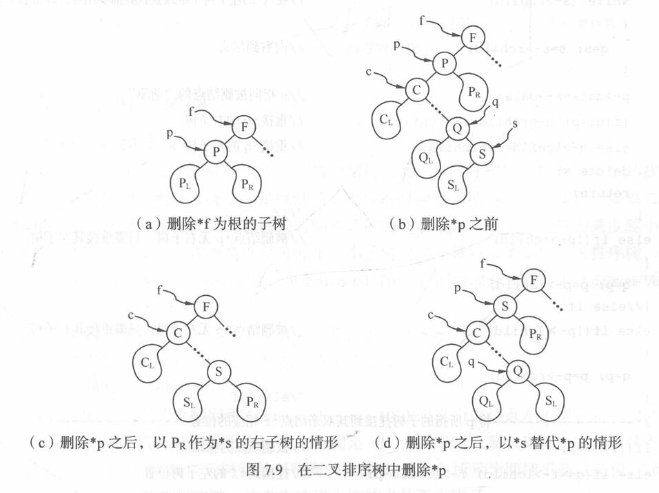

# 查找

## 查找的基本概念

+ **查找表**：由**同一类型**的**数据元素**（或**记录**）构成的**集合**
  + 由于“集合”中的数据元素之间存在着完全松散的关系，因此查找表是一种非常灵便的数据结构，可以利用其他的数据结构来实现：比如本章将要介绍的**线性表**、**树表**及**散列表**等
+ **关键字**：关键字是**数据元素**（或**记录**）中**某个数据项的值**，用它可以**标识**一个数据元素（或记录）
  + 若此关键字可以**唯一**地**标识一个记录**，则称此关键字为**主关键字**
    + 对**不同的记录**，其**主关键字**均**不同**
  + 反之，称**用以识别若干记录的关键字**为**次关键字**
  + 当数据元素**只有一个数据项**时，其**关键字**即为该数据元素的**值**
+ **查找**：根据**给定的某个值**，在查找表中确定一个其**关键字等于给定值**的**数据元素**（或**记录**）
  + 若表中**存在**这样的一个**记录**，则称**查找成功**，此时查找的结果可给出整个记录的信息，或指示该记录在查找表中的位置
  + 若表中**不存在关键字等于给定值**的**记录**，则称**查找不成功**，此时查找的结果可给出一个 **“空”记录**或 **“空”指针**
+ **动态查找表**和**静态查找表**：
  + 若在**查找**的**同时**对表做**修改操作**（如**插入**和**删除**），则相应的表称之为**动态查找表**，**否**则称之为**静态查找表**
    + 换句话说，**动态查找表**的**表结构**本身是在**查找过程中动态生成**的：
      + 在创建表时，对于给定值，若表中**存在**其**关键字等于给定值的记录**，则**查找成功返**回；否则**插入**关键字等于给定值的记录
+ **平均查找长度**：为确定记录在查找表中的位置，**需和给定值进行比较的关键字个数**的**期望值**，称为查找算法在**查找成功**时的**平均查找长度**（Average Search Length，ASL）
  + 对于**含有$n$个记录的表**，查找成功时的平均查找长度为$$ASL = \sum_{i = 1}^n P_i C_i$$其中：
    + $P_i$为查找表中**第$i$个记录**的**概率**，且$\sum\limits_{i = 1}^n P_i = 1$
    + $C_i$为找到表中**其关键字与给定值相等的第$i$个记录**时，和**给定值已进行过比较的关键字个数**；显然，$C_i$随查找过程不同而不同
  + 由于查找算法的基本运算是关键字之间的比较操作，所以可用**平均查找长度**来**衡量**查找算法的**性能**

## 静态查找表

### 顺序表的查找（顺序查找）

+ **顺序查找**（Sequential Search）的查找过程为：从**表的一端**开始，**依次**将**记录的关键字**和**给定值**进行**比较**
  + 若**某个记录的关键字**和**给定值相等**，则查找**成功**
  + 反之，若**扫描整个表**后，仍**未找到**关键字和给定值相等的记录，则查找**失败**  
+ 顺序查找方法既**适用**于线性表的**顺序存储结构**，又适用于线性表的**链式存储结构**
+ 数据元素类型定义如下：

  ```C
  typedef struct{
  	KeyType key;         // 关键字域
  	InfoType otherinfo;  // 其他域
  }ElemType;
  ```

+ 顺序表的定义为：

  ```C
  typedef struct{
  	ElemType *R;  // 存储空间基地址
  	int length;   // 当前长度
  }SSTable;
  ```

+ 假设元素从顺序表ST的ST.R[1]开始顺序向后存放，ST.R[0]闲置不用，查找时从表的最后开始比较：
  + 可以用`for(i = ST.length; i >= 1; i--) {if(ST.R[i].key == key) return i;}`来搜索
  + 也可以**令`ST.R[0] = key;`** ，从而循环变为`for(i = ST.length; ST.R[i].key != key; i--); return i;`
    + 第二种方法能够减少比较的次数，ST.R[0]起到了**监视哨**的作用
+ 顺序查找的$ASL = \frac{n + 1}{2}$，**时间复杂度**为$O(n)$

### 有序表的查找（折半查找）

+ **折半查找**（Binary Search）也称**二分查找**，要求线性表必须**采用顺序存储结构**，而且**表中元素**按**关键字有序排列**；其查找过程为：从**表的中间记录**开始
  + 如果**给定值和中间记录的关键字相等**，则查找**成功**
  + 如果**给定值大于**或者**小于中间记录的关键字**，则在**表中大于**或**小于中间记录的那一半**中**查找**
    + 重复以上操作，直到查找**成功**，或者**在某一步中查找区间为空**，则代表查找**失败**
+ 算法步骤：
  1. **置查找区间初值**，**low**为$1$，**high**为**表长**
  2. 当**low小于等于high**时，循环执行以下操作：
     1. **mid**取值为**low和high的中间值**
     2. 将**给定值key**与**中间位置记录的关键字**进行**比较**：
        + 若**相等**则查找**成功**，**返回中间位置mid**
        + 若**不相等**则**利用中间位置记录将表对分成前、后两个子表**；如果 **key**比**中间位置记录的关键字小**，则**high**取为**mid - 1**，**否**则**low**取为**mid + 1**
  3. 循环结束，说明查找区间为空，则查找**失败**，返回0
+ 折半查找过程可用**二叉树**来描述：
  + 树中**每一结点**对应**表中一个记录**，但**结点值**不是~~记录的关键字~~，而是**记录在表中的位置序号**
  + 把当前**查找区间的中间位置**作为**根**，**左子表**和**右子表**分别作为根的**左子树**和**右子树**，由此得到的二叉树称为**折半查找**的**判定树**
  + 具有$n$个结点判定树深度为$\lfloor \log_2 n \rfloor + 1$，从而折半查找的$ASL = \frac{n + 1}{n}\log_2 (n + 1) - 1\approx \log_2(n + 1) - 1$，**时间复杂度**为$O(\log_2 n)$

### 静态树表的查找（次优查找树）

+ 如果**有序表**中各记录的**查找概率不等**，则在**只考虑查找成功**的情况下，则使**查找性能达最佳**的**判定树**是其带权内路径长度之和$PH$值$$PH = \sum_{i = 1}^n w_i h_i$$取**最小值**的二叉树；
  + 其中：
    + $n$为二叉树上**结点的个数**（即有序表的长度）
    + $h_i$为**第$i$个结点**在二叉树上的**层次数**
    + 结点的**权$w_i = cp_i\ (i=1, 2, \cdots, n)$** ，其中$p_i$为结点的**查找概率**，$c$为某个**常量**
  + **静态最优查找树**（Static Optimal Search Tree）：$PH$值取**最小**的**二叉树**
    + 构造静态最优查找树花费的时间代价较高
  + **次优查找树**（Nearly Optimal Search Tree）：$PH$值取**近似最小**的**二叉树**，构造方法如下：
    + 考虑按关键字有序的序列$(r_l, r_{l + 1}, \cdots, r_h)$满足$r_l.\text{key} < r_{l + 1}.\text{key} < \cdots < r_h.\text{key}$，每个记录相应的权值为$w_l, w_{l + 1}, \cdots, w_h$
      1. 首先在记录序列中取第$i$个记录$r_i$作为**根结点**，其满足$$\Delta P_i = \left| \sum_{j = i + 1}^h w_j - \sum_{j = l}^{i - 1} w_j \right|$$**最小**
         + 即**该记录之后的第$i + 1$个到第$h$个记录对应权值之和**与**该记录之前的第$l$个到第$i - 1$个记录对应权值之和**的**差**做到**最小**
         + 为了方便计算，引入**累计权值和**$sw_i = \sum\limits_{j = l}^i w_j$，且令$w_{l - 1} = 0$和$sw_{l - 1} = 0$，则$$\begin{aligned} \Delta P_i =& |(sw_h - sw_i) - (sw_{i - 1} - sw_{l - 1})| \\ =& |sw_h - (sw_i + sw_{i - 1})| \end{aligned}$$
      2. 分别对**子序列$(r_l, r_{l + 1}, \cdots, r_{i - 1})$和$(r_{i + 1}, r_{l + 2}, \cdots, r_h)$构造次优查找树**
    + 次优查找树的**平均查找长度**和 **$\log n$成正比**

### 索引顺序表的查找（分块查找）

+ **分块查找**（Blocking Search）又称**索引顺序查找**，这是一种**性能介于顺序查找和折半查找之间**的一种查找方法
  + 在此查找法中，除表本身以外，尚需建立一个 **“索引表”**，索引表包含对每一个**子表**（或称**块**）建立的**索引项**
    + **索引项**包括两项内容：
      + **关键字项**：其值为该子表内的**最大关键字**
      + **指针项**：指示该子表的**第一个记录**在**表中位置**
    + **索引表**按**关键字有序**，则**表**或者**有序**，或者**分块有序**
    + 所谓 **“分块有序”** 指的是**后一个子表的所有关键字**均**大于前一个子表的最大关键字**
+ 分块查找的**查找过程**：先确定**待查记录所在的块**（子表），然后**在块中顺序查找**
  + 由于**由索引项组成的索引表**按**关键字有序**，则**确定块**的**查找**可以用**顺序查找**，亦可用**折半查找**；而**块中记录**是**任意排列**的，则在**块中**只能是**顺序查找**
  + 由此，**分块查找的算法**为**顺序查找**和**折半查找**两种算法的简单合成
  + 分块查找的**平均查找长度**为$ASL_{bs} = L_b + L_w$
    + 其中，$L_b$为**查找索引表确定所在块**的**平均查找长度**，$L_w$为**在块中查找元素**的**平均查找长度**
    + 设**长度为$n$的表**被**均匀地分成$b$块**，**每块含$s$个记录**（即$b = \left\lceil \frac{n}{s} \right\rceil$），表中**每个记录的查找概率相等**，则有：
      + **每块查找的概率**为$\frac{1}{b}$，块中**每个记录的查找概率**为$\frac{1}{s}$
      + 使用**顺序查找**确定块时：
        + 平均查找长度$ASL_{bs} = \frac{b + 1}{2} + \frac{s + 1}{2} = \frac{1}{2}\left(\frac{n}{s} + s\right) + 1$
        + $s$取$\sqrt{n}$时，$ASL_{bs}$有最小值$\sqrt{n} + 1$，此时**时间复杂度**为$O(\sqrt{n})$
      + 使用**折半查找**确定块时：
        + 平均查找长度$ASL_{bs} \approx \log_2 \left(\frac{n}{s} + 1\right) + \frac{s}{2}$
+ **优缺点**：
  + **优点**：在表中**插入**和**删除数据元素**时，只要**找到该元素对应的块**，就可以**在该块内进行插入和删除运算**
    + 由于**块内是无序**的，故**插入**和**删除**比较容易，**无需进行大量移动**
    + 如果线性表**既要快速查找**又**经常动态变化**，则可采用分块查找
  + **缺点**：要增加一个**索引表的存储空间**并对**初始索引表**进行**排序**运算

## 动态查找表

### 二叉排序树和平衡二叉树

#### 二叉排序树

+ **二叉排序树**（Binary Sort Tree）又称**二叉查找树**，它是一种对排序和查找都很有用的特殊二叉树
  + 二叉排序树或者是一棵**空树**，或者是**具有下列性质**的二叉树：
    + 若它的**左子树不空**，则**左子树上所有结点的值**均**小于**它的**根结点的值**
    + 若它的**右子树不空**，则**右子树上所有结点的值**均**大于**它的**根结点的值**
    + 它的**左、右子树**也分别为**二叉排序树**
+ 二叉排序树的**查找**：
  + 查找**算法**：
    + 若**二叉排序树为空**，则**查找失败**，返回空指针
    + 若**二叉排序树非空**，将**给定值key**与**根结点的关键字T->data.key**进行比较：
      + 若**key等于T->data.key**，则**查找成功**，返回根结点地址
      + 若**key小于T->data.key**，则**递归查找左子树**
      + 若**key大于T->data.key**，则**递归查找右子树**
  + 含有$n$个结点的二叉排序树的**平均查找长度**和**树的形态**有关：
    + **最差的情况**是，当**先后插入的关键字有序**时，构成的二叉排序树蜕变为**单支树**
      + 树的深度为$n$，其**平均查找长度**为$\frac{n + 1}{2}$（和**顺序查找**相同）
    + **最好的情况**是，二叉排序树的形态和**折半查找的判定树**相似
      + 其**平均查找长度**和$\log_2 n$成正比
    + 若考虑把$n$个结点按各种可能的次序插入到二叉排序树中，则有$n!$棵二叉排序树（其中有的形态相同）
      + 可以证明，综合所有可能的情况，就平均而言，二叉排序树的**平均查找长度**仍然和$\log_2 n$是**同数量级**的，即**时间复杂度**为$O(\log_2 n)$
+ 二叉排序树的**插入**：
  + 插入**算法**：
    + 若二叉排序树**为空**，则待**插入结点\*S**作为**根结点**插入到空树中
    + 若二叉排序树**非空**，则将**key**与**根结点的关键字T->data.key**进行比较
      + 若**key小于T->data.key**，则将**\*S**插入**左子树**
      + 若**key大于T->data.key**，则将**\*S**插入**右子树**
  + 二叉排序树的**插入**的**基本过程**是**查找**，从而**时间复杂度**为$O(\log_2 n)$
+ 二叉排序树的**创建**：
  + 创建**算法**：
    1. 将二叉排序树T**初始化为空树**
    2. **读入一个关键字为key**的**结点**
    3. 如果读入的关键字key**不是输入结束标志**，则**循环执行以下操作**：
       1. 将此结点**插入二叉排序树T**中
       2. **读入一个关键字为key**的**结点**
  + 二叉排序树的**创建**的需要进行 **$n$次插入**，从而**时间复杂度**为$O(n\log_2 n)$
+ 二叉排序树的**删除**：
  + 删除**算法**：
    + 首先从二叉排序树的根结点开始**查找关键字为key**的**待删结点**
      + 如果树中不存在此结点，则不做任何操作
      + 否则，假设**被删结点**为**\*p**（指向结点的指针为p），其**双亲结点**为**\*f**（指向结点的指针为f），**P<sub>L</sub>**和**P<sub>R</sub>**分别表示其**左子树**和**右子树**
    + 不妨设**\*p为\*f的左子树**
    + 若\*p结点为**叶子结点**，即**P<sub>L</sub>和P<sub>R</sub>均为空树**：
      + 由于删去叶子结点不破坏整棵树的结构，则只需**修改其双亲结点的指针**即可：`f->lchild = NULL;`
    + 若\*p结点**只有左子树P<sub>L</sub>**或者**只有右子树P<sub>R</sub>** ：
      + 此时只要**令P<sub>L</sub>或P<sub>R</sub>直接成为其双亲结点\*f的左子树**即可：`f->lchild = p->lchild;`或`f->lchild = p->rchild;`
    + 若\*p结点的**左子树**和**右子树均不空**：
      + 在删去*p之后，为保持其他元素之间的相对位置不变，可以有两种处理方法：
        + 令**\*p的左子树**为**\*f的左子树**，而**\*p的右子树**为**\*s的右子树**（下方图中c方法）：`f->lchild = p->lchild; s->rchild = p->rchild;`
          + 此方法可能增加树的深度，因此较为少用
        + 令**\*p的直接前驱**（或**直接后继**）**替代\*p**，然后再**从二叉排序树中删去它的直接前驱**（下方图中d方法）：`p->data = s->data; q->rchild = s->lchild`
          + 此方法以**被删结点左子树中关键字最大的结点替代被删结点**，然后**从左子树中删除这个结点**；**此结点一定没有右子树**（否则它就不是左子树中关键字最大的结点），这样**不会增加树的高度**，所以常采用这种处理方案
            
  + 二叉排序树的**删除**的**基本过程**是**查找**，从而**时间复杂度**为$O(\log_2 n)$
    

#### 平衡二叉树

+ **平衡二叉树**或者是空树，或者是具有如下特征的**二叉排序树**：
  + 左子树和右子树的**深度之差**的**绝对值不超过$1$**
  + 左子树和右子树**也是平衡二叉树**
    + 若将二叉树上结点的**平衡因子**（Balance Factor，BF）定义为该结点**左子树**和**右子树**的**深度之差**，则**平衡二叉树**上**所有结点的平衡因子只可能是$-1$、$0$和$1$**
+ 插入结点时，首先按照二叉排序树处理，若**插入结点后破坏了平衡二叉树的特性**，需对平衡之叉树进行调整，调整方法是：
  + 找到**离插入结点最近**且**平衡因子绝对值超过$1$** 的**祖先结点**，**以该结点为根的子树**称为**最小不平衡子树**，可将重新平衡的范围局限于这棵子树
  + 设该子树的**根结点为A**，则失去平衡后进行调整的规律包括以下4中情况：
    + **LL型**：由于在**A的左子树根结点的左子树**上**插入结点**，A的平衡因子由$1$增至$2$，致使以A为根的子树失去平衡，则需进行一次**向右**的**顺时针旋转**操作
      
    + **RR型**：由于在**A的右子树根结点的右子树**上**插入结点**，A的平衡因子由$-1$减至$-2$，致使以A为根的子树失去平衡，则需进行一次**向左**的**逆时针旋转**操作
      
    + **LR型**：由于在**A的左子树根结点的右子树**上**插入结点**，A的平衡因子由$1$增至$2$，致使以A为根结点的子树失去平衡，则需进行**两次旋转操作**：
      + 第一次对**B及其右子树**进行**逆时针旋转**，**C转上去成为B的根**，这时变成了LL型
        + 如果**C原来有左子树**，则**调整C的左子树为B的右子树**
      + 第二次进行**LL型**的**顺时针旋转**即可恢复平衡
        
    + **RL型**：由于在**A的右子树根结点的左子树**上**插入结点**，A的平衡因子由$-1$减至$-2$，致使以A为根结点的子树失去平衡，则需进行**两次旋转操作**：
      + 第一次对**B及其右子树**进行**顺时针旋转**，**C转上去成为B的根**，这时变成了LL型
        + 如果**C原来有右子树**，则**调整C的右子树为B的左子树**
      + 第二次进行**RR型**的**逆时针旋转**即可恢复平衡
        
+ 平衡二叉树**插入**的**具体算法**：
  1. 若**BBST**为**空树**，则插入一个**数据元素为e**的新结点作为**BBST的根结点**，树的**深度增$1$**
  2. 若**e的关键字**和**BBST的根结点的关键字相等**，则**不进行插入**
  3. 若**e的关键字小于BBST的根结点的关键字**，而且在**BBST的左子树中不存在和e有相同关键字的结点**，则将**e插入在BBST的左子树**上，并且当插入完成、**左子树深度增加$1$** 后，分别就下列不同情况处理之：
     + BBST的**根结点的平衡因子为$-1$** （**右子树的深度大于左子树的深度**）：
       + 将**根结点的平衡因子更改为$0$** ，BBST的**深度不变**
     + BBST的**根结点的平衡因子为$0$** （**左、右子树的深度相等**）：
       + 将**根结点的平衡因子更改为$1$** ，BBST的**深度增加$1$**
     + BBST的**根结点的平衡因子为$1$** （**左子树的深度大于右子树的深度**）：
       + 若BBST的**左子树根结点的平衡因子为$1$** ，则需进行**单向右旋平衡处理**，并且在右旋处理之后，将**根结点**和其**右子树根结点**的**平衡因子**更改为$0$，树的**深度不变**
       + 若BBST的**左子树根结点的平衡因子为$-1$** ，则需进行**先向左、后向右**的**双向旋转平衡**处理，并且在旋转处理之后，**修改根结点**和其**左、右子树根结点的平衡因子**，树的**深度不变**
  4. 若e**的关键字大于BBST的根结点的关键字**，而且在**BBST的右子树中不存在和e有相同关键字的结点**，则将**e插入在BBST的右子树**上，并且当插入完成、**右子树深度增加$1$** 后，分别就不同情况处理之；其处理操作**和步骤3中所述相对称**

### B-树

+ 一棵$m$阶的B-树，或为**空树**，或为**满足下列特性的$m$叉树**：

  + 树中**每个结点至多有$m$棵子树**
  + 若**根结点不是叶子结点**，则**至少有两棵子树**
  + **除根之外**的所有**非终端结点至少有$\left\lceil \frac{m}{2} \right\rceil$棵子树**
  + **所有的叶子结点**都出现在**同一层次**上，并且**不带信息**，通常称为**失败结点**
    + **失败结点实际并不存在**，**指向这些结点的指针为空**；引入失败结点是为了**便于分析B-树的查找性能**
  + 所有的**非终端结点最多有$m - 1$个关键字**，其结构包含：$$\{n, P_0, K_1, P_1, K_2, P_2, \cdots, K_n, P_n\}$$
    + $n$为**关键字的个数** / $n + 1$为**子树的个数**，满足$\left\lceil \frac{m}{2} \right\rceil - 1 \leqslant n \leqslant m - 1$
    + $K_i (i = 1, 2, \cdots, n)$为**关键字**，且$K_i < K_{i + 1} (i = 1, 2, \cdots, n - 1)$
    + $P_i (i = 0, \cdots, n)$为**指向子树根结点的指针**，且：
      + **$P_{i - 1}$所指子树**中**所有结点的关键字**均**小于$K_i (i = 1, 2, \cdots, n)$**
      + **$P_i$所指子树**中**所有结点的关键字**均**大于$K_n$**


+ B-树的**特点**：
  + **平衡**：所有**叶子结点**均在**同一层次**
  + **有序**：树中**每个结点中的关键字**都是**有序**的，且**关键字$K_i$“左子树”中的关键字**均**小于$K_i$** ，而**其“右子树”中的关键字**均**大于$K_i$**
  + **多路**：**除叶子结点外**，有的结点中有一个关键字、两棵子树，有的结点中有两个关键字、三棵子树，这种 **$4$阶**的B-树**最多**有**三个关键字、四棵子树**
+ B-树的**查找**：
  + 查找**算法**：
    1. 将**给定值$\text{key}$** 与**根结点的各个关键字$K_1, K_2, \cdots, K_j (1 \leqslant j \leqslant m - 1)$进行比较**
       + 由于该**关键字序列**是**有序**的，所以查找时可采用**顺序查找**，也可采用**折半查找**
       + 查找时：
         + 若$\text{key} = K_i (1 \leqslant i \leqslant j)$，则**查找成功**
         + 若$\text{key} < K_1$，则**顺着指针$P_0$所指向的子树**继续**向下查找**
         + 若$K_i < \text{key} < K_j (1 \leqslant i \leqslant j - 1)$，则**顺着指针$P_i$所指向的子树**继续**向下查找**
         + 若$key > K_j$，则**顺着指针$P_j$所指向的子树**继续**向下查找**
    2. 如果在自上而下的查找过程中，**找到了值为$\text{key}$的关键字**，则**查找成功**；如果**直到叶子结点也未找到**，则**查找失败**
  + 若$m$阶B-树深度为$h$，总共具有$N$个关键字，则叶子结点（查找不成功的结点）为$N + 1$，则有$$N + 1 \geqslant 2 \times \left(\left\lceil \frac{m}{2} \right\rceil\right)^{h - 1}$$亦即$$h \leqslant \log_{\left\lceil \frac{m}{2} \right\rceil} \left( \frac{N + 1}{2} \right) + 1$$也就是说，查找的路径长度不会超过$\log_{\left\lceil \frac{m}{2} \right\rceil} \left( \frac{N + 1}{2} \right) + 1$
+ B-树的**插入**：
  1. 在B-树中**查找给定关键字的记录**
     + 若**查找成功**，则**插入操作失败**
     + 否则将**新记录**作为**空指针p**插入到**查找失败的叶子结点**的**上一层结点**（由**q指向**）中
  2. 若**插入新记录**和**空指针**后，**q指向的结点**的**关键字个数未超过$m - 1$** ，则**插入操作成功**，**否**则转入**步骤3**
  3. 以**该结点的第$\left\lceil \frac{m}{2} \right\rceil$个关键字$K_{\left\lceil \frac{m}{2} \right\rceil}$** 为**拆分点**，将该结点分成3个部分：
     + **$K_{\left\lceil \frac{m}{2} \right\rceil}$左边部分**仍然保留在原结点中
     + **$K_{\left\lceil \frac{m}{2} \right\rceil}$右边部分**存放在一个**新创建的结点**（由**p指向**）中
     + **关键字值为$K_{\left\lceil \frac{m}{2} \right\rceil}$的记录**和**指针p**插入到**q的双亲结点中**
       + 因**q的双亲结点增加一个新的记录**，所以**必须对q的双亲结点重复步骤2和步骤3**，依次类推，**直至**由**q指向的结点**是**根结点**，转入**步骤4**
  4. 由于**根结点无双亲**，则由**其分裂产生的两个结点的指针p和q**，以及**关键字为$K_{\left\lceil \frac{m}{2} \right\rceil}$的记录**构成一个**新的根结点**
     + 此时，**B-树**的**高度增加1**
+ B-树的**删除**：
  + **删除记录后**，**结点的关键字个数**如果**小于$\left\lceil \frac{m}{2} \right\rceil$** ，则要进行 **“合并”结点**的操作
    + 合并完后，可能需要递归继续合并！
  + 除了**删除记录**，还要**删除该记录邻近的指针**
  + 若该结点**为最下层的非终端结点**，由于其**指针均为空**，删除后不会影响其他结点，可**直接删除**
    + 删除后也要根据情况处理“合并”节点
  + 若该结点**不是最下层的非终端结点**，邻近的指针则指向一棵子树，不可直接删除；此时可做**如下处理**：
    + 将**要删除记录用其右（左）边邻近指针**所**指向的子树**中**关键字最小（大）的记录**进行**替换**
      + **该记录必定**在**最下层的非终端结点中**
      + 采取这种方法进行处理，无论要删除的记录所在的结点是否为最下层的非终端结点，都可归结为在最下层的非终端结点中删除记录的情况

### B+树

+ **B+树**和**B-树**的**差异**
  + 有 **$n$棵子树的结点**中含有 **$n$个关键字**
  + 所有的**叶子结点**组合起来包含了**全部关键字的信息**，以及**指向含这些关键字记录的指针**，且**叶子结点本身依关键字的大小自小而大顺序链接**
  + 所有的**非终端结点**可以看成是**索引部分**，结点中**仅含有其子树**（根结点）中的**最大（或最小）关键字**


+ B+树的**查找**：
  + 若**非终端结点上的关键字等于给定值**，**并不终止**，而是**继续向下直到叶子结点**
    + 因此，在B+树中，**不管查找成功与否**，**每次查找**都是走了一条**从根到叶子结点的路径**。
    + B+树查找的分析类似于B-树
    + B+树不仅能够有效地查找单个关键字，而且更适合**查找某个范围内的所有关键字**
      + 例如，在B+树上找出**范围在$[a，b]$之间的所有关键字值**，其处理方法如下：
        1. 通过**一次查找找出关键字$a$，不管它是否存在**，都**可以到达可能出现$a$的叶子结点**
        2. 在**叶子结点**中**查找关键字值等于$a$或大于$a$的那些关键字**，对于所**找到的每个关键字**都有**一个指针指向相应的记录**，这些**记录的关键字在所需要的范围**
        3. 如果**在当前结点中没有发现大于$b$的关键字**，就可以**使用当前叶子结点的最后一个指针找到下一个叶子结点**，并**继续进行同样的处理，直至在某个叶子结点中找到大于$b$的关键字**，才**停止查找**

### 键树

+ **键树**又称**数字查找树**（Digital Search Trees），它是一棵**度$\geqslant 2$的树**，树中的每个结点中不是包含一个或几个关键字，而是**只含有组成关键字的符号**
  + 例如，若关键字是**数值**，则**结点**中只包含一个**数位**；若关键字是**单词**，则**结点**中只包含一个**字母字符**，这种树会给某种类型关键字的表的查找带来方便
  + 为了查找和插入方便，我们约定键树是**有序树**，即**同一层中兄弟结点之间依所含符号自左至右有序**，并约定**结束符`$`小于任何字符**
+ 通常，键树可有两种存储结构：
  + 以**树的孩子兄弟链**表来表示键树：
    + 此时每个**分支结点**包括3个域
      + **symbol域**：存储**关键字的一个字符**
      + **first域**：存储指向**第一棵子树根**的**指针**
      + **next域**：存储指向**右兄弟**的**指针**
    + 同时，**叶子结点**的**infoptr域**存储**指向该关键字记录**的**指针**
    + 此时的键树又称**双链树**
      
    + **查找过程**：
      + 从双链树的根指针出发，顺**first指针**找到**第一棵子树的根结点**，将**第1个字符**和**此结点的symbol域**比较
        + 若**相等**，则**顺first域**再**比较下一字符**
        + 若**不相等**，则**沿next域**继续**顺序查找**
        + 若**直至“空”仍比较不等**，则**查找不成功**
    + **平均查找长度**：$\frac{1}{2}(1 + d)$，其中$d$为**最大深度**
  + 以**树的多重链表**表示键树：
    + 则树的每个结点中应含有 **$d$个指针域**，此时的键树又称**Trie树**
    + 在Trie树中有两种结点：
      + **分支结点**：含有 **$d$个指针域**和一个**指示该结点中非空指针域的个数**的**整数域**
        + 在分支结点中**不设数据域**，每个分支结点**所表示的字符**均由**其双亲结点中（指向该结点）的指针所在位置**决定
      + **叶子结点**：含有**关键字域**和**指向记录的指针域**
        + 若**从键树中某个结点到叶子结点的路径**上**每个结点都只有一个孩子**，则可**将该路径上所有结点压缩成一个“叶子结点”**，且在**该叶子结点**中存储**关键字及指向记录的指针**等信息
          
    + **查找过程**：
      + **从根结点出发，沿和给定值相应的指针逐层向下，直至叶子结点**
        + 若叶子结点中的**关键字和给定值相等**，则**查找成功**
        + 若**分支结点中和给定值相应的指针为空**，或**叶结点中的关键字和给定值不相等**，则**查找不成功**
  + 比较：若键树中**结点的度较大**，则采用**Trie树**结构较双链树更为合适

## 哈希表（散列表）

### 什么是哈希表（散列表）

+ **散列函数**和**散列地址**：
  + 在记录的**存储位置$p$** 和其**关键字$\text{key}$** 之间建立一个**确定的对应关系$H$** ，使$p = H(\text{key})$，称这个**对应关系$H$** 为**散列函数**，$p$为**散列地址**
+ **散列表**：
  + 一个**有限连续的地址空间**，用以存储**按散列函数计算**得到**相应散列地址**的**数据记录**
    + 通常**散列表的存储空间**是一个**一维数组**，**散列地址**是**数组的下标**
+ **冲突**和**同义词**：
  + 对**不同的关键字**可能得到**同一散列地址**，即$\text{key}_1 \neq \text{key}_2$，而$H(\text{key}_1) =H(\text{key}_2)$，这种现象称为**冲突**
  + 具有**相同函数值的关键字**对该**散列函数**来说称作**同义词**，$\text{key}_1$与$\text{key}_2$互称为同义词

### 哈希函数（散列函数）的构造方法

+ 构造一个“好”的散列函数应遵循以下两条原则：
  + 函数**计算要简单**，**每一关键字**只能有**一个散列地址**与之对应
  + 函数的**值域需在表长的范围**内，计算出的**散列地址的分布应均匀**，**尽可能减少冲突**
+ **数字分析法**：
  + **适用情况**：
    + 事先知道**关键字集合**，以及**关键字每一位**上**各种数字的分布情况**，且**每个关键字的位数**比**散列表的地址码位数多**
  + 若每个关键字由 **$n$位数**组成，如$k_1 k_2 \cdots k_n$，则可以**从关键字中提取数字分布比较均匀的若干位**作为**散列地址**
+ **平方取中法**：
  + **适用情况**：
    + **不能事先了解关键字的所有情况**，或**难于直接从关键字中找到取值较分散的几位**
  + 先对**源程序的标识符**进行**内部数字编码**，将其取**平方**后找出**平方数字中适合作为散列地址的数位**
+ **折叠法**：
  + **适用情况**：
    + **散列地址**的**位数较少**，而**关键字**的**位数较多**，且**难于直接从关键字中找到取值较分散的几位**
  + 将**关键字分割成位数相同的几部分**（最后一部分的位数可以不同），然后**取这几部分的叠加和**（**舍去进位**）作为**散列地址**
    + **移位叠加**是将**分割后每一部分的最低位对齐**，然后**相加**
    + **边界叠加**是将**两个相邻的部分沿边界来回折叠**，然后**对齐相加**
+ **除余留数法**：
  + 除留余数法计算简单，适用范围非常广，是**最常用**的构造散列函数的方法
  + 假设**散列表表长**为$m$，选择一个**不大于$m$的数$p$** ，用 **$p$去除关键字**，除后**所得余数**为**散列地址**，即$H(\text{key}) = \text{key} \% p$
    + 这个方法的**关键**是**选取适当的$p$** ，一般情况下，可以选$p$为**小于表长的最大质数**；例如，表长$m = 100$，可取$p = 97$

### 处理冲突的方法

+ **开放地址法**：
  + 基本思想：
    + 把记录都存储在散列表数组中，当某一记录关键字$\text{key}$的**初始散列地址$H_0 = H(\text{key})$发生冲突**时，以$H_0$为基础，采**取合适方法计算**得到**另一个地址$H_1$**
    + 如果 **$H_1$仍然发生冲突**，以$H_1$为基础**再求下一个地址$H_2$** ，若 **$H_2$仍然冲突**，再**求得$H_3$**
    + 依次类推，**直至$H_k$不发生冲突**为止，则$H_k$为该记录在表中的**散列地址**
  + 这种方法在寻找“下一个”空的散列地址时，**原来的数组空间**对**所有的元素**都是**开放**的，所以称为**开放地址法**
    + 通常把**寻找“下一个”空位的过程**称为**探测**，上述方法可用如下公式表示：$$H_i = (H(\text{key}) \% m),\quad i = 1, 2, \cdots, k (k \leqslant m - 1)$$其中$H(\text{key})$为**散列函数**，$m$为**散列表表长**，$d_i$为**增量序列**
    + 根据$d_i$取值的不同，可以分为以下3种**探测方法**：
      + **线性探测法**：$$d_i = 1, 2, 3, \cdots, m - 1$$
        + 这种探测方法可以将**散列表**假想成一个**循环表**，发生冲突时，**从冲突地址的下一单元顺序寻找空单元**，如果到**最后一个位置也没找到空单元**，则**回到表头开始继续查找**，直到找到一个空位，就把此元素放入此空位中；如果**找不到空位**，则说明散列表已满，需要进行**溢出**处理
      + **二次（平方）探测法**：$$d_i = 1^2, -1^2, 2^2, -2^2, 3^2, \cdots, +k^2, -k^2$$
      + **伪随机探测法**：$$d_i = \text{伪随机数序列}$$
    + 在处理冲突过程中发生的**两个第一个散列地址不同的记录**争夺**同一个后继散列地址**的现象称作 **“二次聚集”**（或称作 **“堆积”**），即在**处理同义词的冲突过程**中又**添加了非同义词的冲突**
      + **线性探测法**的
        + **优点**：只要散列表未填满，**总能找到一个不发生冲突的地址**
        + **缺点**：会**产生“二次聚集”现象**
      + **二次（平方）探测法**和**伪随机探测法**的
        + **优点**：可以**避免“二次聚集”现象**
        + **缺点**：**不能保证一定找到不发生冲突的地址**
  + **链地址法**：
    + 把**具有相同散列地址的记录**放在**同一个单链表**中，称为**同义词链表**
      + 有 **$m$个散列地址**就有 **$m$个单链表**，同时用数组$HT[0, \cdots, m - 1]$存放**各个链表的头指针**，凡是**散列地址为$i$的记录**都以结点方式**插入**到**以$HT[i]$为头结点的单链表**中

### 哈希表（散列表）的查找与分析

+ 散列表的**查找**：
  1. 给定待查找的关键字$\text{key}$，根据造表时设定的散列函数计算$H_0 = H(\text{key})$
  2. 若**单元$H_0$为空**，则**所查元素不存在**
  3. 若**单元$H_0$中元素的关键字为$\text{key}$** ，则**查找成功**
  4. 否则**重复下述解决冲突的过程**：
     1. 按**处理冲突的方法**，计算**下一个散列地址$H_i$**
     2. 若**单元$H_i$为空**，则**所查元素不存在**
     3. 若**单元$H_i$中元素的关键字为$\text{key}$** ，则**查找成功**
+ 虽然散列表在关键字与记录的存储位置之间建立了直接映像，但**由于“冲突”的产生**，使得**散列表的查找过程**仍然是一个**给定值和关键字进行比较的过程**；因此，仍需以**平均查找长度**作为衡量**散列表查找效率**的**量度**
  + 查找过程中需和给定值进行比较的关键字的个数取决于三个因素：**散列函数**、**处理冲突的方法**和**散列表的装填因子**
    + **散列表的装填因子$\alpha$** 定义为$$\alpha = \frac{\text{表中填入的记录数}}{\text{散列表的长度}}$$这里$\alpha$标志散列表**的装满程度**
      + **$\alpha$越小**，**发生冲突的可能性**就**越小**
      + 反之， **$\alpha$越大**，表中已填入的记录越多，再填记录时，**发生冲突的可能性**就**越大**，则查找时，**给定值需与之进行比较的关键字的个数**也就**越多**
    + **散列函数的“好坏”** 首先影响**出现冲突的频繁程度**，但一般情况下认为:凡是**“均匀的”散列函数**，对同一组**随机的关键字**，**产生冲突的可能性相同**
      + 假如所设定的散列函数是“均匀”的，则**影响平均查找长度的因素**只有**两个**：**处理冲突的方法**和**装填因子$\alpha$**
  + 常见处理冲突方法的**平均查找长度**（**探测次数**）：

    |            处理冲突的方法            |               查找成功的平均查找长度                |                 查找失败的平均查找长度                  |
    | :----------------------------------: | :-------------------------------------------------: | :-----------------------------------------------------: |
    |              线性探测法              | $\frac{1}{2} \left(1 + \frac{1}{1 - \alpha}\right)$ | $\frac{1}{2} \left(1 + \frac{1}{(1 - \alpha)^2}\right)$ |
    | 二次（平方）探测法<br />伪随机探测法 |         $-\frac{1}{\alpha} \ln(1 - \alpha)$         |                 $\frac{1}{1 - \alpha}$                  |
    |               链地址法               |               $1 + \frac{\alpha}{2}$                |                 $\alpha + e^{-\alpha}$                  |

  + 散列表的**平均查找长度**是 **$\alpha$的函数**，而**不是**~~记录个数$n$的函数~~
    + 因此，在设计散列表时，不管$n$多大，总可以**选择合适的$\alpha$** 以便**将平均查找长度限定在一个范围内**

