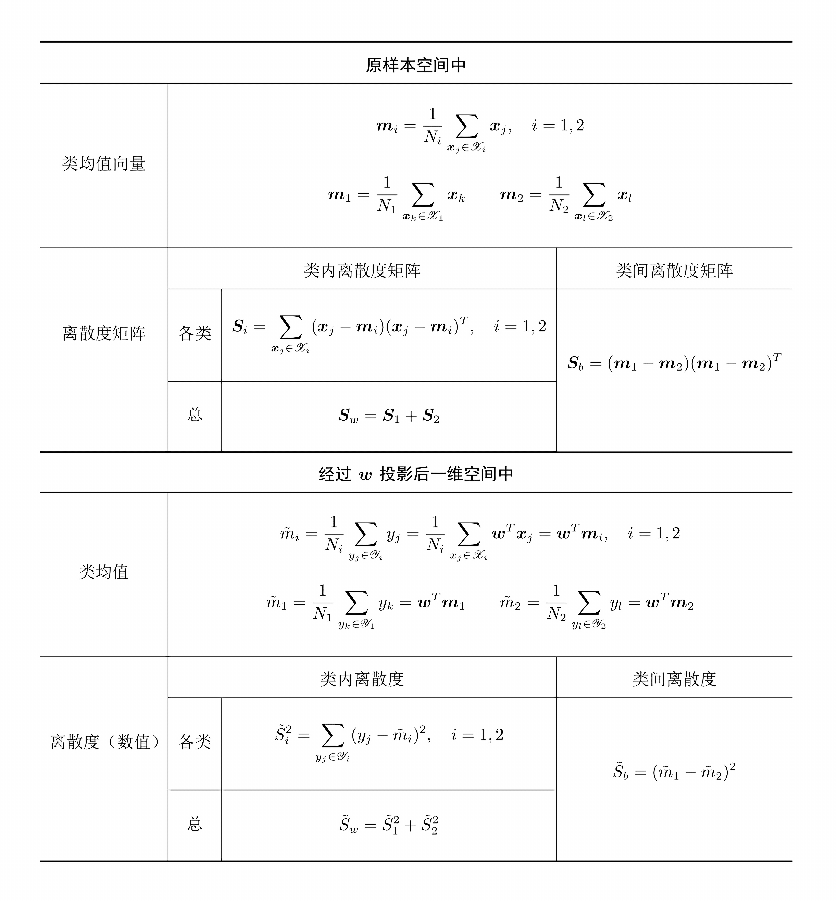

# Fisher判别大合集

## 基础Fisher判别
### 投影方向最优化目标与最优化问题的推导
设训练样本集为
$$
\mathscr{X} = \{\bm{x}_1, \bm{x}_2, \cdots, \bm{x}_N\}
$$

其中$\omega_1$类的样本为$\mathscr{X}_1 = \{\bm{x}_1^1, \bm{x}_2^1, \cdots, \bm{x}_{N_1}^1\}$，$\omega_2$类的样本为$\mathscr{X}_2 = \{\bm{x}_1^2, \bm{x}_2^2, \cdots, \bm{x}_{N_2}^2\}$。

我们需要找到一个**投影方向**$\bm{w}$（也为$d$维列向量），使得投影后样本变成
$$
y_i = \bm{w}^T \bm{x}_i,\quad i = 1, 2, \cdots, N
$$

首先先做出以下定义：

同时，我们有投影前后的关系：
| 名称 | 投影前 | 投影后 | 关系 | 推导 |
|-|-|-|-|-|
| 类均值 | $\bm{m}_i$ | $\tilde{m}_i$ | $\tilde{m}_i = \bm{w}^T\bm{m}_i$ | $\begin{aligned} \tilde{m}_i =&\ \dfrac{1}{N_i} \sum_{y_j \in \mathscr{Y}_i} y_j = \dfrac{1}{N_i} \sum_{x_j \in \mathscr{X}_i} \bm{w}^T \bm{x}_j \bm{w}^T \bm{m}_i \end{aligned}$ |
| 各类类内离散度 | $\bm{S}_i$ | $\tilde{S}_i$ | $\tilde{S}_i = \bm{w}^T \bm{S}_i \bm{w}$ | $\begin{aligned} \tilde{S}_i^2 =&\ \sum_{y_j \in \mathscr{Y}_i} (y_j - \tilde{m}_i)^2 = \sum_{x_j \in \mathscr{X}_i} (\bm{w}^T\bm{x}_j - \bm{w}^T\bm{m}_i)^2 \\ =&\ \sum_{x_j \in \mathscr{X}_i} (\bm{w}^T(\bm{x}_j - \bm{m}_i))^T(\bm{w}^T(\bm{x}_j - \bm{m}_i)) \\ =&\ \bm{w}^T \left(\sum_{x_j \in \mathscr{X}_i} (\bm{x}_j - \bm{m}_i)(\bm{x}_j - \bm{m}_i)^T\right) \bm{w} \\ =&\ \bm{w}^T \bm{S}_i \bm{w} \end{aligned}$ |
| 总类内离散度 | $\bm{S}_w$ | $\tilde{S}_w$ | $\tilde{S}_w = \bm{w}^T \bm{S}_w \bm{w}$ | $\begin{aligned} \tilde{S}_w =&\ \tilde{S}_1 + \tilde{S}_2 = \bm{w}^T \bm{S}_1 \bm{w} + \bm{w}^T \bm{S}_2 \bm{w} \\ =&\ \bm{w}^T (\bm{S}_1 + \bm{S}_2) \bm{w} = \bm{w}^T \bm{S}_w \bm{w}\end{aligned}$ |
| 类间离散度 | $\bm{S}_b$ | $\tilde{S}_b$ | $\tilde{S}_b = \bm{w}^T \bm{S}_b \bm{w}$ | $\begin{aligned} \tilde{S}_b^2 =&\ (\tilde{m}_1 - \tilde{m}_2)^2 = (\bm{w}^T\bm{m}_1 - \bm{w}^T\bm{m}_2)^2 \\ =&\ (\bm{w}^T(\bm{m}_1 - \bm{m}_2))^T(\bm{w}^T(\bm{m}_1 - \bm{m}_2)) \\ =&\ \bm{w}^T (\bm{m}_1 - \bm{m}_2)(\bm{m}_1 - \bm{m}_2)^T \bm{w} \\ =&\ \bm{w}^T \bm{S}_b \bm{w} \end{aligned}$ |

我们希望找到的投影方向，使得投影以后**两类尽可能分开（类间离散度尽量大）**，而**各类内部又尽可能聚集（类内离散度尽量小）**，这一目标可以表示成如下准则：
$$
\max J_F(w) = \max \dfrac{\tilde{S}_b}{\tilde{S}_w} = \max \dfrac{(\tilde{m}_1 - \tilde{m}_2)^2}{\tilde{S}_1^2 + \tilde{S}_2^2}
$$该函数称为**Fisher准则函数**。

如果将投影还原回原空间，则有
$$
\max J_F(\bm{w}) = \max \dfrac{\bm{w}^T \bm{S}_b \bm{w}}{\bm{w}^T \bm{S}_w \bm{w}}
$$该函数被称为**广义Rayleigh商**。

由于对$\bm{w}$的幅值调整不影响值的变化，我们可以固定分母为常数$c$，从而最优化问题变为
$$\begin{aligned}
  \max \quad & \bm{w}^T \bm{S}_b \bm{w} \\
  s.t. \quad & \bm{w}^T \bm{S}_w \bm{w} = c \neq 0
\end{aligned}$$

### 投影方向的求解
使用拉格朗日乘子法，对约束条件配以乘子$\lambda$得到拉格朗日函数
$$
L(\bm{w}, \lambda) = \bm{w}^T \bm{S}_b \bm{w} - \lambda (\bm{w}^T \bm{S}_w \bm{w} - c)
$$

对$\bm{w}$求导，得
$$
\begin{aligned}
    \dfrac{\partial L}{\partial \bm{w}} =&\ 2 \bm{S}_b \bm{w} - 2 \lambda \bm{S}_w \bm{w} = \bm{0} \\[1em]
    \Longleftrightarrow&\ \bm{S}_b \bm{w} = \lambda \bm{S}_w \bm{w} \\
    \Longleftrightarrow&\ \bm{S}_w^{-1} \bm{S}_b \bm{w} = \lambda \bm{w} \\
    \Longleftrightarrow&\ \bm{S}_w^{-1} (\bm{m}_1 - \bm{m}_2)(\bm{m}_1 - \bm{m}_2)^T \bm{w} = \lambda \bm{w} \\
\end{aligned}
$$

注意到这里$(\bm{m}_1 - \bm{m}_2)^T \bm{w}$和$\lambda$为标量，不影响$\bm{w}$的方向，而我们唯一关心的就是$\bm{w}$的方向；从而直接取
$$\bm{w}^* = \bm{S}_w^{-1} (\bm{m}_1 - \bm{m}_2)$$

作为**Fisher判别准则下最优的投影方向**。

***
另一种方法是直接对$J_F(\bm{w})$求导，并在每次出现标量时将其移动到一侧（下面推导过程中的$A$和$B$）：
$$
\begin{aligned}
    &\ \dfrac{{\rm d}J_F(\bm{w})}{{\rm d}\bm{w}} = \bm{0} \\[1em]
    \Longleftrightarrow&\ \dfrac{(\bm{w}^T \bm{S}_b \bm{w})' \cdot \bm{w}^T \bm{S}_w \bm{w} - \bm{w}^T \bm{S}_b \bm{w} \cdot (\bm{w}^T \bm{S}_w \bm{w})'}{(\bm{w}^T \bm{S}_w \bm{w})^2} = \bm{0} \\
    \Longleftrightarrow&\ 2\bm{S}_b \bm{w} \cdot \bm{w}^T \bm{S}_w \bm{w} - \bm{w}^T \bm{S}_b \bm{w} \cdot 2\bm{S}_w \bm{w} = \bm{0} \\
    \Longleftrightarrow&\ (\bm{S}_b \bm{w} \bm{w}^T \bm{S}_w - \bm{S}_w \bm{w} \bm{w}^T \bm{S}_b) \bm{w} = \bm{0} \\
    \Longleftrightarrow&\ \bm{S}_b \bm{w} \bm{w}^T \bm{S}_w = \bm{S}_w \bm{w} \bm{w}^T \bm{S}_b \\
    \Longleftrightarrow&\ (\bm{m}_1 - \bm{m}_2)(\bm{m}_1 - \bm{m}_2)^T \bm{w} \bm{w}^T \bm{S}_w = \bm{S}_w \bm{w} \bm{w}^T (\bm{m}_1 - \bm{m}_2)(\bm{m}_1 - \bm{m}_2)^T \\
    \Longleftrightarrow&\ \dfrac{(\bm{m}_1 - \bm{m}_2)^T \bm{w}}{\bm{w}^T (\bm{m}_1 - \bm{m}_2)} \cdot (\bm{m}_1 - \bm{m}_2) \bm{w}^T \bm{S}_w = \bm{S}_w \bm{w} (\bm{m}_1 - \bm{m}_2)^T \\
    \Longleftrightarrow&\ A \cdot \bm{S}_w^{-1} \left( (\bm{m}_1 - \bm{m}_2) \bm{w}^T \bm{S}_w \right) \bm{S}_w^{-1} (\bm{m}_1 - \bm{m}_2) \\
    &= \bm{S}_w^{-1} \left( \bm{S}_w \bm{w} (\bm{m}_1 - \bm{m}_2)^T \right) \bm{S}_w^{-1} (\bm{m}_1 - \bm{m}_2) \\
    \Longleftrightarrow&\ A \cdot \bm{S}_w^{-1}(\bm{m}_1 - \bm{m}_2) \bm{w}^T (\bm{m}_1 - \bm{m}_2) = \bm{w} (\bm{m}_1 - \bm{m}_2)^T \bm{S}_w^{-1} (\bm{m}_1 - \bm{m}_2) \\
    \Longleftrightarrow&\ A \cdot \dfrac{\bm{w}^T (\bm{m}_1 - \bm{m}_2)}{(\bm{m}_1 - \bm{m}_2)^T \bm{S}_w^{-1} (\bm{m}_1 - \bm{m}_2)} \bm{S}_w^{-1}(\bm{m}_1 - \bm{m}_2) = \bm{w} \\
    \Longleftrightarrow&\ A B \cdot \bm{S}_w^{-1}(\bm{m}_1 - \bm{m}_2) = \bm{w}
\end{aligned}
$$

由此可得
$$\bm{w} \propto \bm{S}_w^{-1}(\bm{m}_1 - \bm{m}_2)$$

由于我们只关心$\bm{w}$的方向，因此所有标量都可以舍去，从而直接取
$$\bm{w}^* = \bm{S}_w^{-1} (\bm{m}_1 - \bm{m}_2)$$

作为**Fisher判别准则下最优的投影方向**。

## 核Fisher判别
### 非线性变换
首先，我们对样本进行非线性变换$\bm{x} \mapsto \varPhi(\bm{x}) \in F$。在变换后的空间$F$中，Fisher线性判别的准则变为
$$
\max J_F(\bm{w}) = \max \dfrac{\bm{w}^T \bm{S}_b^{\varPhi} \bm{w}}{\bm{w}^T \bm{S}_w^{\varPhi} \bm{w}}
$$

这里上标$\varPhi$表示非线性变换之后的新矩阵/向量。

我们的目标是**找出其中的内积（$\bm{\alpha}^T \bm{\beta} = \bm{\alpha} \cdot \bm{\beta}$），并用核函数进行替代**。

首先我们列出所有变换前后的表格：
| 变换前 | 变换后 |
|-|-|
| $$\bm{m}_i = \frac{1}{N_i} \sum_{\bm{x}_j \in \mathscr{X}_i} \bm{x}_j$$ | $$\bm{m}_i^{\varPhi} = \frac{1}{N_i} \sum_{\bm{x}_j \in \mathscr{X}_i} \varPhi(\bm{x}_j)$$ |
| $$\bm{S}_i = \sum_{\bm{x}_j \in \mathscr{X}_i} (\bm{x}_j - \bm{m}_i)(\bm{x}_j - \bm{m}_i)^T$$ | $$\bm{S}_i^{\varPhi} = \sum_{\bm{x}_j \in \mathscr{X}_i} (\varPhi(\bm{x}_j) - \bm{m}_i^{\varPhi})(\varPhi(\bm{x}_j) - \bm{m}_i^{\varPhi})^T$$ |
| $$\bm{S}_w = \bm{S}_1 + \bm{S}_2$$ | $$\bm{S}^{\varPhi}_w = \bm{S}^{\varPhi}_1 + \bm{S}^{\varPhi}_2$$ |
| $$\bm{S}_b = (\bm{m}_1 - \bm{m}_2)(\bm{m}_1 - \bm{m}_2)^T$$ | $$\bm{S}^{\varPhi}_b = (\bm{m}_1^{\varPhi} - \bm{m}_2^{\varPhi})(\bm{m}_1^{\varPhi} - \bm{m}_2^{\varPhi})^T$$ |

### 分子的推导
根据可再生核希尔伯特空间的有关理论可以知道，上述问题的任何解$\bm{w} \in F$都处在$F$空间中所有训练样本张成的子空间内，即
$$
\bm{w} = \sum_{k = 1}^N \alpha_k \varPhi(\bm{x}_k)
$$

先考查$\bm{w}^T \bm{S}_b^{\varPhi} \bm{w}$，有
$$\begin{aligned}
    \bm{w}^T \bm{S}_b^{\varPhi} \bm{w} =&\ \bm{w}^T (\bm{m}_1^{\varPhi} - \bm{m}_2^{\varPhi})(\bm{m}_1^{\varPhi} - \bm{m}_2^{\varPhi})^T \bm{w} \\
    =&\ (\bm{w}^T \bm{m}_1^{\varPhi} - \bm{w}^T \bm{m}_2^{\varPhi})((\bm{m}_1^{\varPhi})^T \bm{w} - (\bm{m}_2^{\varPhi})^T \bm{w})
\end{aligned}$$

注意到这里的$\bm{w}^T \bm{m}_i^{\varPhi}$可以转化为核函数，即
$$
\begin{aligned}
    \bm{w}^T \bm{m}_i^{\varPhi} =&\ \bm{w}^T \left(\frac{1}{N_i} \sum_{\bm{x}_j \in \mathscr{X}_i} \varPhi(\bm{x}_j) \right) = \left( \sum_{k = 1}^N \alpha_k \varPhi(\bm{x}_k) \right)^T \left(\frac{1}{N_i} \sum_{\bm{x}_j \in \mathscr{X}_i} \varPhi(\bm{x}_j) \right) \\
    =&\ \frac{1}{N_i} \sum_{k = 1}^N \sum_{\bm{x}_j \in \mathscr{X}_i} \alpha_k \varPhi(\bm{x}_k)^T \varPhi(\bm{x}_j) = \frac{1}{N_i} \sum_{k = 1}^N \sum_{\bm{x}_j \in \mathscr{X}_i} \alpha_k K(\bm{x}_k, \bm{x}_j)
\end{aligned}
$$

定义
$$\begin{gathered}
    \bm{\alpha} = (\alpha_1, \alpha_2, \cdots, \alpha_N)^T \\
    M_{(i, k)} = \dfrac{1}{N_i} \sum_{\bm{x}_j \in \mathscr{X}_i} K(\bm{x}_k, \bm{x}_j) \\
    \bm{M}_i = (M_{(i, 1)}, M_{(i, 2)}, \cdots, M_{(i, N)})^T
\end{gathered}$$

这里$i = 1, 2$；则$\bm{w}^T \bm{m}_i^{\varPhi}$可以写成
$$
\begin{aligned}
    \bm{w}^T \bm{m}_i^{\varPhi} =&\ \frac{1}{N_i} \sum_{k = 1}^N \sum_{\bm{x}_j \in \mathscr{X}_i} \alpha_k K(\bm{x}_k, \bm{x}_j) = \sum_{k = 1}^N \alpha_k \left(\frac{1}{N_i} \sum_{\bm{x}_j \in \mathscr{X}_i} K(\bm{x}_k, \bm{x}_j)\right) \\
    =&\ \sum_{k = 1}^N \alpha_k M_{(i, k)} = (\alpha_1, \alpha_2, \cdots, \alpha_N)(M_{(i, 1)}, M_{(i, 2)}, \cdots, M_{(i, N)})^T \\
    =&\ \bm{\alpha}^T \bm{M}_i
\end{aligned}
$$

同时可以推出$(\bm{m}_i^{\varPhi})^T \bm{w} = (\bm{w}^T \bm{m}_i^{\varPhi})^T = \bm{M}_i^T \bm{\alpha}$；

再定义
$$
\bm{M} = (\bm{M}_1 - \bm{M}_2)(\bm{M}_1 - \bm{M}_2)^T
$$

从而
$$\begin{aligned}
    \bm{w}^T \bm{S}_b^{\varPhi} \bm{w} =&\ (\bm{w}^T \bm{m}_1^{\varPhi} - \bm{w}^T \bm{m}_2^{\varPhi})((\bm{m}_1^{\varPhi})^T \bm{w} - (\bm{m}_2^{\varPhi})^T \bm{w}) \\
    =&\ (\bm{\alpha}^T\bm{M}_1 - \bm{\alpha}^T \bm{M}_2)(\bm{M}_1^T\bm{\alpha} - \bm{M}_2^T\bm{\alpha}) \\
    =&\ \bm{\alpha}^T (\bm{M}_1 - \bm{M}_2)(\bm{M}_1 - \bm{M}_2)^T \bm{\alpha} \\
    =&\ \bm{\alpha}^T \bm{M} \bm{\alpha}
\end{aligned}$$

### 分母的推导
再考查$\bm{w}^T \bm{S}_w^{\varPhi} \bm{w}$，有
$$\begin{aligned}
    &\ \bm{w}^T \bm{S}_w^{\varPhi} \bm{w} \\
    =&\ \bm{w}^T (\bm{S}^{\varPhi}_1 + \bm{S}^{\varPhi}_2) \bm{w} \\
    =&\ \bm{w}^T \left(\sum_{\bm{x}_j \in \mathscr{X}_1} (\varPhi(\bm{x}_j) - \bm{m}_1^{\varPhi})(\varPhi(\bm{x}_j) - \bm{m}_1^{\varPhi})^T + \sum_{\bm{x}_k \in \mathscr{X}_2} (\varPhi(\bm{x}_k) - \bm{m}_2^{\varPhi})(\varPhi(\bm{x}_k) - \bm{m}_2^{\varPhi})^T \right) \bm{w}
\end{aligned}$$

由$\bm{\alpha} = (\alpha_1, \alpha_2, \cdots, \alpha_N)^T$我们有
$$
\bm{w} = \sum_{k = 1}^N \alpha_k \varPhi(\bm{x}_k) = (\varPhi(\bm{x}_1), \varPhi(\bm{x}_2), \cdots, \varPhi(\bm{x}_N)) \bm{\alpha}
$$

这里$(\varPhi(\bm{x}_1), \varPhi(\bm{x}_2), \cdots, \varPhi(\bm{x}_N))$表示将$\varPhi(\bm{x}_k)$依次作为各列构成的矩阵；

我们可以藉此推出
$$\begin{aligned}
    &\ \bm{w}^T (\varPhi(\bm{x}_k) - \bm{m}_i^{\varPhi}) \\
    =&\ \bm{w}^T \left(\varPhi(\bm{x}_k) -\frac{1}{N_i} \sum_{\bm{x}_j \in \mathscr{X}_i} \varPhi(\bm{x}_j)\right) \\
    =&\ \bm{w}^T (\varPhi(\bm{x}_{n_1}), \varPhi(\bm{x}_{n_2}), \cdots, \varPhi(\bm{x}_{n_{N_i}})) \left(-\frac{1}{N_i} \bm{I}_{N_i} + \bm{E}_{t(k), t(k)}\right) (1, 1, \cdots, 1)_{N_i}^T \\
    =&\ \bm{\alpha}^T (\varPhi(\bm{x}_1), \varPhi(\bm{x}_2), \cdots, \varPhi(\bm{x}_N))^T (\varPhi(\bm{x}_{n_1}), \varPhi(\bm{x}_{n_2}), \cdots, \varPhi(\bm{x}_{n_{N_i}})) \\
    & \left(-\frac{1}{N_i} \bm{I}_{N_i} + \bm{E}_{t(k), t(k)}\right) (1, 1, \cdots, 1)_{N_i}^T \\
    =&\ \bm{\alpha}^T \begin{pmatrix}
        \varPhi(\bm{x}_1) \cdot \varPhi(\bm{x}_{n_1}) & \varPhi(\bm{x}_1) \cdot \varPhi(\bm{x}_{n_2}) & \cdots & \varPhi(\bm{x}_1) \cdot \varPhi(\bm{x}_{n_{N_i}}) \\
        \varPhi(\bm{x}_2) \cdot \varPhi(\bm{x}_{n_1}) & \varPhi(\bm{x}_2) \cdot \varPhi(\bm{x}_{n_2}) & \cdots & \varPhi(\bm{x}_2) \cdot \varPhi(\bm{x}_{n_{N_i}}) \\
        \vdots & \vdots & \ddots & \vdots \\
        \varPhi(\bm{x}_N) \cdot \varPhi(\bm{x}_{n_1}) & \varPhi(\bm{x}_N) \cdot \varPhi(\bm{x}_{n_2}) & \cdots & \varPhi(\bm{x}_N) \cdot \varPhi(\bm{x}_{n_{N_i}})
    \end{pmatrix}\\
    & \left(-\frac{1}{N_i} \bm{I}_{N_i} + \bm{E}_{t(k), t(k)}\right) (1, 1, \cdots, 1)_{N_i}^T \\
\end{aligned}$$
 
其中$(1, 1, \cdots, 1)_{N_i}$代表一个长为$N_i$、全部由$1$构成的向量，$\bm{I}_{N_i}$代表$N_i \times N_i$的单位矩阵，$\bm{E}_{t(k), t(k)}$代表$N_i \times N_i$的、仅有第$t(k)$行第$t(k)$列（$t(k)$的取值：$k$是$\mathscr{X}_i$所有元素下标中，从小到大的第$t$顺位数）为$1$其余为$0$的矩阵，下标$n_l$满足$\bm{x}_{n_l} \in \mathscr{X}_i$。

我们记
$$\begin{aligned}    
    \bm{K}_i =&\ \begin{pmatrix}
            \varPhi(\bm{x}_1) \cdot \varPhi(\bm{x}_{n_1}) & \varPhi(\bm{x}_1) \cdot \varPhi(\bm{x}_{n_2}) & \cdots & \varPhi(\bm{x}_1) \cdot \varPhi(\bm{x}_{n_{N_i}}) \\
            \varPhi(\bm{x}_2) \cdot \varPhi(\bm{x}_{n_1}) & \varPhi(\bm{x}_2) \cdot \varPhi(\bm{x}_{n_2}) & \cdots & \varPhi(\bm{x}_2) \cdot \varPhi(\bm{x}_{n_{N_i}}) \\
            \vdots & \vdots & \ddots & \vdots \\
            \varPhi(\bm{x}_N) \cdot \varPhi(\bm{x}_{n_1}) & \varPhi(\bm{x}_N) \cdot \varPhi(\bm{x}_{n_2}) & \cdots & \varPhi(\bm{x}_N) \cdot \varPhi(\bm{x}_{n_{N_i}})
        \end{pmatrix} \\
    =&\ \begin{pmatrix}
            K(\bm{x}_1, \bm{x}_{n_1}) & K(\bm{x}_1, \bm{x}_{n_2}) & \cdots & K(\bm{x}_1, \bm{x}_{n_{N_i}}) \\
            K(\bm{x}_2, \bm{x}_{n_1}) & K(\bm{x}_2, \bm{x}_{n_2}) & \cdots & K(\bm{x}_2, \bm{x}_{n_{N_i}}) \\
            \vdots & \vdots & \ddots & \vdots \\
            K(\bm{x}_N, \bm{x}_{n_1}) & K(\bm{x}_N, \bm{x}_{n_2}) & \cdots & K(\bm{x}_N, \bm{x}_{n_{N_i}})
        \end{pmatrix}
\end{aligned}
$$为**第$i$类的核函数矩阵**；

又注意到$\left(-\dfrac{1}{N_i} \bm{I}_{N_i} + \bm{E}_{t(k), t(k)}\right)^T = \left(-\dfrac{1}{N_i} \bm{I}_{N_i} + \bm{E}_{t(k), t(k)}\right)$，从而
$$\begin{aligned}
    &\ \bm{w}^T \left( \sum_{\bm{x}_k \in \mathscr{X}_i} (\varPhi(\bm{x}_k) - \bm{m}_i^{\varPhi})(\varPhi(\bm{x}_k) - \bm{m}_i^{\varPhi})^T \right) \bm{w} \\
    =&\ \sum_{\bm{x}_k \in \mathscr{X}_i} \bm{w}^T (\varPhi(\bm{x}_k) - \bm{m}_i^{\varPhi})(\varPhi(\bm{x}_k) - \bm{m}_i^{\varPhi})^T \bm{w} \\
    =&\ \sum_{\bm{x}_k \in \mathscr{X}_i} \left( \bm{\alpha}^T \bm{K}_i \left(-\frac{1}{N_i} \bm{I}_{N_i} + \bm{E}_{t(k), t(k)}\right) (1, 1, \cdots, 1)_{N_i}^T (1, 1, \cdots, 1)_{N_i} \left(-\frac{1}{N_i} \bm{I}_{N_i} + \bm{E}_{t(k), t(k)}\right) \bm{K}_i^T \bm{\alpha} \right) \\
    =&\ \bm{\alpha}^T \bm{K}_i \left( \sum_{\bm{x}_k \in \mathscr{X}_i} \left(-\frac{1}{N_i} \bm{I}_{N_i} + \bm{E}_{t(k), t(k)}\right) (1, 1, \cdots, 1)_{N_i}^T (1, 1, \cdots, 1)_{N_i} \left(-\frac{1}{N_i} \bm{I}_{N_i} + \bm{E}_{t(k), t(k)}\right)\right) \bm{K}_i^T \bm{\alpha}
\end{aligned}$$

由于
$$
\bm{E}_{i, i} (1, 1, \cdots, 1)_{N_i}^T (1, 1, \cdots, 1)_{N_i} \bm{E}_{i, i} = \bm{E}_{i, i} \\[1em]
(1, 1, \cdots, 1)_{N_i}^T (1, 1, \cdots, 1)_{N_i} \bm{I}_{N_i} = \bm{I}_{N_i} (1, 1, \cdots, 1)_{N_i}^T (1, 1, \cdots, 1)_{N_i} \\
= (1, 1, \cdots, 1)_{N_i}^T (1, 1, \cdots, 1)_{N_i} \\[1em]
\sum_{\bm{x}_k \in \mathscr{X}_i} \bm{E}_{t(k), t(k)} = \bm{I}_{N_i}
$$

故中间括号内的求和部分可化简为
$$\begin{aligned}
    &\ \sum_{\bm{x}_k \in \mathscr{X}_i} \left(-\frac{1}{N_i} \bm{I}_{N_i} + \bm{E}_{t(k), t(k)}\right) (1, 1, \cdots, 1)_{N_i}^T (1, 1, \cdots, 1)_{N_i} \left(-\frac{1}{N_i} \bm{I}_{N_i} + \bm{E}_{t(k), t(k)}\right) \\
    =&\ N_i \cdot \dfrac{1}{N_i^2} \bm{I}_{N_i} - \dfrac{1}{N_i} \sum_{\bm{x}_k \in \mathscr{X}_i} \bm{E}_{t(k), t(k)} (1, 1, \cdots, 1)_{N_i}^T (1, 1, \cdots, 1)_{N_i} \\
    &\ - \dfrac{1}{N_i} \sum_{\bm{x}_k \in \mathscr{X}_i} (1, 1, \cdots, 1)_{N_i}^T (1, 1, \cdots, 1)_{N_i} \bm{E}_{t(k), t(k)} + \sum_{\bm{x}_k \in \mathscr{X}_i} \bm{E}_{t(k), t(k)} \\
    =&\ \dfrac{1}{N_i} \bm{I}_{N_i} - \dfrac{1}{N_i} \bm{I}_{N_i}(1, 1, \cdots, 1)_{N_i}^T (1, 1, \cdots, 1)_{N_i} - \dfrac{1}{N_i} (1, 1, \cdots, 1)_{N_i}^T (1, 1, \cdots, 1)_{N_i} \bm{I}_{N_i} + \bm{I}_{N_i} \\
    =&\ \dfrac{1}{N_i} \bm{I}_{N_i} - \dfrac{1}{N_i} \bm{I}_{N_i} - \dfrac{1}{N_i} \bm{I}_{N_i} + \bm{I}_{N_i} \\
    =&\ \bm{I}_{N_i} - \dfrac{1}{N_i} \bm{I}_{N_i} = \dfrac{N_i - 1}{N_i} \bm{I}_{N_i}
\end{aligned}$$

得到
$$\begin{aligned}
    &\ \bm{w}^T \left( \sum_{\bm{x}_k \in \mathscr{X}_i} (\varPhi(\bm{x}_k) - \bm{m}_i^{\varPhi})(\varPhi(\bm{x}_k) - \bm{m}_i^{\varPhi})^T \right) \bm{w} \\
    =&\ \bm{\alpha}^T \bm{K}_i \left( \sum_{\bm{x}_k \in \mathscr{X}_i} \left(-\frac{1}{N_i} \bm{I}_{N_i} + \bm{E}_{t(k), t(k)}\right) (1, 1, \cdots, 1)_{N_i}^T (1, 1, \cdots, 1)_{N_i} \left(-\frac{1}{N_i} \bm{I}_{N_i} + \bm{E}_{t(k), t(k)}\right)\right) \bm{K}_i^T \bm{\alpha} \\
    =&\ \bm{\alpha}^T \bm{K}_i \left( \bm{I}_{N_i} - \dfrac{1}{N_i} \bm{I}_{N_i} \right) \bm{K}_i^T \bm{\alpha}
\end{aligned}$$

再定义
$$\begin{aligned}
    \bm{N} =&\ \sum_{i = 1, 2} \bm{K}_i \left( \bm{I}_{N_i} - \dfrac{1}{N_i} \bm{I}_{N_i} \right) \bm{K}_i^T \\
    =&\ \bm{K}_1 \left( \bm{I}_{N_1} - \dfrac{1}{N_1} \bm{I}_{N_1} \right) \bm{K}_1^T + \bm{K}_2 \left( \bm{I}_{N_2} - \dfrac{1}{N_2} \bm{I}_{N_2} \right) \bm{K}_2^T
\end{aligned}$$

从而有
$$\begin{aligned}
    &\ \bm{w}^T \bm{S}_w^{\varPhi} \bm{w} \\
    =&\ \bm{w}^T (\bm{S}^{\varPhi}_1 + \bm{S}^{\varPhi}_2) \bm{w} \\
    =&\ \bm{w}^T \left(\sum_{\bm{x}_j \in \mathscr{X}_1} (\varPhi(\bm{x}_j) - \bm{m}_1^{\varPhi})(\varPhi(\bm{x}_j) - \bm{m}_1^{\varPhi})^T + \sum_{\bm{x}_k \in \mathscr{X}_2} (\varPhi(\bm{x}_k) - \bm{m}_2^{\varPhi})(\varPhi(\bm{x}_k) - \bm{m}_2^{\varPhi})^T \right) \bm{w} \\
    =&\ \bm{\alpha}^T \left( \bm{K}_1 \left( \bm{I}_{N_1} - \dfrac{1}{N_1} \bm{I}_{N_1} \right) \bm{K}_1^T + \bm{K}_2 \left( \bm{I}_{N_2} - \dfrac{1}{N_2} \bm{I}_{N_2} \right) \bm{K}_2^T \right) \bm{\alpha} \\
    =&\ \bm{\alpha}^T \bm{N} \bm{\alpha}
\end{aligned}$$

### 应用与总结
最终得到
$$J_F(\bm{w}) = \dfrac{\bm{w}^T \bm{S}_b \bm{w}}{\bm{w}^T \bm{S}_w \bm{w}} \Longleftrightarrow J(\bm{\alpha}) = \dfrac{\bm{\alpha}^T \bm{M} \bm{\alpha}}{\bm{\alpha}^T \bm{N} \bm{\alpha}}$$

其最优解方向满足
$$\bm{\alpha}^* \propto \bm{N}^{-1} (\bm{M}_1 - \bm{M}_2)$$

在应用时，不需要直接反求出$\bm{w}$，而是将$\bm{x}$变换到新空间$F$内进行比较，只需要计算$\bm{w} \cdot \varPhi(\bm{x})$并与空间$F$内的阈值比较即可，而

$$
\bm{w} \cdot \varPhi(\bm{x}) = \left(\sum_{k = 1}^N \alpha_k \varPhi(\bm{x}_k)\right) \cdot \varPhi(\bm{x}) = \sum_{k = 1}^N \alpha_k (\varPhi(\bm{x}_k) \cdot \varPhi(\bm{x})) = \sum_{k = 1}^N \alpha_k K(\bm{x}_k, \bm{x})
$$

从而化为核函数形式，可以高效地计算。

如果矩阵$\bm{N}$非正定，则引入新矩阵
$$
\bm{N}_{\mu} = \bm{N} + \bm{\mu} \bm{I}_{N}
$$
 
代替原来的矩阵，使之正定即可。

**总结先前证明中出现的所有符号：**
| 符号 | 形状 | 定义 | 名称 |
|-|-|-|-|
| $$\bm{w}$$ | $$N \times 1$$ | 变换后空间$F$内投影方向 | |
| $$\bm{\alpha}$$ | $$N \times 1$$ | $$\bm{w} = \sum_{k = 1}^N \alpha_k \varPhi(\bm{x}_k) = (\varPhi(\bm{x}_1), \varPhi(\bm{x}_2), \cdots, \varPhi(\bm{x}_N)) \bm{\alpha}$$ | |
| $$M_{(i, k)}$$ | 标量 | $$M_{(i, k)} = \dfrac{1}{N_i} \sum_{\bm{x}_j \in \mathscr{X}_i} K(\bm{x}_k, \bm{x}_j)$$ | |
| $$\bm{M}_i$$ | $$N \times 1$$ | $$\bm{M}_i = (M_{(i, 1)}, M_{(i, 2)}, \cdots, M_{(i, N)})^T$$ | |
| $$\bm{M}$$ | $$N \times N$$ | $$\bm{M} = (\bm{M}_1 - \bm{M}_2)(\bm{M}_1 - \bm{M}_2)^T$$ | |
| $$\bm{I}_{N_i}$$ | $$N_i \times N_i$$ | $N_i \times N_i$的单位矩阵$\bm{I}$ | |
| $$\bm{E}_{t(k), t(k)}$$ | $$N_i \times N_i$$ | $N_i \times N_i$的、仅有第$t(k)$行第$t(k)$列为$1$其余为$0$的矩阵 | |
| $$\bm{K}_i$$ | $$N \times N_i$$ | $$\bm{K}_i = \begin{pmatrix} K(\bm{x}_1, \bm{x}_{n_1}) & K(\bm{x}_1, \bm{x}_{n_2}) & \cdots & K(\bm{x}_1, \bm{x}_{n_{N_i}}) \\ K(\bm{x}_2, \bm{x}_{n_1}) & K(\bm{x}_2, \bm{x}_{n_2}) & \cdots & K(\bm{x}_2, \bm{x}_{n_{N_i}}) \\ \vdots & \vdots & \ddots & \vdots \\ K(\bm{x}_N, \bm{x}_{n_1}) & K(\bm{x}_N, \bm{x}_{n_2}) & \cdots & K(\bm{x}_N, \bm{x}_{n_{N_i}}) \end{pmatrix}$$ | 第$i$类的核函数矩阵 |
| $$\bm{N}$$ | $$N \times N$$ | $$\bm{N} = \sum_{i = 1, 2} \bm{K}_i \left( \bm{I}_{N_i} - \dfrac{1}{N_i} \bm{I}_{N_i} \right) \bm{K}_i^T$$ | |

从这张表中还可以看出：
+ $M_{(i, k)}$为$\bm{K}_i$第$k$行的均值；
+ $\bm{M}_i$为$\bm{K}_i$各行均值组成的向量；

