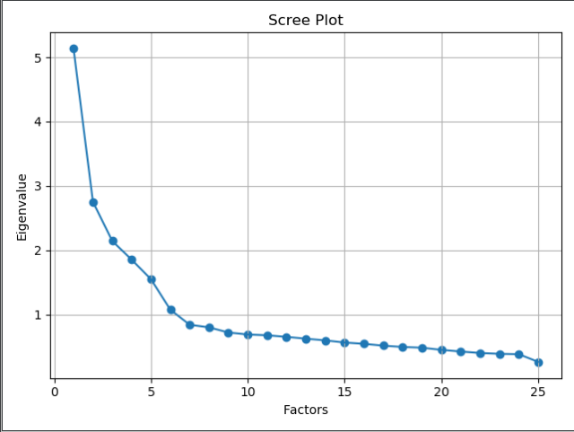

# 特征提取与降维表示

## 引言
特征选择为从$D$个特征中选出$d(d < D)$个特征，另一种把特征空间降维的方法是特征提取，即通过适当的变换将$D$个特征变换成$d(d < D)$个特征。
最常用的特征变换为线性变换，即如果$\bm{x} \in R^D$是$D$维原始特征，变换后的$d$维新特征$\bm{y} \in R^d$为$$\bm{y} = \bm{W}^T \bm{x}$$

其中$\bm{W}$为$D \times d$矩阵，称作**变换阵**。变换可以是降维也可以如第6章广义线性判别函数一样升维，本章只讨论降维情况。

## 基于类别可分性判据的特征提取
如果采用第9章的类别可分性判据作为衡量新特征的准则，则特征提取的目标是求出最优的$\bm{W}^*$使得$$\bm{W}^* = \argmax_{\{\bm{W}\}} J(\bm{W}^T \bm{x})$$其中$J(\cdot)$为基于类内、类间距离的类别可分性判据。

采用基于类内、类间距离的可分性判据中经过$\bm{W}$的特征变换后，类内离散度矩阵和类间离散度矩阵分比为$\bm{W}^T\bm{S}_w\bm{W}$和$\bm{W}^T\bm{S}_b\bm{W}$。从而特征提取的目标就是求$\bm{W}^*$使得下列准则最优：
$$\begin{aligned}
    J_1 =& \text{tr}(\bm{W}^T(\bm{S}_w + \bm{S}_b)\bm{W}) \\
    J_2 =& \text{tr}((\bm{W}^T\bm{S}_w\bm{W})^{-1} (\bm{W}^T\bm{S}_b\bm{W})) \\
    J_3 =& \ln\dfrac{|\bm{W}^T\bm{S}_w\bm{W}|}{|\bm{W}^T\bm{S}_b\bm{W}|} \\
    J_4 =& \ln\dfrac{\text{tr}(\bm{W}^T\bm{S}_w\bm{W})}{\text{tr}(\bm{W}^T\bm{S}_b\bm{W})} \\
    J_5 =& \dfrac{|\bm{W}^T(\bm{S}_w + \bm{S}_b)\bm{W}|}{|\bm{W}^T\bm{S}_w\bm{W}|} \\
\end{aligned}$$

事实上，这些准则虽然不同，但得到的最优变换矩阵是相同的：
设矩阵$\bm{S}_w^{-1}\bm{S}_b$的本征值分别为$\lambda_1, \lambda_2, ..., \lambda_D$，不妨设大小顺序排列为$$\lambda_1\geq \lambda_2\geq ...\geq \lambda_D$$则选取前$d$个本征值对应的本征向量作为$\bm{W}$，即$$\bm{W} = [\bm{u}_1, \bm{u}_2, ..., \bm{u}_d]$$

以$J_1$准则为例，以下为其推导过程：
$J_1$准则的具体形式为$$J_1 = \text{tr}(\bm{W}^T(\bm{S}_w + \bm{S}_b)\bm{W})$$

注意到无论选取什么变换阵$\bm{W}$，只要将其再乘以一个系数，则准则函数值总会变大，但变换方向并未改变；这就是尺度问题。为解决该问题，引入约束条件$\text{tr}(\bm{W}^T\bm{S}_w\bm{W}) = c$，不妨设$c = 1$，则优化问题变为
$$\begin{aligned}
    \max \quad& J_1(\bm{W}) \\
    s.t. \quad& \text{tr}(\bm{W}^T\bm{S}_w\bm{W}) = 1
\end{aligned}$$

采用拉格朗日方法将该问题转化为无约束问题，拉格朗日函数为
$$g(\bm{W}) = J_1(\bm{W}) - \text{tr}(\bm{\Lambda}(\bm{W}^T\bm{S}_w\bm{W} - \bm{I}))$$

其中$\bm{I}$为单位矩阵，$\bm{\Lambda}$为对角阵，对角线元素为拉格朗日乘子。
由于我们需要满足$\dfrac{\partial g(\bm{W})}{\partial \bm{W}} = 0$，从而有
$$\bm{S}_w^{-1} (\bm{S}_w + \bm{S}_b)\bm{W} = \bm{W}\bm{\Lambda}$$整理得$$\bm{S}_w^{-1} \bm{S}_b \bm{W} = \bm{W}(\bm{\Lambda} - \bm{I})$$

可见$\bm{W}$由$\bm{S}_w^{-1} \bm{S}_b$的本征向量构成，$\bm{\Lambda} - \bm{I}$等于$\bm{S}_w^{-1} \bm{S}_b$对应的本征值$\lambda_i$组成的对角阵，即
$$\bm{\Lambda} = \bm{I} + \begin{pmatrix}
    \lambda_1 & & \\
    & \ddots & \\
    & & \lambda_D \\
\end{pmatrix}$$

由约束$\text{tr}(\bm{W}^T\bm{S}_w\bm{W}) = 1$和由上式可推导得的$(\bm{S}_w + \bm{S}_b)\bm{W} = \bm{S}_w \bm{W} \bm{\Lambda}$，代入$J_1(\bm{W})$得
$$J_1(\bm{W}) = \text{tr}(\bm{W}^T(\bm{S}_w + \bm{S}_b)\bm{W}) = \text{tr}(\bm{W}^T \bm{S}_w \bm{W} \bm{\Lambda}) = \text{tr}\bm{\Lambda}$$

而对于$D \times d$的变换矩阵，$$J_1(\bm{W}) = \sum\limits_{i = 1}^d(1 + \lambda_i)$$

从而，最优变换阵$\bm{W}$是由$\bm{S}_w^{-1} \bm{S}_b$从大到小的前$d$个本征值所对应的本征向量构成的，而所得到的$J_1$准则值则由上式定义，其中$\lambda_i,\ i = 1, 2, ..., d$为$\bm{S}_w^{-1} \bm{S}_b$从大到小的前$d$个本征值。

采用基于概率距离的判据或基于熵的判据作为准则也能进行特征提取，但一般情况下只能数值求解，只有在数据服从正态分布且满足某些特殊条件时存在形式化的解。

## 主成分分析（PCA）
出发点：从一组特征中计算出一组按重要性从大到小排列的新特征，它们是原有特征的线性组合，并且相互之间不相关。

记$x_1, x_2, ..., x_p$为$p$个原始特征，设新特征$\xi_i,\ i = 1, 2, ..., p$是这些原始特征的线性组合
$$\xi_i = \sum_{j = 1}^p \alpha_{ij}x_j = \bm{\alpha}_i^T \bm{x}$$

写成矩阵形式则为
$$\bm{\xi} = \bm{A}^T \bm{x}$$

其中$\bm{\xi} = (\xi_1, \xi_2, ..., \xi_p)^T$，$\bm{A} = (\bm{\alpha}_1^T, \bm{\alpha}_2^T, ..., \bm{\alpha}_p^T)$。
为了统一$\xi_i$的尺度，不妨要求线性组合系数的模为$1$，即$\bm{\alpha}_i^T \bm{\alpha}_i = 1$；从而我们的目标变为求解最优的正交变换$\bm{A}$，它使得新特征$\xi_i$的方差达到极值。正交变换保证了新特征间不相关，而新特征的方差越大，则样本在该维特征上的差异就越大，因而这一特征就越重要。

考虑第一个新特征
$$\xi_1 = \sum_{j = 1}^p \alpha_{1j} x_j = \bm{\alpha}_1^T \bm{x}$$

其方差为
$$\begin{aligned}
    \text{var}(\xi_1) =& E[\xi_1^2] - E[\xi_1]^2 \\
    =& E[\bm{\alpha}_1^T \bm{x} \bm{x}^T \bm{\alpha}_1] - E[\bm{\alpha}_1^T \bm{x}]E[\bm{x}^T \bm{\alpha}_1] \\
    =& \bm{\alpha}_1^T \bm{\Sigma} \bm{\alpha}_1
\end{aligned}$$

其中$\bm{\Sigma}$为协方差矩阵，使用样本进行估计的方式如下：
$$\begin{aligned}
    \bm{\Sigma}_{ij} =& \dfrac{\sum\limits_{k = 1}^N (\bm{x}_{ki} - \bar{\bm{x}}_{.i})(\bm{x}_{kj} - \bar{\bm{x}}_{.j})}{N - 1} \\
    =& \dfrac{\sum\limits_{k = 1}^N \left(\bm{x}_{ki} - \dfrac{1}{N}\sum\limits_{l = 1}^N \bm{x}_{li}\right)\left(\bm{x}_{kj} - \dfrac{1}{N}\sum\limits_{l = 1}^N \bm{x}_{lj}\right)}{N - 1}
\end{aligned}$$

这里$\bm{\Sigma}_{ij}$表示协方差矩阵第$i$行第$j$列的元素，$\bar{\bm{x}}_{.i}$、$\bar{\bm{x}}_{.j}$分别表示样本矩阵第$i$、$j$列（第$i$、$j$个特征）的平均值，$N$为样本总数。

我们现在的约束问题为
$$\begin{aligned}
    \max \quad& \text{var}(\xi_1) = \bm{\alpha}_1^T \bm{\Sigma} \bm{\alpha}_1 \\
    s.t. \quad& \bm{\alpha}_1^T\bm{\alpha}_1 = 1
\end{aligned}$$

使用拉格朗日乘子法，得到我们需要求出以下拉格朗日函数的极值：
$$f(\bm{\alpha}_1) = \bm{\alpha}_1^T \bm{\Sigma} \bm{\alpha}_1 - \lambda(\bm{\alpha}_1^T\bm{\alpha}_1 - 1)$$

其中$\lambda$为拉格朗日乘子。令$\dfrac{\partial f(\bm{\alpha}_1)}{\partial \bm{\alpha}_1} = 0$得
$$\bm{\Sigma} \bm{\alpha}_1 = \lambda \bm{\alpha}_1$$

从而$\bm{\alpha}_1$为$\bm{\Sigma}$的本征向量，$\lambda$为对应本征值。代入$\text{var}(\xi_1)$得$$\text{var}(\xi_1) = \bm{\alpha}_1^T \bm{\Sigma} \bm{\alpha}_1 = \lambda \bm{\alpha}_1^T\bm{\alpha}_1 = \lambda$$

从而，最优的$\bm{\alpha}_1$为$\bm{\Sigma}$的最大本征值对应的本征向量。$\xi_1$称为**第一主成分**，它在原始特征的所有线性组合里是方差最大的。

***
下面考虑第二个新特征，它除了需要满足和第一个特征同样的要求（方差最大、模为$1$），还必须要与第一主成分不相关，即
$$\begin{aligned}
    0 =& E[\xi_2 \xi_1] - E[\xi_2]E[\xi_1] \\
    =& E[\bm{\alpha}_2^T \bm{x} \bm{x}^T \bm{\alpha}_1] - E[\bm{\alpha}_2^T \bm{x}]E[\bm{x}^T \bm{\alpha}_1] \\
    =& \bm{\alpha}_2^T \bm{\Sigma} \bm{\alpha}_1
\end{aligned}$$

而回顾$\bm{\Sigma} \bm{\alpha}_1 = \lambda \bm{\alpha}_1$，可知不相关的要求等价于$\bm{\alpha}_2$与$\bm{\alpha}_1$正交，即$$\bm{\alpha}_2^T\bm{\alpha}_1 = 0$$

又有约束条件$\bm{\alpha}_2^T\bm{\alpha}_2 = 1$，在这些约束下最大化$\text{var}(\xi_2)$，可得$\bm{\alpha}_2$为$\bm{\Sigma}$的第二大本征值对应的本征向量，$\xi_2$称为**第二主成分**。

***
协方差矩阵$\bm{\Sigma}$共有$p$个本征值$\lambda_i,\ i = 1, 2, ..., p$（包含可能相等或为$0$的本征值），将其从大到小排序为$\lambda_1 \geq \lambda_2 \geq ... \geq \lambda_p$。
通过以上方法，可以构造出由对应这些本征值的本征向量构造的$p$个主成分$\xi_i,\ i = 1, 2, ..., p$。全部主成分的方差之和$$\sum_{i = 1}^p \text{var}(\xi_i) = \sum_{i = 1}^p \lambda_i$$即为各个原始特征的方差之和。

变换矩阵$\bm{A}$的各个列向量是由$\bm{\Sigma}$的正交归一的本征向量组成的，因此$\bm{A}^T = \bm{A}^{-1}$，即$\bm{A}$为正交矩阵。从而，从$\bm{\xi}$到$\bm{x}$的逆变换为$\bm{x} = \bm{A}\bm{\xi}$。

在实际应用时，常把主成分进行零均值化，即
$$\bm{\xi} = \bm{A}^T(\bm{x} - \bm{\mu})\qquad \bm{x} = \bm{A} \bm{\xi} + \bm{\mu}$$

作为一种特征提取方法，通常希望用较少的主成分来表示数据。如果**取前$k$
个主成分**，可以得知，这$k$个主成分所代表的数据全部方差的比例是$\sum\limits_{i = 1}^k \lambda_i / \sum\limits_{i = 1}^p \lambda_i$。

模式识别中，通常先用样本估算协方差矩阵，求解其特征方程，得到各个主成分方向，选择适当数量的主成分作为样本的新特征，将样本投影到这些主成分方向上进行分类或聚类。
此外，如果把$\bm{\xi}$中对应本征值很小的成分置$0$，再反变换回原空间，还可以达到对原始数据的降噪效果。

然而，主成分分析本身是非监督的，没有考虑样本类别的信息，导致在监督模式识别情况下，以方差最大为目标进行的主成分分析并不一定总有利于后续的分类。

## Karhunen-Loève变换
### K-L变换
模式识别中的一个样本可以看做是随机向量的一次实现。对$D$维随机向量$\bm{x} \in R^D$，可以用一个完备的**正交归一向量系**$\bm{u}_j,\ j = 1, 2, ..., D$来展开：
$$\bm{x} = \sum_{j = 1}^{D} c_j \bm{u}_j$$

其中$c_j$为线性组合系数，$\bm{u}_i$满足
$$\bm{u}_i\bm{u}_j = \begin{cases}
    1, & i = j \\
    0, & i \neq j \\
\end{cases}$$

我们注意到$c_j = \bm{u}_j^T\bm{x}$，从而如果只用有限的$d(d < D)$项来逼近$\bm{x}$，即$$\hat{\bm{x}} = \sum_{j = 1}^d c_j \bm{u}_j$$

则$\hat{\bm{x}}$与原向量$\bm{x}$的均方误差为
$$\begin{aligned}
    e =& E[(\bm{x} - \hat{\bm{x}})^T(\bm{x} - \hat{\bm{x}})] = E\left[\left(\sum_{j = d + 1}^{D} c_j \bm{u}_j\right)^T \left(\sum_{j = d + 1}^{D} c_j \bm{u}_j\right)\right] \\
    =& E\left[\sum_{j = d + 1}^{D} c_j^2\right] = E\left[\sum_{j = d + 1}^{D} \bm{u}_j^T \bm{x} \bm{x}^T \bm{u}_j \right] = \sum_{j = d + 1}^{D} \bm{u}_j^T E[\bm{x}\bm{x}^T] \bm{u}_j
\end{aligned}$$

记$\bm{\Psi} = E[\bm{x}\bm{x}^T]$，则$$e = \sum_{j = d + 1}^{D} \bm{u}_j^T \bm{\Psi} \bm{u}_j$$

要在正交归一的向量系中最小化这一均方误差，就是求解下列优化问题
$$\begin{aligned}
    \min \quad& e = \sum_{j = d + 1}^{D} \bm{u}_j^T \bm{\Psi} \bm{u}_j \\
    s.t. \quad& \bm{u}_j^T \bm{u}_j = 1,\ \forall j
\end{aligned}$$

采用拉格朗日法，得到无约束的目标函数
$$g(\bm{u}) = \sum_{j = d + 1}^{D} \bm{u}_j^T \bm{\Psi} \bm{u}_j - \sum_{j = d + 1}^{D} \lambda_j (\bm{u}_j^T \bm{u}_j - 1)$$

由$\dfrac{\partial g(\bm{u})}{\partial \bm{u}_j} = 0,\ j = d + 1, d + 2, ...$可得
$$(\bm{\Psi} - \lambda_j \bm{I})\bm{u}_j = 0,\quad j = d + 1, d + 2, ...$$

即 **$\bm{u}_j$是$\bm{\Psi}$的本征向量**，且满足$$\bm{\Psi}\bm{u}_j = \lambda_j \bm{u}_j$$

即$\lambda_j$为$\bm{\Psi}$的本征值，从而均方误差为
$$e = \sum_{j = d + 1}^{D} \lambda_j$$

如果令$d = 0$，则$\bm{\Psi}\bm{u}_j = \lambda_j \bm{u}_j$对$j = 1, 2, ..., D$均成立。

要用$d$个向量表示样本使得均方误差最小，**则应该把矩阵$\bm{\Psi}$的本征值按从大到小的顺序排列，选择前$d$个本征值对应的本征向量**，此时的截断误差是在所有用$d$维正交坐标系展开中最小的。
此时，$\bm{u}_j,\ j = 1, 2, ..., d$组成了新的特征空间，样本$\bm{x}$在这个新空间上的展开系数$c_j = \bm{u}_j^T \bm{x},\ j = 1, 2, ..., d$组成了样本新的特征表示向量。这种特征提取方法称为**K-L变换**，其中的矩阵$\bm{\Psi}$称为**K-L变换的产生矩阵**。
可以看出，在这里得到的$d$个新特征与主成分分析中的$d$个主成分很相似，当原特征为零均值或者对原特征进行去均值处理时，二者就等价了。

性质：
+ 用$d$维K-L变换特征代表原始样本所带来的误差，在所有$d$维正交变换中最小；
+ K-L变换的新特征是互不相关的，新特征表示向量的二阶矩阵（协方差矩阵）是对角阵，对角线元素就是K-L变换中的本征值；
+ 用K-L坐标系来表示原数据，表示熵最小；即这种坐标系统下，样本的方差信息最大限度集中在较少的维数上；
+ 如果用本征值最小的K-L变换坐标来表示原数据，则总体熵最小，即在这些坐标上的均值能够最好地代表样本集。

### 用于监督模式识别的K-L变换
当样本集中的样本没有类别信息时，K-L坐标系的产生矩阵$\bm{\Psi} = E[\bm{x}\bm{x}^T]$；如果去掉均值信息，也可以用数据的协方差矩阵$$\bm{\Sigma} = E[(\bm{x} - \bm{\mu})(\bm{x} - \bm{\mu})^T]$$作为K-L坐标系的产生矩阵，此时K-L变换等价于主成分分析。

当样本已知时，可以有各种方法在计算二阶矩阵时考虑到类别信息，从而得到不同的K-L坐标系。
例如，如果$\{\bm{x}\}$有类别标签$\omega_i,\ i = 1, 2, ..., c$的样本集，各类先验概率是$P_i$，均值为$\mu_i$，协方差矩阵满足$\bm{\Sigma}_i = E[(\bm{x} - \bm{\mu}_i)(\bm{x} - \bm{\mu}_i)^T]$，则可以用总类内离散度矩阵
$$\bm{S}_w = \sum_{i = 1}^c P_i \bm{\Sigma}_i$$作为K-L坐标系的产生矩阵。

另一种简单方法是分别对各类样本进行K-L变换，再把所得到的坐标组合起来。显然这样得到的K-L坐标系只是对本类的样本来说具有K-L变换的最优性质。

如果对样本的分类信息有特定的认识或要求，可以设计出一些专门的K-L变换特征提取方法。

#### 从类均值中提取判别信息
如果样本中的主要分类信息包含在均值中，则可以首先用总类内离散度矩阵作为产生矩阵进行K-L变换，消除特征间的相关性，然后考查变换后特征的类均值和方差，选择方差小、类均值和总体均值差别过大的特征。
具体做法：
1. 计算总内类离散度矩阵$\bm{S}_w = \sum\limits_{i = 1}^c P_i \bm{\Sigma}_i = \sum\limits_{i = 1}^c P_i E[(\bm{x} - \bm{\mu}_i)(\bm{x} - \bm{\mu}_i)^T]$
2. 用$\bm{S}_w$作为产生矩阵进行K-L变换，求解本征值$\lambda_i$和对应的本征向量$\bm{u}_i,\ i = 1, 2, ..., D$，得到一组新特征$y_i = \bm{u}_i^T\bm{x},\ i = 1, 2, ..., D$，各维度新特征的方差是$\lambda_i$；
3. 计算新特征的分类性能指标$$J(y_i) = \dfrac{\bm{u}_i^T \bm{S}_b \bm{u}_i}{\lambda_i},\quad i = 1, 2, ..., D$$其中$\bm{S}_b = \sum\limits_{i = 1}^c P(\omega_i) (\bm{\mu}_i - \bm{\mu}) (\bm{\mu}_i - \bm{\mu})^T$为类间离散度矩阵，$\bm{\mu}_i$和$\bm{\mu}$分别为第$i$类的均值和总体均值。
4. 用这一性能指标将新特征排序：$$J(y_1) \geq J(y_2) \geq ... \geq J(y_D)$$选择其中前$d$个新特征，相应的$\bm{u}_i$组成特征变换矩阵$\bm{U} = (\bm{u}_1^T, \bm{u}_2^T, ..., \bm{u}_d^T)^T$。
5. 变换完成后，样本$\bm{x}$在这个新空间上的展开系数$c_j = \bm{u}_j^T \bm{x},\ j = 1, 2, ..., d$组成了样本新的特征表示向量。

#### 包含在类平均向量中判别信息的最优压缩
如果要用最少的维数来保持原空间中类平均向量的信息，则可以在使特征间互不相关的前提下最优压缩均值向量中包含的分类信息。
具体做法：
1. **白化变化：** 用总内类离散度矩阵$\bm{S}_w$作为产生矩阵进行K-L变换，得到特征变换矩阵$\bm{U}$；矩阵形式为$\bm{U}^T\bm{S}_w \bm{U} = \bm{\Lambda} = \begin{pmatrix}
    \lambda_1 & & \\
    & \ddots & \\
    & & \lambda_d \\
\end{pmatrix}$。令$$\bm{B} = \bm{U}\bm{\Lambda}^{-1}$$从而有$\bm{S}_w' = \bm{B}^T \bm{S}_w \bm{B} = \bm{I}$。变换后，类间离散度矩阵可表示为$$\bm{S}_b' = \bm{B}^T \bm{S}_b \bm{B}$$
2. 用$\bm{S}_b'$再进行一次K-L变换，以压缩包含在类均值向量中的信息。对于一个$c$类问题，$\bm{S}_b'$的秩最大为$c - 1$，因此最多有$d = c - 1$个非零的本征值，对应的特征向量组成的变换矩阵记作$\bm{V}' = (\bm{v}_1^T, \bm{v}_2^T, ..., \bm{v}_d^T)^T$。考虑到上一步变换，总变换矩阵为$$\bm{W} = \bm{U}\bm{\Lambda}^{-\frac{1}{2}} \bm{V}'$$这就是我们得到的最终的变换矩阵。

对于二分类问题，可以证明最终得到的新特征方向就是Fisher线性判别中得到的最佳投影方向。

#### 类中心化特征向量中分类信息的提取
如果各类样本已经减去其平均值（即消去各类均值差别所包含的分类信息），此时若各类分布形状不同，仍然能从各类的协方差中提取分类信息。
具体做法：
1. 用总内类离散度矩阵$\bm{S}_w$作为产生矩阵进行K-L变换，得到特征变换矩阵$\bm{U}$。
2. 考查新特征在各类中的方差$r_{ij}$（第$i$类中第$j$个特征的方差），用第$j$个特征的总方差（即$\bm{S}_w$的第$j$个本征值）$\lambda_j$和第$i$类的先验概率$P(\omega_i)$进行归一化，得$$\tilde{r}_{ij} = P(\omega_i) \dfrac{r_{ij}}{\lambda_j},\quad i = 1, 2, ..., c,\quad j = 1, 2, ..., D$$显然，归一化后的方差满足$\sum\limits_{i = 1}^c \tilde{r}_{ij} = 1,\ j = 1, 2, ..., D$，类似于一个概率密度函数。
3. 如果对第$j$个特征，各类的$\tilde{r}_{ij}$相等，则此维特征的方差不包含分类信息；而如果第$j$个特征中某个$\tilde{r}_{ij} = 1$而其余$\tilde{r}_{ij}$均为$0$，则该特征的方差能够提供最大的分类信息。从而，我们能够在归一化方差上定义总体熵来表示方差的分散程度$$J(x_j) = -\sum_{i = 1}^c \tilde{r}_{ij} \log\tilde{r}_{ij}$$或更简单的$$J(x_j) = \prod_{i = 1}^c \tilde{r}_{ij}$$可见$J(x_j)$越小，方差中包含的分类信息越大。
4. 将K-L变换后的特征按照$J(x_j)$排序$$J(x_1) \leq J(x_2) \leq ... \leq J(x_D)$$选取前$d$个特征组成新的特征。

如果样本的均值和方差中都可能包含分类信息，则可以用均值分类信息的最优压缩获得$d' \leq c - 1$个特征，再利用类中心化特征的方差信息获得另外$d' - d$个特征。

## 用“本征脸”作为人脸识别的特征
不妨将图像看作一个$N \times N$的矩阵；从而一个人脸图像可以看做$N^2$维的向量。设训练样本集有$m$张人脸图像，则样本集为$\{\bm{x}_i \in \mathbb{R}^{N^2},\ i = 1, 2, ..., m\}$。$N^2$的维数太高，需要及时降维。

不考虑类别标号，用所有样本估计总协方差矩阵
$$\bm{\Sigma} = \dfrac{1}{m}\sum_{i = 1}^m (\bm{x}_i - \bm{\mu})(\bm{x}_i - \bm{\mu})^T = \dfrac{1}{m}\bm{X}\bm{X}^T$$

其中，$\bm{X}$为所有去均值的样本构成的$N^2 \times m$矩阵，$\bm{\Sigma}$也称作总体散布矩阵，维数为$N^2 \times N^2$。用K-L变换对样本进行降维，需要求解$\bm{\Sigma}$的正交归一的本征向量，但维数过高，计算困难。

考查由样本集构成的另外一个矩阵$\bm{R} = \dfrac{1}{m}\bm{X}^T\bm{X}$，其维数为$m \times m$，通常$m \ll N^2$。矩阵$\bm{R}$的特征方程为
$$\bm{X}^T \bm{X} \bm{v}_i = \lambda_i \bm{v}_i$$
两边同乘$\bm{X}$，有
$$\begin{gathered}
    \bm{X} \bm{X}^T \bm{X} \bm{v}_i = \lambda_i \bm{X} \bm{v}_i \\
    \bm{\Sigma} \bm{X} \bm{v}_i = \lambda_i \bm{X} \bm{v}_i
\end{gathered}$$

记$\bm{u}_i = \bm{X} \bm{v}_i$，则有
$$\bm{\Sigma} \bm{u}_i = \lambda_i \bm{u}_i$$

可见这正是$\bm{\Sigma}$的特征方程，$\bm{X}^T \bm{X}$和$\bm{X} \bm{X}^T$有相同本征值，本征向量具有关系：$$\bm{u}_i = \bm{X} \bm{v}_i$$

再对本征向量归一化，得到$\bm{\Sigma}$的正交归一的本征向量是$$\bm{u}_i = \dfrac{1}{\lambda_i} \bm{X} \bm{v}_i,\quad i = 1, 2, ..., m$$

由于$\text{rank}(\bm{\Sigma}) \leq m$，故$\bm{\Sigma}$至多有$m$个非零本征值。自此，通过求解维数较低的矩阵$\bm{X}^T \bm{X}$的本征值和本征向量，得到了对样本集的K-L变换。

此时，每一个本征向量$\bm{u}_i$仍然是一个$N^2$的向量，即仍然是一个$N \times N$的图像。这些本征向量的图像仍然具有一些人脸的特点，因此被称作 **“本征脸”**；
我们将本征值从大到小排列：
$$\lambda_1 \geq \lambda_2 \geq ... \geq \lambda_m$$

并从前往后选择所希望数目的本征脸，就构成了新的特征空间。
如果提取$k$个特征，每个样本就是这$k$个本征脸的线性组合。选取$k$个本征脸所能代表的样本间信息差异占全部信息差异的比例为
$$\alpha = \dfrac{\sum\limits_{i = 1}^k \lambda_i}{\sum\limits_{i = 1}^m \lambda_i}$$

通常，选取本征脸的个数$k$可以根据上式的比例确定。例如，如果希望保持$90\%$的信息，则可以从$1$开始逐步增加$k$，直到$\alpha \geq 90\%$为止。

另一方面，设样本$\bm{x}_i$在本征脸空间中的表示$\bm{y}_i = (y_{i1}, y_{i2}, ..., y_{ik})^T$，$\bm{\mu}$是原空间中的样本均值向量，则由所选取的$k$个本征脸可以重构出原始图像
$$\hat{\bm{x}}_i = \sum_{j = 1}^k y_{ij}\bm{u}_j + \bm{\mu}$$

如果$k < m$，重构出的图像与原图像有误差，但通常不影响对图像的识别，而且很多小的本征值对应的本征向量（次成分）实际是噪声引起的。
此外，非人脸图像通过一组本征脸表示然后重构后，得到的图像会与原图像产生较大差别。这一方法也可用于区分照片中人脸与景物，即进行人脸检测。

## 多维尺度（MDS）法
### MDS的基本概念
**基本出发点：** 并非将样本从一个空间映射到另一个空间，而是**为了根据样本之间的距离关系或不相似度关系，在低维空间生成对样本的一种表示**；或者说，**将样本之间的距离关系或者不相似度关系在二维或三维空间中表示出来**。

MDS分为**度量型**和**非度量型**：前者将样本间的距离或不相似度看作一种定量的度量，希望在低维空间里的表示能够尽量保持这种度量关系；后者仅将样本间的距离或不相似度看作定性关系，只需要在低维空间里保持其顺序。

### 古典尺度法
如果给定了$d$维空间$n$个点的坐标，容易计算出两两点之间的欧氏距离。古典尺度法关心的为其反问题：**给定一个两两点之间距离（假定为欧氏距离）的矩阵，如何确定这些点在空间里的坐标？** 因此，古典坐标法也被称为**主坐标分析法**。

设有$n$个$d$维样本$\bm{x}_i \in \mathbb{R}^d,\ i = 1, 2, ..., n,\ \bm{x}_i = (x_i^1, x_i^2, ..., x_i^d)^T$。所有样本组成的$n \times d$矩阵为$\bm{X} = (\bm{x}_1^T, \bm{x}_2^T, ..., \bm{x}_n^T)$，样本间两两内积构成的矩阵为$\bm{B} = \bm{X} \bm{X}^T$。
样本$\bm{x}_i$和$\bm{x}_j$之间的欧氏距离为
$$d_{ij}^2 = |\bm{x}_i - \bm{x}_j|^2 = \sum_{l = 1}^d (x_i^l - x_j^l)^2 = |\bm{x}_i|^2 + |\bm{x}_j|^2 - 2\bm{x}_i \bm{x}_j^T$$

从而，所有两两点之间的欧氏距离构成的矩阵为
$$\bm{D}^{(2)} = \{d_{ij}^2\}_{n \times n}= \bm{c} \bm{1}^T + \bm{1}^T \bm{c} - 2\bm{B}$$

其中$\bm{c} = (|\bm{x}_1|^2, |\bm{x}_2|^2, ..., |\bm{x}_n|^2)^T$恰为矩阵$\bm{B}$对角线元素构成的向量，$\bm{1} = (1, 1, ..., 1)^T$为单位列向量。

***
我们现在已知$\bm{D}^{(2)}$，希望求$\bm{X}$。
对坐标的平移不影响样本间距离，因此可以假设所有样本质心为坐标原点，即$\sum\limits_{i = 1}^n \bm{x}_i = \bm{0}$。定义中心化矩阵$\bm{J} = \bm{I} - \dfrac{1}{n} \bm{1}\bm{1}^T$，其中$\bm{I}$为单位对角阵。易知$$(\bm{c} \bm{1}^T) \bm{J} = \bm{0} \qquad \bm{J}(\bm{1} \bm{c}^T) = \bm{0}$$

这里$\bm{0}$表示全部元素为$0$的矩阵。在样本质心为坐标原点的假设下，有$$\bm{J}\bm{X} = \bm{X} \qquad \bm{J} \bm{B} \bm{J} = \bm{B}$$

对$\bm{D}^{(2)}$两边乘以中心化矩阵，得到
$$\begin{aligned}
    \bm{J} \bm{D}^{(2)} \bm{J} =& \bm{J} (\bm{c} \bm{1}^T + \bm{1}^T \bm{c} - 2\bm{B}) \bm{J} \\
    =& \bm{J}(\bm{c} \bm{1}^T)\bm{J} + \bm{J}(\bm{1}^T \bm{c})\bm{J} - 2\bm{J} \bm{B} \bm{J} \\
    =& -2\bm{J} \bm{B} \bm{J} = -2\bm{B}
\end{aligned}$$

从而我们可以从距离矩阵$\bm{D}^{(2)}$计算出样本的内积矩阵
$$\bm{B} = \bm{X} \bm{X}^T = -\dfrac{1}{2}\bm{J}\bm{D}^{(2)}\bm{J}$$

如果$\bm{D}^{(2)}$为欧氏距离构成的矩阵，则$\bm{B}$是对称矩阵，可以用奇异值分解的方法来求解$\bm{X}$：
$$\bm{B} = \bm{U} \bm{\Lambda} \bm{U}^T$$

其中$\bm{U}$为$\bm{B}$的本征向量构成的矩阵，$\bm{\Lambda}$为$\bm{B}$的本征值为对角元素构成的矩阵。从而
$$\bm{X} = \bm{U} \bm{\Lambda}^{\frac{1}{2}}$$

其中$\bm{\Lambda}^{\frac{1}{2}}$即为对角阵$\bm{\Lambda}$对角线所有元素开方后的结果。
如果样本不是中心化的，只需要知道样本的均值向量$\bar{\bm{x}}$就可以反推得各个样本原来的坐标：
$$\tilde{\bm{x}}_i = \bm{x}_i + \bar{\bm{x}},\quad i = 1, 2, ..., n$$

如果要用$k < d$维空间来表示这些样本，则可以按照本征值从大到小排序
$$\lambda_1 \geq \lambda_2 \geq ... \geq \lambda_d$$

取前$k$个本征值组成$\bm{\Lambda}$，并用其对应的特征向量组成$\bm{U}$。

事实上，可以证明如果已知样本集，从中计算出$\bm{D}^{(2)}$，再用古典尺度法得到$\bm{X}$的低维表示，其结果**与主成分分析相同**。

### 度量型MDS
古典尺度法为一种特殊形式，更一般的情况是：
已知一组样本两两之间的相异度（不相似度）度量$\delta_{ij},\ i, j = 1, 2, ..., n$，称为**给定距离**，它们可以是距离度量或其它某种度量；我们想要用低维空间中的一组点来表示这组样本，其在这个空间中两两之间的距离为$d_{ij}$，称为**表示距离**，我们希望低维空间中的$d_{ij}$尽可能忠实地代表$\delta_{ij}$。
我们可以定义多种目标函数来表示给定距离和表示距离之间的误差，称作**压力函数**，然后采用一定方法来最小化目标函数。不同的目标函数定义就产生了不同形式的MDS方法。

如：采用平均误差$\sum\limits_{i, j} (\delta_{ij}^2 - d_{ij}^2)$作为目标函数，取$\delta_{ij}$为欧氏距离，得到的低维空间表示为样本在主成分上的投影。

**MDS压力函数常用形式：**
1. $$S = \sum_{i, j}\alpha_{ij}(\phi(\delta_{ij}) - d_{ij})^2$$其中$\alpha_{ij}$为对样本对的加权，如$\alpha_{ij} = (\sum\limits_{i, j}d_{ij}^2)^{-1}$；
   而$\phi(\cdot)$为事先定义的函数，如希望$\delta_{ij}$和$d_{ij}$之间是线性关系，则可以选$\phi(\delta_{ij}) = a + b\delta_{ij}$。
2. $$S = \sqrt{\dfrac{\sum\limits_{i, j}(f(\delta_{ij}) - d_{ij})^2}{\text{scale}}}$$
   分母上的$\text{scale}$为一个因子，如取$\text{scale} = \sum_{i, j} \delta_{ij}^2$，此时的压力称为**Kruskal压力**。

如果$\phi(\cdot)$和$f(\cdot)$已经确定，可以用迭代方法对各个坐标位置进行优化；
如果$\phi(\cdot)$和$f(\cdot)$有到顶参数，可以采用交替最小二乘的方式优化（固定坐标位置，优化函数参数→固定函数参数，优化坐标位置→……）。

### 非度量型MDS
最小化目标仍为上方的MDS压力函数，不过其中的函数$\phi(\cdot)$和$f(\cdot)$只需要是某种单调函数/弱单调函数即可。这种单调函数可以通过所谓 **“单调回归”** 来实现。
最后的目标为：用低维空间坐标表示的样本点之间的距离关系，尽可能接近地反映原相异度矩阵所表示的顺序关系。

### MDS在模式识别中的应用举例
在MDS中，可以通过计算在不同目标维数下最优的压力函数取值，画出如下所示的**陡坡图**，从而确定比较合适的MDS维数（通常为图上较为明显的拐点位置）。

## 非线性特征变换方法简介
### 核主成分分析（KPCA）
**基本思想：**
对样本进行非线性变换，通过在变换空间进行主成分分析来实现在原空间的非线性主成分分析。

**基本步骤：**
1. 通过核函数计算矩阵$\bm{K} = \{K_{ij}\}_{n \times n}$，其元素满足$$K_{ij} = (\varphi(\bm{x}_i) \cdot \varphi(\bm{x}_j)) = k(\bm{x}_i, \bm{x}_j)$$其中，$n$为样本数，$\bm{x}_i$和$\bm{x}_j$为原空间中的样本，$k(\cdot, \cdot)$为核函数，$\varphi(\cdot)$为非线性变换（不需要知道）。
2. 求解$\bm{K}$的矩阵方程$$\dfrac{1}{n}\bm{K}\bm{\alpha} = \lambda \bm{\alpha}$$并将得到的归一化$n$维本征向量$\bm{\alpha}^l = (\alpha_1^l, \alpha_2^l, ..., \alpha_n^l)^T,\ l = 1, 2, ...$按照对应的本征值从小到大排列。由于存在非线性变换，此处得到的非零本征值数目可能超过样本原来的维数。
3. 根据需要选择前$k$个本征值对应的本征向量作为非线性主成分，其中第$l$个非线性主成分是$$\bm{v}^l = \sum\limits_{i = 1}^n \alpha_i^l \varphi(\bm{x}_i)$$由于没有使用显式变换$\varphi(\cdot)$，此处**无法求出$\bm{v}^l$的显式表达**，但可以计算任意样本在$\bm{v}^l$方向上的投影坐标。
4. 计算样本在非线性主成分上的投影。对样本$\bm{x}$，其在第$l$个非线性主成分上的投影为$$z^l(\bm{x}) = (\bm{v}^l \cdot \varphi(\bm{x})) = \sum\limits_{i = 1}^n \alpha_i^l k(\bm{x}_i, \bm{x})$$如果选择$m$个非线性主成分，则样本$\bm{x}$在前$m$个非线性主成分上的坐标就构成了样本在新空间的表示$(z^1(\bm{x}), z^2(\bm{x}), ..., z^m(\bm{x}))^T$。

### IsoMap方法和LLE方法
#### IsoMap方法
**基本思想：**
当样本在高维空间中按照某种复杂结构分布时，如果直接计算两个样本点间的欧氏距离，就损失了样本分布的结构信息。如果样本分布较为密集，可以假定样本集的复杂结构在每个小的局部都可以用欧式空间来近似。
计算每个样本与相邻样本（如考虑$k$个最近邻）之间的欧氏距离，对于两个不相邻的样本，寻找一系列两两相邻的样本构成连接这两个样本的路径，用两个样本间最短路上的局部距离之和作为两个样本间的距离。这种距离称作**测地距离**。有了样本间的距离矩阵，就可以用MDS等方法映射到低维空间。

#### LLE方法
**基本步骤：**
1. 在原空间中，对样本$\bm{x}_i$选择一组邻域样本，其下标构成$N(i)$。
2. 用这一组邻域样本的线性加权组合重构$\bm{x}_i$，得到一组使重构误差$\left|\bm{x}_i - \sum\limits_{j \in N(i)} w_{ij}\bm{x}_j\right|$最小的权值$w_{ij}$。
3. 保持$w_{ij}$不变，对映射到低维空间的所有样本$\bm{y}_i$，进行调整使得用同样的权值进行重构得到的误差$\left|\bm{y}_i - \sum\limits_{j \in N(i)} w_{ij}\bm{y}_j\right|$最小。

## t-SNE降维可视化方法
t-SNE方法将样本$j$与样本$i$的距离定义为**对于样本$i$，从条件概率分布中抽取选择到样本$j$作为其近邻的概率**。在原高维空间中使用高斯核概率分布来度量样本点之间的距离，即样本$i$和样本$j$之间的距离为：
$$p_{j | i} = \dfrac{\exp\left(-\dfrac{\parallel x_i - x_j \parallel^2}{2\sigma_i^2}\right)}{\sum\limits_{k \neq i}\exp\left(-\dfrac{\parallel x_i - x_k \parallel^2}{2\sigma_i^2}\right)},\quad p_{i | i} = 0$$

由于$p_{j | i}$有可能不等于$p_{i | j}$，用其作为距离度量不满足对称性，因此定义对称的概率分布作为样本$i$和样本$j$在高维空间之中的距离度量：
$$p_{ij} = \dfrac{p_{j | i} + p_{i | j}}{2N}$$其中$N$为总样本数。

降维后，低维空间中的距离表示为：
$$q_{ji} = \dfrac{(1 + \parallel y_j - y_i \parallel^2)^{-1}}{\sum\limits_{k \neq l}(1 + \parallel y_k - y_i \parallel^2)^{-1}},\quad q_{ii} = 0$$

如果降维后能够很好地保持样本间的局部相对关系，则$p_{ij}$和$q_{ij}$分布会很相近。这里用KL散度来衡量降维前后分布之间的差异程度：
$$C = \text{KL}(P \parallel Q) = \sum_i \sum_j p_{ij} \log \dfrac{p_{ij}}{q_{ij}}$$

由KL散度性质，$C \geq 0$，从而算法的优化目标为使得$C$尽量小。
我们使用梯度下降法迭代求解：
1. 产生初始随机解，即在低维空间中重构样本集合$Y^{(0)} = \{y_1, y_2, ..., y_n\}$。
2. 通过$Y^{(t)}$计算得到概率分布$Q$。求目标函数关于重构样本的梯度：$$\dfrac{dC}{dy_i} = 4\sum_j (p_{ij} - q_{ij})(y_i - y_j)(1 + \parallel y_i - y_j \parallel^2)^{-1}$$
3. 更新重构样本集$$Y^{(t)} = Y^{(t - 1)} + \eta \dfrac{dC}{dy_i} + \alpha(t)(Y^{(t - 1)} - Y^{(t - 2)})$$其中学习率$\eta$和动量遗忘率$\alpha(t)$为算法中设计的参数。
4. 达到终止条件（如指定的$T$步）后停止并输出$Y = Y^{(t)}$，否则回到步骤2。

经过t-SNE投影后在低维度空间中的样本分布不一定能保持在原空间中样本间的距离关系，因此通常不用t-SNE投影后的坐标来直接度量样本间的距离。

特征：
+ 由于优化目标非凸，使用梯度下降法时能否收敛与初值有关。
+ 通常将数据降维到二维或三维进行可视化，高维度时由于$t$分布的重尾特性，算法不一定能很好地保持样本间的局部关系结构。
+ 不能将训练集上学习到的降维投影方式直接用在测试集合上降维，必须一起计算。
+ t-SNE算法主要保持样本间局部关系，从而最终可视化投影中相距较远的聚团之间的距离往往没有意义。

主要应用：降维可视化、非监督学习。

### 困惑度参数
在t-SNE方法中，嵌入概率$P$取值受到方差$\sigma_i$的影响。
对于每个样本点$x_i$其取值都不相同。对于样本点比较密集的区域，应当使用较小的$\sigma_i$参数；反之，对于样本点比较稀疏的区域，应当使用较大的$\sigma_i$参数。$\sigma_i$的大小会影响对于样本点$x_i$的$P_i$分布的信息熵，$P_i$的熵值随着$\sigma_i$的增大而增大。
我们把控制这类$\sigma$取值的参数称为**困惑度**，其定义为：
$$\text{Perp}(P_i) = 2^{H(P_i)}$$

其中$H(P_i) = -\sum\limits_{i = 1}^N p_{j | i} \log_2 p_{j | i}$为概率分布$P_i$的信息熵。
困惑度大致等价于**在匹配每个点的原始和拟合分布时考虑的最近邻数**。困惑度较小意味着计算嵌入分布时只考虑几个近邻之间的结构关系，而困惑度较大意味着周围更多的样本被考虑进来。困惑度越大，$\sigma$越大，对不同$j$取值的$p_{ij}$近似相等，概率分布中所有元素出现概率接近于$\dfrac{1}{N - 1}$。通常困惑度参考取值在$5$~$50$之间。
