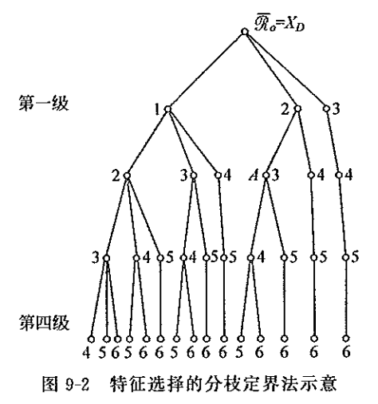
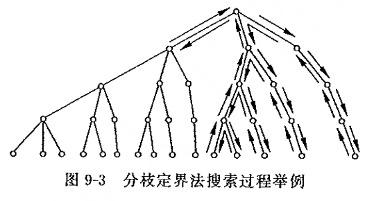

# 特征选择

## 用于分类的特征评价准则
我们需要定义与错误率有一定关系但又便于计算的类别可分性准则$J_{ij}$，用来衡量在一组特征下第$i$类和第$j$类之间的可分程度。这样的判据应该满足以下几个要求：
+ 判据应该与错误率（或错误率的上界）有单调关系，这样才能较好地反映分类目标。
+ 当**特征独立**时，判据对特征应该具有可加性，即$$J_{ij}(x_1, x_2, ..., x_d) = \sum_{k = 1}^d J_{ij}(x_k)$$其中$J_{ij}(\cdot)$为对第$i$类和第$j$类之间的可分性准则函数，其值越大，两类的分离程度就越大。$x_1, x_2, ..., x_d$为一系列特征变量。
+ 判据应当具有以下特性：$$\begin{cases}J_{ij} > 0 & i \neq j \\ J_{ij} = 0 & i = j \\ J_{ij} = J_{ji}\end{cases}$$
+ 理想的判据应当具有单调性，即加入新的特征不会使得判据减小，即$$J_{ij}(x_1, x_2, ..., x_d) \leq J_{ij}(x_1, x_2, ..., x_d, x_{d + 1})$$

### 基于类内距离、类间距离的可分性判据
直观上，可以用两类中任意两两样本间的距离的平均来代表两个类之间的距离。

**判据推导：**
令$\bm{x}_k^{(i)}$和$\bm{x}_l^{(j)}$分别为$\omega_i$类及$\omega_j$类中的$D$维特征向量，$\delta(\bm{x}_k^{(i)}, \bm{x}_l^{(j)})$为这两个向量之间的距离，则各类特征向量之间的平均距离为
$$J_d(\bm{x}) = \dfrac{1}{2} \sum_{i = 1}^c \sum_{j = 1}^c \dfrac{P_i P_j}{n_i n_j} \sum_{k = 1}^{n_i} \sum_{l = 1}^{n_j} \delta(\bm{x}_k^{(i)}, \bm{x}_l^{(j)})$$其中$c$为类别总数，$P_i$和$P_j$为相应类别的先验概率，$n_i$为$\omega_i$类中的样本数，$n_j$为$\omega_j$类中的样本数。
我们采取欧氏距离，即
$$\delta(\bm{x}_k^{(i)}, \bm{x}_l^{(j)}) = (\bm{x}_k^{(i)} - \bm{x}_l^{(j)})^T (\bm{x}_k^{(i)} - \bm{x}_l^{(j)})$$

用$\bm{m}_i$表示第$i$类样本集的均值向量，$\bm{m}$表示所有各类样本集的均值向量：$$\bm{m}_i = \dfrac{1}{n_i} \sum\limits_{k = 1}^{n_i} \bm{x}_k^{(i)} \qquad \bm{m} = \sum\limits_{i = 1}^c P_i \bm{m}_i$$

代入$J_d(\bm{x})$得
$$J_d(\bm{x}) = \dfrac{1}{2} \sum_{i = 1}^c P_i \left[ \dfrac{1}{n_i} \sum_{k = 1}^{n_i} (\bm{x}_k^{(i)} - \bm{m}_i)^T (\bm{x}_k^{(i)} - \bm{m}_i) + (\bm{m}_i - \bm{m})^T (\bm{m}_i - \bm{m}) \right]$$

上式括号内第二项为第$i$类的均值向量与总体均值向量$\bm{m}$之间的平方距离，用先验概率加权平均后可以代表各类均值向量的平均平方距离
$$\begin{aligned}
    &\sum_{i = 1}^c P_i(\bm{m}_i - \bm{m})^T (\bm{m}_i - \bm{m}) \\
    =& \dfrac{1}{2}\sum_{i = 1}^c \sum_{j = 1}^c P_i P_j(\bm{m}_i - \bm{m}_j)^T (\bm{m}_i - \bm{m}_j)
\end{aligned}$$

在基于平均平方距离判据的情况下，也可以使用离散度矩阵来推导：
令
$$\tilde{\bm{S}_b} = \sum_{i = 1}^c P_i (\bm{m}_i - \bm{m})(\bm{m}_i - \bm{m})^T$$为对类间离散度矩阵$\bm{S}_b$的估计，
$$\tilde{\bm{S}_w} = \sum_{i = 1}^c P_i \dfrac{1}{n_i} \sum_{k = 1}^{n_i} (\bm{x}_k^{(i)} - \bm{m})(\bm{x}_k^{(i)} - \bm{m})^T$$为对类间离散度矩阵$\bm{S}_w$的估计，则
$$J_d(\bm{x}) = \text{tr}(\tilde{\bm{S}_w} + \tilde{\bm{S}_b})$$

还可以类似地定义一系列基于类内距离和类间距离的判据：
$$\begin{aligned}
    J_1 =& \text{tr}(\bm{S}_w + \bm{S}_b) \\
    J_2 =& \text{tr}(\bm{S}_w^{-1}\bm{S}_b) \\
    J_3 =& \ln\dfrac{|\bm{S}_w|}{|\bm{S}_b|} \\
    J_4 =& \ln\dfrac{\text{tr}(\bm{S}_w)}{\text{tr}(\bm{S}_b)} \\
    J_5 =& \dfrac{|\bm{S}_w + \bm{S}_b|}{|\bm{S}_w|} \\
\end{aligned}$$

### 基于概率分布的可分性判据
对二分类问题，假定先验概率相等，若对所有使$p(\bm{x}|\omega_2) \neq 0$的点有$p(\bm{x}|\omega_1) = 0$，则两类完全可分；反之，若对所有$\bm{x}$都有$p(\bm{x}|\omega_1) = p(\bm{x}|\omega_2)$则两类完全不可分。
分布密度的交叠程度可用$p(\bm{x}|\omega_1)$及$p(\bm{x}|\omega_2)$这两个分布之间的距离$J_p$来度量。
任何函数$J(\cdot) = \int g(p(\bm{x} | \omega_1), p(\bm{x} | \omega_2), P_1, P_2)\,d\bm{x}$在满足以下条件时都可以被作为类分离性的概率距离度量：
+ $J_p \geq 0$；
+ 当两类完全不交叠时$J_p$取最大值；
+ 当两类分布密度完全相同时，$J_p = 0$；

常用概率距离度量：
+ **巴氏距离（Bhattacharyya距离）：** $$J_B = -\ln \int (p(\bm{x} | \omega_1) p(\bm{x} | \omega_2))^{\frac{1}{2}} \,d\bm{x}$$可知完全重合时$J_B = 0$，而完全不重合时$J_B = +\infty$。
+ **切诺夫界限（Chernoff界限）：** $$J_c = -\ln \int p(\bm{x} | \omega_1)^s p(\bm{x} | \omega_2)^{1-s} \,d\bm{x}$$其中$s \in [0, 1]$，当$s = \dfrac{1}{2}$时Chernoff界限与Bhattacharyya距离相同。
+ **散度：** $$J_D = \int (p(\bm{x} | \omega_1) - p(\bm{x} | \omega_2)) \ln \dfrac{p(\bm{x} | \omega_1)}{p(\bm{x} | \omega_2)} \,d\bm{x}$$若两类概率均服从正态分布且协方差矩阵相等，则有$$J_D = (\bm{\mu}_1 - \bm{\mu}_2)^T \bm{\Sigma}^{-1} (\bm{\mu}_1 - \bm{\mu}_2) = 8J_B$$也正好为两类均值间的Mahalanobis距离的平方。

类似地，可以定义类条件概率密度函数和总体概率密度函数之间的差别，用来衡量一个类别与各类混合的样本总体的可分离程度。考查特征$\bm{x}$和类$\omega_i$的联合概率密度函数
$$p(\bm{x}, \omega_i) = p(\bm{x} | \omega_i) P(\omega_i)$$

如果$\bm{x}$与类$\omega_i$独立，则$p(\bm{x}) = p(\bm{x} | \omega_i), p(\bm{x}, \omega_i) = p(\bm{x})P(\omega_i)$，特征$\bm{x}$不提供分类$\omega_i$的信息。$p(\bm{x})$与$p(\bm{x} | \omega_i)$的差距越大，$\bm{x}$提供的分类信息越多。从而，可以用$p(\bm{x})$与$p(\bm{x} | \omega_i)$之间的函数距离作为对分类贡献的判据：
$$J_i = \int g(p(\bm{x}), p(\bm{x} | \omega_i), P(\omega_i))\,d\bm{x}$$称作**概率相关性判据**。

### 基于熵的可分性判据
考虑一个极端例子：假设有$c$个类别，对特征的某一取值$\bm{x}$，若样本属于各类的后验概率相等，即$$P(\omega_i | \bm{x}) = \dfrac{1}{c}$$

则从该特征无法判断样本属于哪一类，错误概率为$\dfrac{c - 1}{c}$。对另外一种极端情况$$P(\omega_i | \bm{x}) = 1, \quad P(\omega_j | \bm{x}) = 0,\quad \forall j \neq i$$

则样本必定属于$\omega_i$类，错误概率为0。
从而在特征的某个取值下，样本所属各后验概率越平均，则该特征越不利于分类；如果后验概率越集中于某一类，则该特征越有利于分类。

为了衡量各类后验概率的集中程度，我们使用信息论中熵的概念定义类别可分性的判据：
把类别$\omega_i,\ i = 1, 2, ..., c$看作是一系列随机事件，它的发生依赖于随机向量$\bm{x}$，给定$\bm{x}$的后验概率$P(\omega_i | \bm{x})$。如果根据$\bm{x}$能够完全确定$\omega$，则$\omega$就没有不确定性，对$\omega$本身的观察就不会再提供信息量，此时熵为$0$，特征最有利于信息分类；如果$\bm{x}$不能完全确定$\omega$，则$\omega$不确定性最大，对$\omega$本身的观察所提供信息量最大，此时熵最大，特征最不利于分类。
**基于熵的可分性判据：**
$$J_E = \int H(\bm{x}) p(\bm{x}) \,d\bm{x}$$

其中熵度量$H(\bm{x})$常用的有：
+ **香农熵：** $$H = -\sum_{i = 1}^c P(\omega_i | \bm{x}) \log_2 P(\omega_i | \bm{x})$$
+ **平方熵：** $$H = 2\left(1 - \sum_{i = 1}^c P^2(\omega_i | \bm{x})\right)$$

### 利用统计检验作为可分性判据
统计检验基本思想：从样本计算某一个能反映待检验假设的统计量，在比较两组样本（两类样本）时用这个统计量来衡量两组样本之间的差别。假定不存在这样的差异，称作**空假设**；相应地，待检验的假设，即两类样本存在显著差异的假设，则被称作**备择假设**。考查实际样本数据，计算在空假设下有多大概率得到样本取值，如果概率很小则认为空假设不成立，接受备择假设；反之认为空假设成立，接受空假设。这一概率被称为$p$-值。

#### $t$-检验
基本假设：两类变量都服从正态分布，且方差相同。
设在同一特征观测下的两类分别有$m$个和$n$个样本$\{x_i,\ i = 1, 2, ..., m\},\ x_i \sim \mathcal{N}(\mu_x, \sigma^2)$和$\{y_i,\ i = 1, 2, ..., n\},\ y_i \sim \mathcal{N}(\mu_y, \sigma^2)$。其总体样本方差为
$$s_p^2 = \dfrac{(n - 1)S_x^2 + (m - 1)S_y^2}{m + n - 2}$$

其中$S_x^2$和$X_y^2$分别为两类样本各自的估计方差，两类样本均值分别记为$\bar{x}$和$\bar{y}$。$t$-检验的统计量为
$$t = \dfrac{\bar{x} - \bar{y}}{s_p\sqrt{\dfrac{1}{n} + \dfrac{1}{m}}}$$

其服从自由度为$n + m - 2$的$t$分布。
**双边$t$-检验**的空假设是两类均值相同，即$\mu_x = \mu_y$，备择假设是$\mu_x \neq \mu_y$。如果期待该特征在一类的均值大于在另一类的均值，则可以使用**单边$t$-检验**，此时空假设为$\mu_x \leq \mu_y$，备择假设为$\mu_x > \mu_y$。
在求出$t$后，可对照查表得对应空假设的$p$-值，根据适当的显著性水平（如$0.05$或$0.01$）来决定是否拒绝空假设。

$t$-检验属于参数化检验方法，此类方法对数据分布有一定假设，必要时需要先检验样本分布是否符合该假设。

#### Wilcoxon秩和检验（Mann-Whitney U检验）
这是一种非参数检验，不对数据分布作特殊假设；但当数据符合正态分布时，$t$-检验更为有效。

做法：首先将两类数据混合在一起，对所有样本按照所考查的特征从小到大排序，第一名排序为$1$，第二名排序为$2$，依此类推，如果出现特征取值相等的样本则采用中间排序。在两类样本中分别计算所得排序序号之和$T_1$、$T_2$，称为**秩和**。设两类样本数分别为$n_1$、$n_2$。如果某一类样本秩和显著大于/小于另一类的秩和，则两类样本所考查特征存在显著差异。
为了考查某一类的秩和是否显著小于（或大于）另一类的秩和，需要研究当两类没有显著差异时由于随机因素造成的秩和的分布。不同样本数目情况下$T$的空间分布是不同的。对于小的样本数，人们预先计算出了$T$的分布。对于较大的样本数（如$n_1$、$n_2$都大于$10$），则可以用正态分布$\mathcal{N}(\mu_1, \sigma_1^2)$来近似估计秩和$T_1$的空分布，其中
$$\mu_1 = \dfrac{n_1(n_1 + n_2 + 1)}{2}\qquad \sigma_1^2 = \dfrac{n_1 n_2 (n_1 + n_2 + 1)}{12}$$

对$T_2$的估计同理可得。

## 特征选择的最优算法
理想的特征选择方法，应当能够从给定的$D$个特征中根据某种判据准则选择出$d < D$个特征，使得在这$d$个特征上该准则最优。先前的可分性判据中个，除了逐一考虑每个单独特征的统计检验判据外，剩下的判据都是定义在特征向量上的，需要从$D$个特征中选择出最优的特征组合。
穷举数量为$C_D^d = \dfrac{D!}{(D - d)!d!}$，数量级过大不具备操作性。

### 分枝定界法
基本思想：将所有特征选择组合成一个树状结构，按照特定规律对树进行搜索，使得搜索过程尽可能早地可以达到最优解而不必遍历整个树。

要做到这一点，基本要求为准则判据对特征具有单调性，即如果有互相包含的特征组序列$$\bar{X_1} \supset \bar{X_2} \supset ... \supset \bar{X_i}$$则$$J(\bar{X_1}) \geq J(\bar{X_2}) \geq ... \geq J(\bar{X_i})$$即特征增多时判据值不会减小。理论上，基于距离的可分性判据和基于概率密度函数距离的可分性判据都满足这一性质。

例（具体可见《模式识别（第四版）》P203）：

最终得到的一个完整的树应当有$D - d$层（不含根节点），树中每个节点包含去掉的某一个特征，每个叶子节点代表一种选择方案（从叶子节点到根节点，所有未去掉的特征构成最终选择结果）；不过在实际生长和回溯过程中不一定会得到一个完整的树。界限$B$的初始值**不存在**。
1. 对于第$l$层的节点$i$，假定其包含$D_i$个（未去掉的）候选特征，我们首先从$D_i$个候选特征中去掉同在$l$层、位于$i$节点左侧的特征；假设此时还剩下$D_i'$个特征；
2. 分别在已经去掉特征的基础上，依次单独去掉这$D_i'$个特征，按照**去掉某个特征后**的**准则函数损失量**从大到小，将去掉的特征从左到右生长为子节点；
3. 选择子结点中未考查过的、最右侧的节点，前进到该节点。如果当前层全部考查结束，返回父节点并重复步骤3。
    + 如果$B$不存在且该节点为叶子节点，则将当前叶子节点损失函数值赋值给$B$；否则重复步骤1。
    + 如果$B$存在，比对该节点对应损失函数值与$B$：如果损失函数值小于$B$，则返回父节点并重复步骤3；如果损失函数值大于等于$B$，当该节点为叶子节点时更新$B$为当前损失函数值，否则重复步骤1。

## 特征选择的次优算法
为了进一步减小计算量，可以考虑用一些次优搜索方法。

### 单独最优特征的组合
根据单个特征的判据值排队，选择其中前$d$个特征。
假设：单独作用时性能最优的特征，组合起来也是性能最优的。

### 顺序前进法
一种“自底向上”的方法；第一个特征选择单独最优的特征，第二个特征从其余所有特征中选择与第一个特征组合在一起后准则最优的特征，后面每一个特征都选择与已经入选的特征组合起来最优的特征。
改进：**广义顺序前进法**，每次选择$l(l > 1)$个特征。

### 顺序后退法
一种“自顶向下”的方法；每次剔除一个特征，剔除的特征为使得剩余的特征的准则函数值最优的特征。
改进：**广义顺序后退法**，每次剔除$r(r > 1)$个特征。

### 增$l$减$r$法（$l$-$r$法）
自底向上：取$l > r$，每次先增加$l$个特征，再剔除$r$个特征。
自顶向下：取$l < r$，每次先剔除$r$个特征，再增加$l$个特征。
改进： **$(Z_l, Z_r)$法**，不采用逐步增选或剔除特征，而是每次选择或者剔除多个特征。

## 遗传算法
一种非启发式、依赖随机搜索较快地获得最优或次优解的算法。

对于从$D$个特征中选取$d$个特征的目标，将所有特征视作一条由$D$个0/1字符构成的字符串，0代表该特征没有被选中，1代表该特征被选中，这个字符串便被称为**染色体**，记作$m$。我们的目标是获得一个有且仅有$d$个1的染色体，这样的染色体共有$C_D^d$种。
优化的目标被描述成**适应度函数**，每一条染色体对应一个适应度值$f(m)$。可以用先前定义的类别可分性判据作为适应度。针对不同的适应度有不同的选择概率$p(f(m))$。
基本步骤：
1. 初始化，$t = 0$。随机地产生一个包含$L$条不同染色体的种群$M(0)$。
2. 计算当前种群$M(t)$中每一条染色体的适应度$f(m)$。
3. 按照选择概率$p(f(m))$对种群中的染色体进行采样，由采样出的染色体经过一定操作繁殖出下一代染色体，组成下一代种群$M(t + 1)$。
   + 操作一：**重组/交叉**，指两条染色体配对，并在某个随机的位置上以一定的重组概率$P_{co}$进行交叉，互换部分染色体。
   + 操作二：**突变**，每条染色体的每一个位置都有一定概率$P_{mut}$发生突变（从0变成1或从1变成0）。
4. 回到步骤2，直到达到终止条件，输出适应度最大的染色体作为找到的最优解。

## 包裹法：以分类性能为准则的特征选择方法
以上介绍的所有方法，都是定义一种类别可分性判据，用适当的算法选择一组在这一判据意义下最优的特征。然而，如果分类方法能够处理全部候选特征，那么就可以直接用分类器的错误率来作为特征选择的依据。
 
当特征数目很多时，用穷举的办法尝试所有的特征组合显然是不可行的。一种解决方法是，开始利用所有的特征设计分类器，然后考查各个特征在分类器中的贡献，逐步剔除贡献小的特征。

这种将分类器与特征选择集成到一起、利用分类器进行特征选择的方法通常被称作**包裹法**，相应地利用单独的可分性准则来选择特征再进行分类的方法被称为**过滤法**。

包裹法对分类器有两个基本要求：
+ 分类器能够处理高维的特征向量；
+ 分类器能够在特征维数很高但样本数有限的情况下取得较好效果；

### 递归支持向量机（R-SVM）
每次选择特征总数的一个比例，或者人为规定一格逐级减小的特征数目序列。
基本步骤：
1. 用当前所有候选特征训练支持向量机；
2. 评估当前所有特征在支持向量机中的相对贡献，按照相对贡献大小排序；
3. 根据事先确定的递归，选择特征数目选择出的、排序在前面的特征，用这组特征构成新的候选特征，转步骤1，直到达到所规定的特征选择数目。

对支持向量机的输出函数$$f(\bm{x}) = \bm{w} \cdot \bm{x} + b = \sum_{i = 1}^n \alpha_i y_i (\bm{x}_i \cdot \bm{x}) + b$$

R-SVM定义两类在当前特征上的分离程度为
$$S = \dfrac{1}{n_1} \sum_{\bm{x}^+ \in \omega_1} f(\bm{x}^+) - \dfrac{1}{n_2} \sum_{\bm{x}^- \in \omega_2} f(\bm{x}^-)$$其中$n_1$、$n_2$分别为训练集中$\omega_1$、$\omega_2$类别的样本数目。
这一分离程度可以改写成各个特征之和的形式
$$S = \sum_{j = 1}^d w_j m_j^+ - \sum_{j = 1}^d w_j m_j^- = \sum_{j = 1}^d w_j (m_j^+ - m_j^-)$$

其中$d$为候选特征维数，$w_j$为$\bm{w}$的第$j$个分量，$m_j^+$、$m_j^-$分别是两类样本在第$j$维特征上的均值。
从而，**每个特征对分离程度$S$的贡献**为
$$s_j = w_j (m_j^+ - m_j^-),\quad j = 1, 2, ..., d$$

R-SVM即用上式来判断每个特征在当前SVM模型中提供的贡献。

### 支持向量机递归特征剔除（SVM-RFE）
每次剔除特征总数的一个比例，或者人为规定一格逐级减小的特征数目序列。
基本步骤：
1. 用当前所有候选特征训练支持向量机；
2. 评估当前所有特征在支持向量机中的相对贡献，按照相对贡献大小排序；
3. 根据事先确定的递归，剔除特征数目选择出的、排序在后面的特征，用剩下的特征构成新的候选特征，转步骤1，直到达到所规定的特征选择数目。

SVM-RFE的损失函数为SVM输出和正确类别标号$y$之间的平方平均误差作为SVM分类的损失函数
$$J = \sum_{i = 1}^{n_1 + n_2} \parallel \bm{w} \cdot \bm{x}_i - y_i \parallel^2$$

考查各个权值对这个损失函数的影响，得到各个特征的贡献：
$$s_j^{\text{RFE}} = w_j^2$$

实际应用中，二者分类性能基本相同，但R-SVM特征选择的稳定性和在对未来样本的推广能力方面有一定优势。

### 非线性核的包裹法
包裹法可以推广到SVM采用非线性核的情况。我们知道SVM对偶问题的目标为
$$Q = \sum_{i = 1}^n \alpha_i - \dfrac{1}{2}\sum_{i, j = 1}^n \alpha_i \alpha_j y_i y_j K(\bm{x}_i, \bm{x}_j)$$

用$\bm{x}^{(-k)}$表示去掉第$k$维特征后的样本，去掉第$k$个特征对这一目标函数的影响是
$$DQ(k) = \dfrac{1}{2}\alpha_i \alpha_j y_i y_j (K(\bm{x}_i, \bm{x}_j) - K(\bm{x}_i^{(-k)}, \bm{x}_j^{(-k)}))$$

可以用这个量作为特征$k$在非线性SVM分类器中的贡献，并利用前面介绍的递归方法来进行包裹法特征选择。
